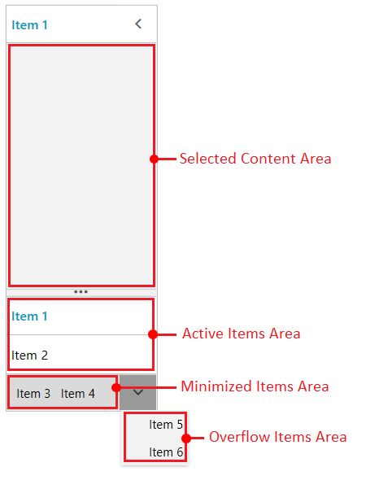

# Resizing and Item Positions

This article describes the resizing feature and the item areas of RadOutlookBar.

RadOutlookBar has three areas where the RadOutlookBarItems can reside - __active__ area, __minimized__ area and __overflow__ area.

#### __[XAML] Example 1: Defining the RadOutlookBar__
{{region radoutlookbar-resizing-0}}
	<telerik:RadOutlookBar>
		<telerik:RadOutlookBarItem Header="Item 1" />
		<telerik:RadOutlookBarItem Header="Item 2" />
		<telerik:RadOutlookBarItem Header="Item 3" />
		<telerik:RadOutlookBarItem Header="Item 4" />
		<telerik:RadOutlookBarItem Header="Item 5" />
		<telerik:RadOutlookBarItem Header="Item 6" />
	</telerik:RadOutlookBar>
{{endregion}}

#### Figure 1: Item Areas

Items are arranged in the active area by default. If there is not enough space for all items, some will get moved to the minimized area. If the minimized area is not wide enough, the items go to the overflow area.

The active area can be resized in height using the [horizontal splitter](). Increasing the height of the active area will move items from the minimized to the active area, and also from the overflow to the minimized area in some situations.

## Customizing Area Settings

The different areas have several settings that can be used to determine their size and number of items that the area can host.

To set the maximum number of items in the active area, use the __ActiveItemsMaxCount__ property. If the control has more items than the ActiveItemsMaxCount then they will go to the minimized and overflow areas.

#### __[XAML] Example 2: Restricting the active area to two items__
{{region radoutlookbar-resizing-1}}
	<telerik:RadOutlookBar ActiveItemsMaxCount="2" />
{{endregion}}

To set the minimum height of the selected content area, use the __MinContentHeight__ property.

#### __[XAML] Example 3: Setting the minimum height of the selected content area__
{{region radoutlookbar-resizing-2}}
	<telerik:RadOutlookBar MinContentHeight="250" />
{{endregion}}

To set the minimum height of the minimized area, use the __MinimimizedAreaMinHeight__ property.

#### __[XAML] Example 4: Setting the minimum height of the minimized area__
{{region radoutlookbar-resizing-3}}
	<telerik:RadOutlookBar MinimizedAreaMinHeight="100" />
{{endregion}}

To set the current number of items in the active area, use the __ActiveItemsCount__ property. If any of the previous settings don't restrict the active area size, the number of items in the area will match the value of the property.

#### __[XAML] Example 5: Setting current number of items in the active area__
{{region radoutlookbar-resizing-4}}
	<telerik:RadOutlookBar ActiveItemsCount="2" />
{{endregion}}

>tip The initial position of the items can be adjusted based on those settings and also on the order of the items in the Items collection of RadOutlookBar.

## Item Position Changed

When the control is resized, the items positions can change from the active to the minimized and overflow areas and vice verca. This change is reported via the __ItemPositionChanged__ event of RadOutlookBar. The event arguments provide the previous and the new positions of the corresponding item. To get this information, use the __OldPosition__ and __NewPosition__ properties of the event arguments.

#### __[XAML] Example 6: Subscribing to ItemPositionChanged__
{{region radoutlookbar-resizing-5}}
	<telerik:RadOutlookBar ItemPositionChanged="RadOutlookBar_ItemPositionChanged" />
{{endregion}}

#### __[XAML] Example 7: ItemPositionChanged event handler__
{{region radoutlookbar-resizing-6}}
	private void RadOutlookBar_ItemPositionChanged(object sender, PositionChangedEventArgs e)
	{
		var outlookBarItem = (RadOutlookBarItem)e.OriginalSource;
		OutlookBarItemPosition oldPosition = e.OldPosition;
		OutlookBarItemPosition newPosition = e.NewPosition;
	}
{{endregion}}

## See Also
 * [Getting Started]()
 * [Visual Structure]()
