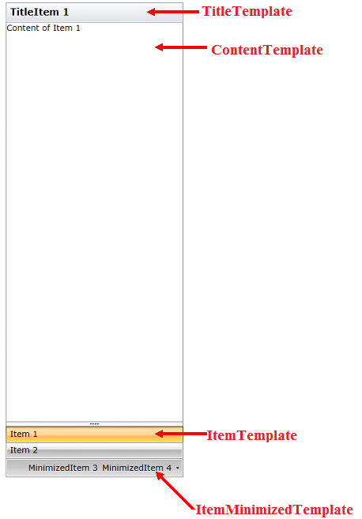

# Templates

* __ItemDropDownTemplate__ - template for the items displayed in the overflow area.

* __ItemDropDownTemplateSelector__ - template selector for the items displayed in the overflow area.

* __ItemMinimizedTemplate__ - template for the minimized items

* __ItemMinimizedTemplateSelector__ - template selector for the minimized items

* __ContentTemplate__ - template for the selected content

* __ContentTemplateSelector__ - template selector for the selected content

* __MinimizedButtonContentTemplate__ - template for the minimized button content

* __MinimizedButtonContentTemplateSelector__ - template selector for the minimized button content

* __TitleTemplate__ - template for the title

* __TitleTemplateSelector__ - template selector for the title

* __ItemTemplate__ - template for the item

* __ItemTemplateSelector__ - template selector for the item

## See Also
 * [Getting Started]()
