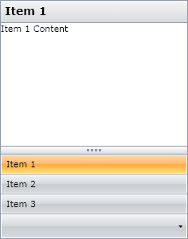
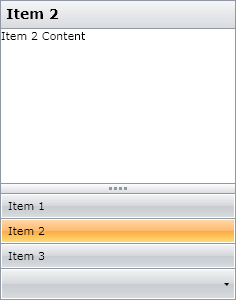
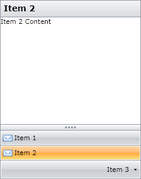

# Getting Started with {{ site.framework_name }} OutlookBar

## Adding Telerik Assemblies Using NuGet

To use __RadOutlookBar__ when working with NuGet packages, install the `Telerik.Windows.Controls.Navigation.for.Wpf.Xaml` package. The [package name may vary]() slightly based on the Telerik dlls set - [Xaml or NoXaml]()

Read more about NuGet installation in the [Installing UI for WPF from NuGet Package]() article.

>tip With the 2025 Q1 release, the Telerik UI for WPF has a new licensing mechanism. You can learn more about it [here]().

## Adding Assembly References Manually

If you are not using NuGet packages, you can add a reference to the following assemblies:

* __Telerik.Licensing.Runtime__
* __Telerik.Windows.Controls__
* __Telerik.Windows.Controls.Navigation__
* __Telerik.Windows.Data__

You can find the required assemblies for each control from the suite in the [Controls Dependencies]()[Controls Dependencies]() help article.

## Adding the RadOutlookBar to the Project



__Example 1__
```XAML
	<telerik:RadOutlookBar>
	    <telerik:RadOutlookBarItem Header="Item 1" Icon="Letter.png">
	        <TextBlock Text="Item 1 Content" />
	    </telerik:RadOutlookBarItem>
	    <telerik:RadOutlookBarItem Header="Item 2" 
	                               Icon="Letter.png"
	                               IsSelected="True">
	        <TextBlock Text="Item 2 Content" />
	    </telerik:RadOutlookBarItem>
	    <telerik:RadOutlookBarItem Header="Item 3" Icon="Letter.png">
	        <TextBlock Text="Item 3 Content" />
	    </telerik:RadOutlookBarItem>
	</telerik:RadOutlookBar>
```


## Selecting item

By default the first item will be selected. In order to select another item you can use the __IsSelected__ property.        

__Example 2__
```XAML
	<UserControl xmlns="http://schemas.microsoft.com/winfx/2006/xaml/presentation"
	             xmlns:x="http://schemas.microsoft.com/winfx/2006/xaml"
	             xmlns:d="http://schemas.microsoft.com/expression/blend/2008"
	             xmlns:mc="http://schemas.openxmlformats.org/markup-compatibility/2006"
	             xmlns:telerik="http://schemas.telerik.com/2008/xaml/presentation">
	    <Grid x:Name="LayoutRoot">
	        <telerik:RadOutlookBar >
	            <telerik:RadOutlookBarItem Header="Item 1">
	                <TextBlock Text="Item 1 Content" />
	            </telerik:RadOutlookBarItem>
	            <telerik:RadOutlookBarItem Header="Item 2">
	                <TextBlock Text="Item 2 Content" />
	            </telerik:RadOutlookBarItem>
	            <telerik:RadOutlookBarItem Header="Item 3">
	                <TextBlock Text="Item 3 Content" />
	            </telerik:RadOutlookBarItem>
	        </telerik:RadOutlookBar>
	    </Grid>
	</UserControl>
```



## Handling changes in the selection

To handle the changes in the selection you can use the __SelectionChanged__ event of the __RadOutlookBar__:        

__Example 3__
```XAML
	<telerik:RadOutlookBar x:Name="RadOutlookBar1" SelectionChanged="RadOutlookBar1_SelectionChanged">
	    <telerik:RadOutlookBarItem Header="Item 1" Icon="Letter.png">
	        <TextBlock Text="Item 1 Content" />
	    </telerik:RadOutlookBarItem>
	    <telerik:RadOutlookBarItem Header="Item 2" 
	                               Icon="Letter.png"
	                               IsSelected="True">
	        <TextBlock Text="Item 2 Content" />
	    </telerik:RadOutlookBarItem>
	    <telerik:RadOutlookBarItem Header="Item 3" Icon="Letter.png">
	        <TextBlock Text="Item 3 Content" />
	    </telerik:RadOutlookBarItem>
	</telerik:RadOutlookBar>
```

__Example 4__
```C#
	private void RadOutlookBar1_SelectionChanged(object sender, RoutedEventArgs e)
	{
		RadOutlookBarItem newSelectedItem = (sender as RadOutlookBar).SelectedItem as RadOutlookBarItem;
	}
```
```VB.NET
	Private Sub RadOutlookBar1_SelectionChanged(ByVal sender As Object, ByVal e As RoutedEventArgs)
	    Dim newSelectedItem As RadOutlookBarItem = TryCast(TryCast(sender, RadOutlookBar).SelectedItem, RadOutlookBarItem)
	End Sub
```

## Limiting active items

To limit the number of items that can be displayed in the active area you can use the __ActiveItemsMaxCount__ property:        

__Example 5__
```XAML
	<telerik:RadOutlookBar ActiveItemsMaxCount="2">
	    <telerik:RadOutlookBarItem Header="Item 1" Icon="Letter.png">
	        <TextBlock Text="Item 1 Content" />
	    </telerik:RadOutlookBarItem>
	    <telerik:RadOutlookBarItem Header="Item 2" 
	                               Icon="Letter.png"
	                               IsSelected="True">
	        <TextBlock Text="Item 2 Content" />
	    </telerik:RadOutlookBarItem>
	    <telerik:RadOutlookBarItem Header="Item 3" Icon="Letter.png">
	        <TextBlock Text="Item 3 Content" />
	    </telerik:RadOutlookBarItem>
	</telerik:RadOutlookBar>
```



## Setting a Theme

The controls from our suite support different themes. You can see how to apply a theme different than the default one in the [Setting a Theme]() help article.

>important Changing the theme using implicit styles will affect all controls that have styles defined in the merged resource dictionaries. This is applicable only for the controls in the scope in which the resources are merged. 

To change the theme, you can follow the steps below:

* Choose between the themes and add reference to the corresponding theme assembly (ex: **Telerik.Windows.Themes.Windows8.dll**). You can see the different themes applied in the **Theming** examples from our [WPF Controls Examples](https://demos.telerik.com/wpf/)[Silverlight Controls Examples](https://demos.telerik.com/silverlight/#Menu/Theming) application.

* Merge the ResourceDictionaries with the namespace required for the controls that you are using from the theme assembly. For the RadOutlookBar, you will need to merge the following resources:

	* __Telerik.Windows.Controls__
	* __Telerik.Windows.Controls.Navigation__

__Example 6__ demonstrates how to merge the ResourceDictionaries so that they are applied globally for the entire application.

__Example 6: Merge the ResourceDictionaries__  
```XAML
	<Application.Resources>
		<ResourceDictionary>
			<ResourceDictionary.MergedDictionaries>
				<ResourceDictionary Source="/Telerik.Windows.Themes.Windows8;component/Themes/System.Windows.xaml"/>
				<ResourceDictionary Source="/Telerik.Windows.Themes.Windows8;component/Themes/Telerik.Windows.Controls.xaml"/>
				<ResourceDictionary Source="/Telerik.Windows.Themes.Windows8;component/Themes/Telerik.Windows.Controls.Navigation.xaml"/>
			</ResourceDictionary.MergedDictionaries>
		</ResourceDictionary>
	</Application.Resources>
```

>Alternatively, you can use the theme of the control via the [StyleManager](https://docs.telerik.com/devtools/wpf/styling-and-appearance/stylemanager/common-styling-apperance-setting-theme-wpf)[StyleManager](https://docs.telerik.com/devtools/silverlight/styling-and-appearance/stylemanager/common-styling-apperance-setting-theme).

__Figure 2__ shows a RadOutlookBar with the **Windows8** theme applied.

#### __Figure 2: RadOutlookBar with the Windows8 theme__



## Telerik UI for WPF Learning Resources

* [Telerik UI for WPF OutlookBar Component](https://www.telerik.com/products/wpf/outlookbar.aspx)
* [Getting Started with Telerik UI for WPF Components]()
* [Telerik UI for WPF Installation]()
* [Telerik UI for WPF and WinForms Integration]()
* [Telerik UI for WPF Visual Studio Templates]()
* [Setting a Theme with Telerik UI for WPF]()
* [Telerik UI for WPF Virtual Classroom (Training Courses for Registered Users)](https://learn.telerik.com/learn/course/external/view/elearning/16/telerik-ui-for-wpf) 
* [Telerik UI for WPF License Agreement](https://www.telerik.com/purchase/license-agreement/wpf-dlw-s)


## See Also
 * [Visual Structure]()
 * [Resizing]()
 * [Selection]()
 * [Events]()
