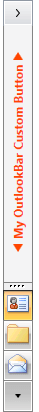

# How to Customize the Minimized Button Content

__RadOutlookBar__ exposes two properties that can be used to customize its __Minimized Button__ (the button that is displayed when the control is minimized).

>tip You can see how the __Minimized Button__ looks by default in the [Visual Structure]() article.          

The first property is __MinimizedButtonContent__ - defines the Content of the button.

#### __XAML__
```XAML
	<telerik:RadOutlookBar MinimizedButtonContent="My OutlookBar Custom Button"/>
```

>When this property is not set the default value of the button is set to “Folders”.

The second property is __MinimizedButtonContentTemplate__ - defines the __ContentTemplate__ of the button. You can use it to change the default appearance of the minimized button.        

#### __XAML__
```XAML
	<telerik:RadOutlookBar MinimizedButtonContent="My OutlookBar Custom Button" IsMinimized="True">
	    <telerik:RadOutlookBar.MinimizedButtonContentTemplate>
	        <DataTemplate>
	            <StackPanel Orientation="Horizontal">
	                <Polygon Points="8,0 0,5, 8,10" Fill="OrangeRed" Margin="0 0 5 0 " VerticalAlignment="Center" />
	                <TextBlock Text="{Binding}" FontWeight="Bold" Foreground="OrangeRed" />
	                <Polygon Points="0,0 8,5, 0,10" Fill="OrangeRed" Margin="5 0 0 0 " VerticalAlignment="Center" />
	            </StackPanel>
	        </DataTemplate>
	    </telerik:RadOutlookBar.MinimizedButtonContentTemplate>
	
	    <telerik:RadOutlookBarItem Header="Contacts" Icon="contacts.png" />
	    <telerik:RadOutlookBarItem Header="Folders" Icon="folders.png" />
	    <telerik:RadOutlookBarItem Header="Mail" Icon="mail.png" />
	</telerik:RadOutlookBar>
```

You can see the end result on the picture below



## See Also
 * [Getting Started]()
 * [Visual Structure]()
 * [Templates]()
 * [Icons]()