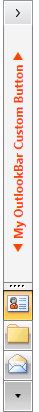

# How to Customize the Minimized Button Content

__RadOutlookBar__ exposes two properties that can be used to customize its __Minimized Button__ (the button that is displayed when the control is minimized).

>tip You can see how the __Minimized Button__ looks by default in the [Visual Structure]() article.          

The first property is __MinimizedButtonContent__ - defines the Content of the button.

<snippet id='radoutlookbar-how-to-customize-minimized-button-content-block_1-xaml' />

>When this property is not set the default value of the button is set to “Folders”.

The second property is __MinimizedButtonContentTemplate__ - defines the __ContentTemplate__ of the button. You can use it to change the default appearance of the minimized button.        

<snippet id='radoutlookbar-how-to-customize-minimized-button-content-block_2-xaml' />

You can see the end result on the picture below

## See Also
 * [Getting Started]()
 * [Visual Structure]()
 * [Templates]()
 * [Icons]()