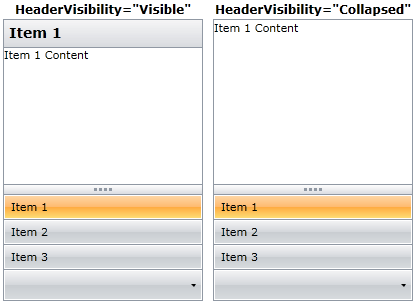

# How to Hide the Header Row

## 

To hide the header row you can use the __HeaderVisibility__ property and set the value to 
        __Collapsed__. 

#### __XAML__

{{region radoutlookbar-how-to-hide-the-header-row_0}}
	<telerik:RadOutlookBar x:Name="RadOutlookBar1" HeaderVisibility="Collapsed">
	 <telerik:RadOutlookBarItem Header="Item 1">
	  <TextBlock Text="Item 1 Content" />
	 </telerik:RadOutlookBarItem>
	 <telerik:RadOutlookBarItem Header="Item 2">
	  <TextBlock Text="Item 2 Content" />
	 </telerik:RadOutlookBarItem>
	 <telerik:RadOutlookBarItem Header="Item 3">
	  <TextBlock Text="Item 3 Content" />
	 </telerik:RadOutlookBarItem>
	</telerik:RadOutlookBar>
	{{endregion}}

# See Also

 * [Getting Started]()
