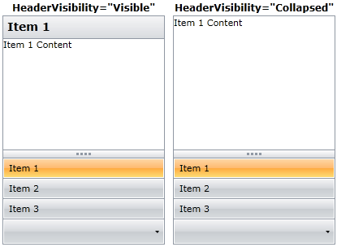

# How to Hide the Header Row

To hide the header row you can use the __HeaderVisibility__ property and set the value to __Collapsed__. 

<snippet id='radoutlookbar-how-to-hide-the-header-row-block_1-xaml' />

## See Also
 * [Getting Started]()