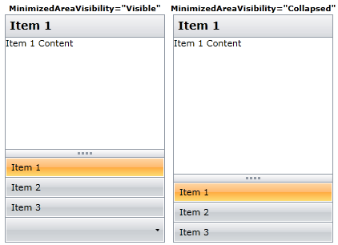

# How to Hide the Minimized Area

To hide the minimize area you can use the __MinimizedAreaVisibility__ property and set its value to __Collapsed__.



#### __XAML__
```XAML
	<telerik:RadOutlookBar x:Name="RadOutlookBar1" MinimizedAreaVisibility="Collapsed">
	    <telerik:RadOutlookBarItem Header="Item 1">
	        <TextBlock Text="Item 1 Content" />
	    </telerik:RadOutlookBarItem>
	    <telerik:RadOutlookBarItem Header="Item 2">
	        <TextBlock Text="Item 2 Content" />
	    </telerik:RadOutlookBarItem>
	    <telerik:RadOutlookBarItem Header="Item 3">
	        <TextBlock Text="Item 3 Content" />
	    </telerik:RadOutlookBarItem>
	</telerik:RadOutlookBar>
```