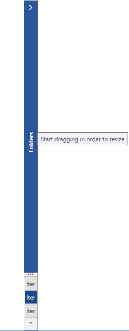
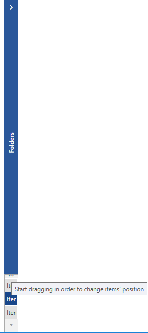
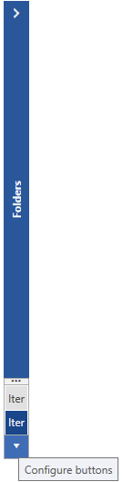

# Localization

>tip To learn more about the ways to localize the controls from the suite please read the common topic on [Localization]().

__RadOutlookBar__ provides strings for localizing various of its elements. In order to be able to distinguish these resources, an unique identifier, called resource key, is assigned to each string that can be localized.

Here is a list of all of the Resources available and their default values.

Key	|	Value
---	|	---	
OutlookBarConfigureButtons | Configure buttons
OutlookBarHorizontalSplitter | Start dragging in order to change items' position
OutlookBarVerticalResizer | Start dragging in order to resize

#### __Figure 1: Vertical Resizer__

#### __Figure 2: Horizontal Splitter__

#### __Figure 3: Configure Buttons__

## See also

* [Localization]()
