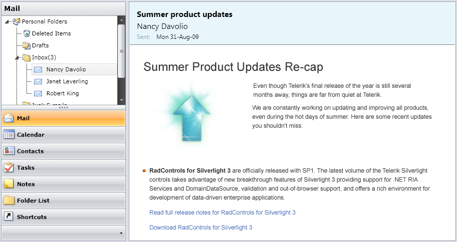

# Overview



## 

Thank you for choosing Telerik __RadOutlookBar__!
				

Telerik __RadOutlookBar__ control lets you deliver Outlook's navigational bar to your applications just as easy as adding a single control. You can take advantage of the group data templates, overflow menu, defining items position (define whether the items will appear in the main navigation bar or in the overflow menu by simply dragging the main navigation bars horizontal splitter).
				

____

__RadOutlookBar__ key features list:
				

* __Dynamic Layout__

* __Minimize Area__

* __Overflow Area__

* __Integration with Telerik controls - ContextMenu, ComboBox, DropDown buttons__

* __All Telerik controls for Silverlight support styling with Expression Blend__

Check out the online demo at: [http://demos.telerik.com/silverlight/#OutlookBar/FirstLook](http://demos.telerik.com/silverlight/#OutlookBar/FirstLook)
