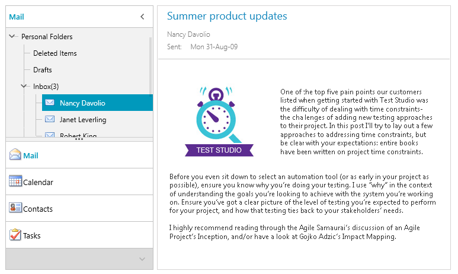

# {{ site.framework_name }} OutlookBar Overview

Thank you for choosing Telerik __RadOutlookBar__!				

Telerik __RadOutlookBar__ control lets you deliver Outlook's navigational bar to your applications just as easy as adding a single control. You can take advantage of the group data templates, overflow menu, defining items position (define whether the items will appear in the main navigation bar or in the overflow menu by simply dragging the main navigation bars horizontal splitter).		



		

## Key Features

* __Minimize Area__: The control exposes a minimization behavior, which creates more user-friendly applications that have the "MS Outlook look and feel". Read more about this in the [Populating With Data]() article.

* __Selection__: The control provides selection of its items. Read more about this in the [Selection]() article.

* __Overflow Area__: The __RadOutlookBar__ can display its items in accompanying (pop-up) overflow area if the available area is too small.

* __Customization__: To customize the appearance, the control exposes a bunch of properties that you can use to modify its parts. Read more about this in the [Templates]() article.

>tip Get started with the control with its [Getting Started]() help article that shows how to use it in a basic scenario.

> Check out the online demos at [demos.telerik.com](https://demos.telerik.com/silverlight/#OutlookBar/FirstLook)[demos.telerik.com](https://demos.telerik.com/wpf/)


## Telerik UI for WPF Support and Learning Resources

* [Telerik UI for WPF OutlookBar Homepage](https://www.telerik.com/products/wpf/outlookbar.aspx)
* [Get Started with the Telerik UI for WPF OutlookBar]()
* [Telerik UI for WPF API Reference](https://docs.telerik.com/devtools/wpf/api/)
* [Getting Started with Telerik UI for WPF Components]()
* [Telerik UI for WPF Virtual Classroom (Training Courses for Registered Users)](https://learn.telerik.com/learn/course/external/view/elearning/16/telerik-ui-for-wpf) 
* [Telerik UI for WPF OutlookBar Forums](https://www.telerik.com/forums/wpf)
* [Telerik UI for WPF Knowledge Base](https://docs.telerik.com/devtools/wpf/knowledge-base)


