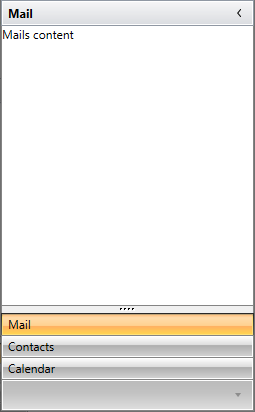
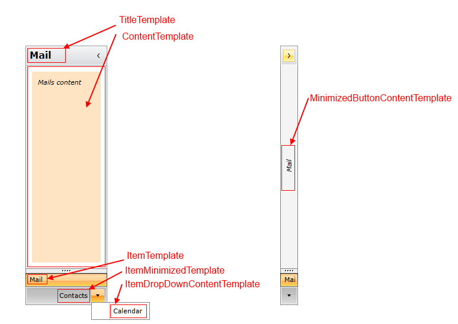

# Data Binding

The goal of this article is to demonstrate how to populate a __RadOutlookBar__ with business objects. Basically the control can be data bound to a collection of objects through its __ItemsSource__ property and dynamically create __RadOutlookBarItems__. 

The __ItemsSource__ property allows __RadOutlookBar__ to be bound to any collection that implements the __IEnumerable__ interface. By default the content of the generated __RadOutlookBarItems__ will be set to the value returned by the __ToString()__ method of the business object.        

In order to bind a __RadOutlookBar__ to a collection of business objects you can perform the following steps:        

* Define a __RadOutlookBar__ in XAML.

	__Example 1: Defining RadOutlookBar in XAML__
	<snippet id='radoutlookbar-populating-with-data-databinding-block_1-xaml' />

* Create a business object

	__Example 2: The MenuItem class__
	<snippet id='radoutlookbar-populating-with-data-databinding-block_2-cs' />
	<snippet id='radoutlookbar-populating-with-data-databinding-block_2-vb' />

* Create a view model class which will contains only a collection business objects

	__Example 3: The MailMenuViewModel class__
	<snippet id='radoutlookbar-populating-with-data-databinding-block_3-cs' />
	<snippet id='radoutlookbar-populating-with-data-databinding-block_3-vb' />

* Set the __DataContext__ of the __RadOutlookBar__ to a new instance of the created view model

	__Example 4: Setting the DataContext of the RadOutlookBar__
	<snippet id='radoutlookbar-populating-with-data-databinding-block_4-cs' />
	<snippet id='radoutlookbar-populating-with-data-databinding-block_4-vb' />

* Then bind the __ItemsSource__ property to the collection of the view model and set the __ItemTemplate__, __ContentTemplate__ and __TitleTemplate__ to display the proper information.

	__Example 5: Configure the RadOutlookBar__

	<snippet id='radoutlookbar-populating-with-data-databinding-block_5-xaml' />

You can see the end result bellow:

## Using Custom Templates

The __RadOutlookBar__ has few properties of type __DataTemplate__ that can be used in order to control its items appearance.

Each property accepts a DataTemplate as a value that determines the visual appearance of the __RadOutlookBarItems__ and the __RadOutlookBar__ itself. The properties that can be used are the following:

* __ItemTemplate__
* __ItemMinimizedTemplate__
* __ItemDropDownTemplate__
* __TitleTemplate__
* __MinimizedButtonContentTemplate__
* __ContentTemplate__

>There are also template selectors for all of the listed templates except for the __MinimizedButtonContentTemplate__.

In Example 5 we already set the __ItemTemplate__, __ContentTemplate__ and __TitleTemplate__ properties.

To customize the project that we developed so far you can also set the rest of the available templates:

* __ItemMinimizedTemplate__: This is the __DataTemplate__ that describes each __RadOutlookBarItem__ that is placed in the minimized area of the __RadOutlookBar__:

	<snippet id='radoutlookbar-populating-with-data-databinding-block_6-xaml' />

* __ItemDropDownContentTemplate__: This is the __DataTemplate__ applied to the items in the drop down which contains the minimized items that cannot fit in the minimized area:

	<snippet id='radoutlookbar-populating-with-data-databinding-block_7-xaml' />

* __MinimizedButtonContentTemplate__: This is the __DataTemplate__ that describes the button which is displayed when you minimize the __RadOutlookBar__:

	<snippet id='radoutlookbar-populating-with-data-databinding-block_8-xaml' />

* Let's also extend the __ContentTemplate__ from **Example 5**: This is the __DataTemplate__ that describes the content of the selected item:

	<snippet id='radoutlookbar-populating-with-data-databinding-block_9-xaml' />

* After you define your templates you can set the appropriate properties of the RadOutlookBar

	<snippet id='radoutlookbar-populating-with-data-databinding-block_10-xaml' />
	
>tip Find a runnable project of the previous example in the [WPF Samples GitHub repository](https://github.com/telerik/xaml-sdk/tree/master/OutlookBar/DataBinding).

You can see the end result on the screenshots below.  

## See Also
 * [Visual Structure]()
 * [Templates]()
 * [Icons]()