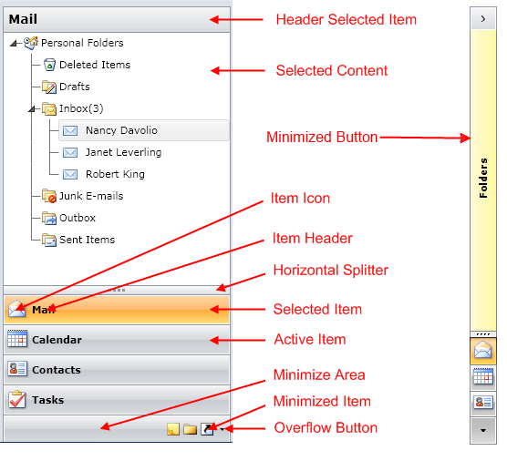

# Visual Structure

This section defines terms and concepts used in the scope of __RadOutlookBar__ you have to get familiar with before  you continue reading this help.

Below you can see a snapshot and explanation of the main visual elements of the __RadOutlookBar__ control.

# See Also
 * [Getting Started]()