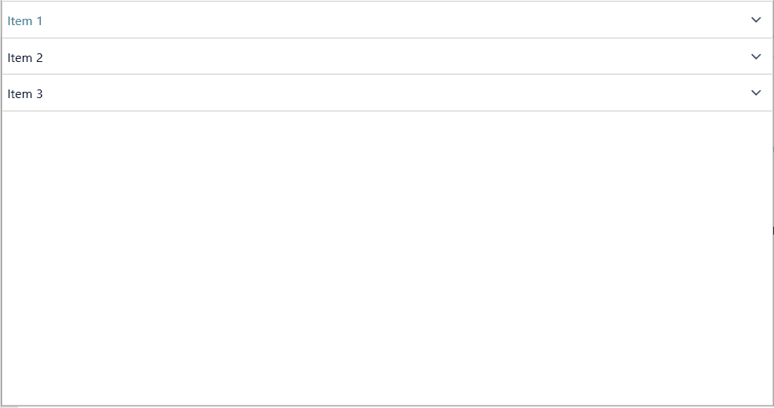

# Resizing Items

By default, the __RadPanelBar__ items cannot be resized through the UI. To enable the UI resizing on the items you can use the __IsResizingEnabled__ property of the __RadPanelBar__ control. It is enabled by setting the __IsResizingEnabled__ property to __True__.

#### __[XAML] Example 1: Enable items resizing
{{region radpanelbar-features-resize-items_0}}
	<telerik:RadPanelBar IsResizingEnabled="True"/>
{{endregion}}

The __IsResizingEnabled__ property can be set in code as well.

#### __[C#] Example 2: Enable items resizing in code
{{region radpanelbar-features-resize-items_1}}
	radPanelBar.IsResizingEnabled = true;
{{endregion}}

#### __[VB.NET] Example 2: Enable items resizing in code
{{region radpanelbar-features-resize-items_2}}
	radPanelBar.IsResizingEnabled = True
{{endregion}}

## Controling the Items Expanded Length

The expanded length of the __RadPanelBarItem__ element can be controlled via its __ExpandedLength__ property. To control the minimum and maximum expanded length, set the __ExpandedMinLength__ and __ExpandedMaxLength__ properties. The expanded length values will be applied only when the __IsResizingEnabled__ property is set to __True__.

#### __[XAML] Example 3: Set PanelBarItem expanded length constraints__
{{region radpanelbar-features-resize-items_3}}
	<telerik:RadPanelBar Name="radPanelBar">
        <telerik:RadPanelBarItem Header="Item 1" ExpandedLength="200" ExpandedMinLength="150" ExpandedMaxLength="250"/>
    </telerik:RadPanelBar>
{{endregion}}

#### __Figure 1: RadPanelBarItem with expanded length constraints__

## See Also

* [Getting Started]()
* [Structure]()
* [Bind to object]()
