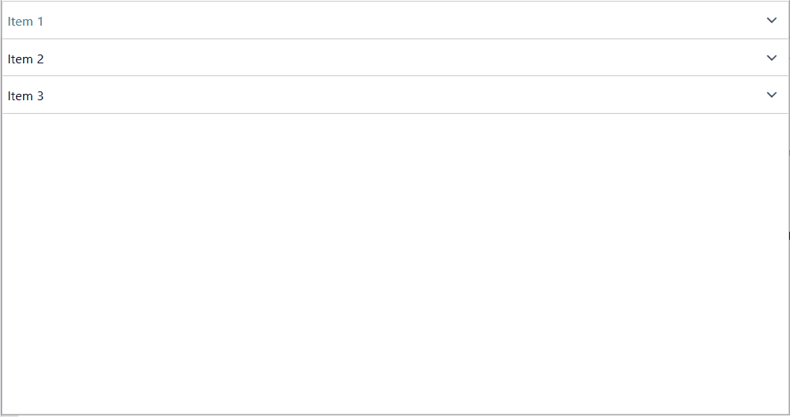

# Resizing Items

By default, the __RadPanelBar__ items cannot be resized through the UI. To enable the UI resizing on the items you can use the __IsResizingEnabled__ property of the __RadPanelBar__ control. It is enabled by setting the __IsResizingEnabled__ property to __True__.

#### __[XAML] Example 1: Enable items resizing
<snippet id='radpanelbar-features-resizeable-items-block_1-xaml' />

The __IsResizingEnabled__ property can be set in code as well.

#### __[C#] Example 2: Enable items resizing in code
<snippet id='radpanelbar-features-resizeable-items-block_2-cs' />

#### __[VB.NET] Example 2: Enable items resizing in code
<snippet id='radpanelbar-features-resizeable-items-block_5-vb' />

## Controling the Items Expanded Length

The expanded length of the __RadPanelBarItem__ element can be controlled via its __ExpandedLength__ property. To control the minimum and maximum expanded length, set the __ExpandedMinLength__ and __ExpandedMaxLength__ properties. The expanded length values will be applied only when the __IsResizingEnabled__ property is set to __True__.

__Example 3: Set PanelBarItem expanded length constraints__
<snippet id='radpanelbar-features-resizeable-items-block_3-xaml' />

#### __Figure 1: RadPanelBarItem with expanded length constraints__

## Enabling RadPanelBarItem Scrolling

The __RadPanelBar__ control exposes an __IsScrollViewerInsideItemsEnabled__ property that allows to scroll the content of each __RadPanelBarItem__ element. The property controls the __ScrollBarVisibility__ of the __ScrollViewer__ control, which is present inside the __ControlTemplate__ of the __RadPanelBarItem__ control.

To allow the __RadPanelBarItem__ control to scroll its content, set the __IsScrollViewerInsideItemsEnabled__ property to __True__.

__Example 4: Set IsScrollViewerInsideItemsEnabled Property__
<snippet id='radpanelbar-features-resizeable-items-block_4-xaml' />

## See Also

* [Getting Started]()
* [Structure]()
* [Bind to object]()