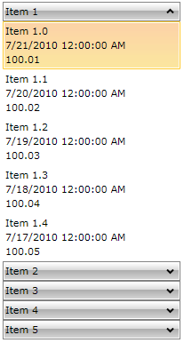

# How to Display Hierarchical Data

__RadPanelBarItem__ inherits from __HeaderedItemsControl__therefore it can display hierarchical data, e.g. collections that contain other collections.
		

## 

The __HierarchicalDataTemplate__ class is designed to be used with __HeaderedItemsControl__ types to display such data. There should be virtually no differences between the usage of __HierarchicalDataTemplate__ in __RadPanelBar__ and other controls.
				

The following example demonstrates how to create a hierarchical data source and bind a __RadPanelBar__ to it, using a __HierarchicalDataTemplate__. The __ItemsSource__ property of the __HierarchicalDataTemplate__ specifies the __binding__ that has to be applied to the __ItemsSource__ property of each item. The __DataTemplate__ property specifies the template that has to be applied on each item, while the __ItemTemplate__ is the template applied on its child items.
				

1. Create a new class and name it __MyViewModel__:
					  

#### __C#__

{{region howto-display-hierarchical-data_0}}
	public class MyViewModel
	 {
	  public MyViewModel()
	  {
	   this.RelatedItems = new ObservableCollection<object>();
	  }
	  public string Title { get; set; }
	  public DateTime DateCreated { get; set; }
	  public double Price { get; set; }
	  public IList<object> RelatedItems { get; set; }
	 }
	{{endregion}}

#### __VB.NET__

{{region howto-display-hierarchical-data_1}}
	Public Class MyViewModel
	 Public Sub New()
	  Me.RelatedItems = New ObservableCollection(Of Object)()
	 End Sub
	 Public Property Title() As String
	  Get
	   Return _Title
	  End Get
	  Set(ByVal value As String)
	   _Title = value
	  End Set
	 End Property
	 Private _Title As String
	 Public Property DateCreated() As DateTime
	  Get
	   Return _DateCreated
	  End Get
	  Set(ByVal value As DateTime)
	   _DateCreated = value
	  End Set
	 End Property
	 Private _DateCreated As DateTime
	 Public Property Price() As Double
	  Get
	   Return _Price
	  End Get
	  Set(ByVal value As Double)
	   _Price = value
	  End Set
	 End Property
	 Private _Price As Double
	 Public Property RelatedItems() As IList(Of Object)
	  Get
	   Return _RelatedItems
	  End Get
	  Set(ByVal value As IList(Of Object))
	   _RelatedItems = value
	  End Set
	 End Property
	 Private _RelatedItems As IList(Of Object)
	End Class
	{{endregion}}

The class has four properties:
						  

* Property __Price__ which is of type double.
								  

* Property __CreatedOn__ which is of type DateTime.
								  

* Property __Title__ which is of type string.
								  

* Property __RelatedItems__ which is a collection of objects. These are the child items.
								  Add a static method to the class which aims to create some mock-up data:

#### __C#__

{{region howto-display-hierarchical-data_2}}
	public static IList<object> GenerateItems()
	{
	 var result = new ObservableCollection<object>();
	 foreach (var num in Enumerable.Range(1, 5))
	 {
	  var item = new MyViewModel();
	  item.DateCreated = DateTime.Today.AddDays(-num % 15);
	  item.Price = num * 100 + Convert.ToDouble(num) / 100;
	  item.Title = String.Format("Item {0}", num);
	  for (int i = 0; i < 5; i++)
	  {
	   var child = new MyViewModel();
	   child.DateCreated = DateTime.Today.AddDays(-num % 5 - i);
	   child.Price = num * 100 + Convert.ToDouble(num + i) / 100;
	   child.Title = String.Format("Item {0}.{1}", num, i);
	   item.RelatedItems.Add(child);
	  }
	  result.Add(item);
	 }
	 return result;
	}
	{{endregion}}

#### __VB.NET__

{{region howto-display-hierarchical-data_3}}
	Public Shared Function GenerateItems() As IList(Of Object)
	 Dim result = New ObservableCollection(Of Object)()
	 For Each num In Enumerable.Range(1, 5)
	  Dim item = New MyViewModel()
	  item.DateCreated = DateTime.Today.AddDays(-num Mod 15)
	  item.Price = num * 100 + Convert.ToDouble(num) / 100
	  item.Title = [String].Format("Item {0}", num)
	  For i As Integer = 0 To 4
	   Dim child = New MyViewModel()
	   child.DateCreated = DateTime.Today.AddDays(-num Mod 5 - i)
	   child.Price = num * 100 + Convert.ToDouble(num + i) / 100
	   child.Title = [String].Format("Item {0}.{1}", num, i)
	   item.RelatedItems.Add(child)
	  Next
	  result.Add(item)
	 Next
	 Return result
	End Function
	{{endregion}}

1. Declare a __HierarchicalDataTemplate__

#### __XAML__

{{region howto-display-hierarchical-data_4}}
	<UserControl.Resources>
	 <DataTemplate x:Key="PanelBarItemTemplate">
	  <StackPanel>
	   <TextBlock Text="{Binding Title}"/>
	   <TextBlock Text="{Binding DateCreated}"/>
	   <TextBlock Text="{Binding Price}"/>
	  </StackPanel>
	 </DataTemplate>
	
	 <telerik:HierarchicalDataTemplate x:Key="PanelBarHeaderTemplate"
	                                   ItemsSource="{Binding RelatedItems}"
	                                   ItemTemplate="{StaticResource PanelBarItemTemplate}">
	   <TextBlock Text="{Binding Title}" />
	 </telerik:HierarchicalDataTemplate>
	
	</UserControl.Resources>
	{{endregion}}



#### __XAML__

{{region howto-display-hierarchical-data_5}}
	<Window.Resources>
	 <DataTemplate x:Key="PanelBarItemTemplate">
	  <StackPanel>
	   <TextBlock Text="{Binding Title}"/>
	   <TextBlock Text="{Binding DateCreated}"/>
	   <TextBlock Text="{Binding Price}"/>
	  </StackPanel>
	 </DataTemplate>
	
	 <HierarchicalDataTemplate x:Key="PanelBarHeaderTemplate"
	                           ItemsSource="{Binding RelatedItems}"
	                           ItemTemplate="{StaticResource PanelBarItemTemplate}">
	   <TextBlock Text="{Binding Title}" />
	 </HierarchicalDataTemplate>
	
	</Window.Resources>
	{{endregion}}



1. Define the __RadPanelBar__and set its __ItemTemplate__ property
					  

#### __XAML__

{{region howto-display-hierarchical-data_6}}
	<telerik:RadPanelBar x:Name="radPanelBar" Width="200" 
	                               HorizontalAlignment="Center" VerticalAlignment="Top"
	                               ItemTemplate="{StaticResource PanelBarHeaderTemplate}">
	</telerik:RadPanelBar>
	{{endregion}}

1. Set the __ItemsSource__ property of the __RadPanelBar__

#### __C#__

{{region howto-display-hierarchical-data_7}}
	this.radPanelBar.ItemsSource = MyViewModel.GenerateItems();
	{{endregion}}

#### __XAML__

{{region howto-display-hierarchical-data_8}}
	Me.radPanelBar.ItemsSource = MyViewModel.GenerateItems()
	{{endregion}}

