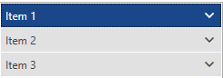
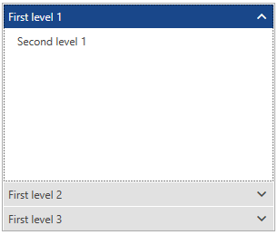

# Bind to Object Data

__RadPanelBar__ can be bound to a collection of objects and dynamically create its collection of items. The collection that is provided as ItemsSource can contain either __RadPanelBarItems__ or any other type of objects. If the ItemsSource collection contains __RadPanelBarItems__, they are directly made children of the __RadPanelBar__ control. Otherwise, the objects in the ItemsSource collection are wrapped in __RadPanelBarItem__ objects and are pushed into the __Items__ collection of the __RadPanelBar__ control.

Naturally, if the collection you are binding to implements the __INotifyCollectionChanged__ interface, whenever your source collection is changed, the change would be immediately reflected in the __Items__ collection of the __RadPanelBar__.

## Binding ItemsSource to a Collection of Strings

**Examples 1 and 2** demonstrate how you can bind the __RadPanelBar__ to a collection of strings:

__Example 1: RadPanelBar definition__
```XAML
	<telerik:RadPanelBar ItemsSource="{Binding}" />
```

__Example 2: Binding RadPanelBar to list of strings__
```C#
	public partial class MainWindow : Window
    {
        public MainWindow()
        {
            InitializeComponent();

            List<string> myListDataSource = new List<string>();
            myListDataSource.Add("Item 1");
            myListDataSource.Add("Item 2");
            myListDataSource.Add("Item 3");

            this.DataContext = myListDataSource;
        }
    }
```
```VB.NET
	Partial Public Class MainWindow
		Inherits Window

		Public Sub New()
			InitializeComponent()

			Dim myListDataSource As New List(Of String)()
			myListDataSource.Add("Item 1")
			myListDataSource.Add("Item 2")
			myListDataSource.Add("Item 3")

			Me.DataContext = myListDataSource
		End Sub
	End Class
```

By default, the string values from the ItemsSource collection will be assigned to the __Header__ property of each __RadPanelBarItem__ in the __RadPanelBar__ control you are populating.

#### __Figure 1: Result from Example 2 in Office2016 Theme__


## Binding ItemsSource to a Collection of Objects

In case you want to display (in the item headers) a specific property of an object in a source collection, you can use either the __DisplayMemberPath__, or the __ItemTemplate__ property of __RadPanelBar__. The approach of using an ItemTemplate is demonstrated in **Examples 3 and 4**:

__Example 3: RadPanelBar definition with ItemTemplate__
```XAML
	<HierarchicalDataTemplate x:Key="headerTemplate" ItemsSource="{Binding Items}">
		<TextBlock Text="{Binding Text}" />
	</HierarchicalDataTemplate>

	<telerik:RadPanelBar ItemsSource="{Binding}" 
						 ItemTemplate="{StaticResource headerTemplate}"/>
```

__Example 3: Displaying a specific property as a Header__
```C#
	public class SampleItem : ViewModelBase
    {
        private string text;
        private ObservableCollection<SampleItem> items;

        public string Text
        {
            get
            {
                return this.text;
            }

            set
            {
                if (this.text != value)
                {
                    this.text = value;
                    this.OnPropertyChanged("Text");
                }
            }
        }

        public ObservableCollection<SampleItem> Items
        {
            get
            {
                return this.items;
            }

            set
            {
                if (this.items != value)
                {
                    this.items = value;
                    this.OnPropertyChanged("Items");
                }
            }
        }
    }

	public partial class MainWindow : Window
    {
        public MainWindow()
        {
            InitializeComponent();

			var source = new ObservableCollection<SampleItem>();
			for (int i = 1; i <= 3; i++)
			{
				var secondLevelItems = new ObservableCollection<SampleItem>() { new SampleItem() { Text = "Second level " + i } };
				source.Add(new SampleItem() { Text = "First level " + i, Items = secondLevelItems });
			}

			this.DataContext = source;
        }
    }
```
```VB.NET
	Public Class SampleItem
		Inherits ViewModelBase

		Private _text As String
		Private _items As ObservableCollection(Of SampleItem)

		Public Property Text() As String
			Get
				Return Me._text
			End Get

			Set(ByVal value As String)
				If Me._text <> value Then
					Me._text = value
					Me.OnPropertyChanged("Text")
				End If
			End Set
		End Property

		Public Property Items() As ObservableCollection(Of SampleItem)
			Get
				Return Me._items
			End Get

			Set(ByVal value As ObservableCollection(Of SampleItem))
				If Me._items IsNot value Then
					Me._items = value
					Me.OnPropertyChanged("Items")
				End If
			End Set
		End Property
	End Class

	Partial Public Class MainWindow
	Inherits Window

		Public Sub New()
			InitializeComponent()

			Dim source = New ObservableCollection(Of SampleItem)()
			For i As Integer = 1 To 3
				Dim secondLevelItems = New ObservableCollection(Of SampleItem)() From {
					New SampleItem() With {.Text = "Second level " & i}
				}
				source.Add(New SampleItem() With {
					.Text = "First level " & i,
					.Items = secondLevelItems
				})
			Next i

			Me.DataContext = source
		End Sub
	End Class

```

#### __Figure 2: Result from Example 4 in Office2016 Theme__


## See also 
* [Getting Started]()
* [How to Display Hierarchical Data]()