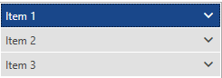
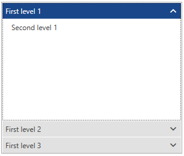
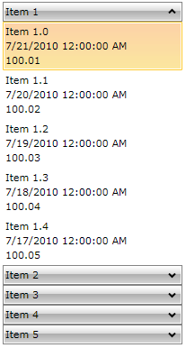

# Data Binding

__RadPanelBar__ can be bound to a collection of objects and dynamically create its collection of items. The collection that is provided as ItemsSource can contain either __RadPanelBarItems__ or any other type of objects. If the ItemsSource collection contains __RadPanelBarItems__, they are directly made children of the __RadPanelBar__ control. Otherwise, the objects in the ItemsSource collection are wrapped in __RadPanelBarItem__ objects and are pushed into the __Items__ collection of the __RadPanelBar__ control.

Naturally, if the collection you are binding to implements the __INotifyCollectionChanged__ interface, whenever your source collection is changed, the change would be immediately reflected in the __Items__ collection of the __RadPanelBar__.

## Binding ItemsSource to a Collection of Strings

The following examples demonstrate how you can bind the __RadPanelBar__ to a collection of strings:

__RadPanelBar Definition__
```XAML
<telerik:RadPanelBar ItemsSource="{Binding}" />
```

__Binding RadPanelBar to a List of Strings__
```C#
public partial class MainWindow : Window
    {
        public MainWindow()
        {
            InitializeComponent();

            List<string> myListDataSource = new List<string>();
            myListDataSource.Add("Item 1");
            myListDataSource.Add("Item 2");
            myListDataSource.Add("Item 3");

            this.DataContext = myListDataSource;
        }
    }
```
```VB.NET
Partial Public Class MainWindow
	Inherits Window

	Public Sub New()
		InitializeComponent()

		Dim myListDataSource As New List(Of String)()
		myListDataSource.Add("Item 1")
		myListDataSource.Add("Item 2")
		myListDataSource.Add("Item 3")

		Me.DataContext = myListDataSource
	End Sub
End Class
```

By default, the string values from the ItemsSource collection will be assigned to the __Header__ property of each __RadPanelBarItem__ in the __RadPanelBar__ control you are populating.

__Result from the Previous Example in the Office2016 Theme__



## Binding ItemsSource to a Collection of Objects

In case you want to display (in the item headers) a specific property of an object in a source collection, you can use either the __DisplayMemberPath__, or the __ItemTemplate__ property of __RadPanelBar__. The approach of using an ItemTemplate is demonstrated in the following examples:

__RadPanelBar Definition with ItemTemplate__
```XAML
<HierarchicalDataTemplate x:Key="headerTemplate" ItemsSource="{Binding Items}">
	<TextBlock Text="{Binding Text}" />
</HierarchicalDataTemplate>

<telerik:RadPanelBar ItemsSource="{Binding}" 
					 ItemTemplate="{StaticResource headerTemplate}"/>
```

__Displaying a Specific Property as a Header__
```C#
public class SampleItem : ViewModelBase
    {
        private string text;
        private ObservableCollection<SampleItem> items;

        public string Text
        {
            get
            {
                return this.text;
            }

            set
            {
                if (this.text != value)
                {
                    this.text = value;
                    this.OnPropertyChanged("Text");
                }
            }
        }

        public ObservableCollection<SampleItem> Items
        {
            get
            {
                return this.items;
            }

            set
            {
                if (this.items != value)
                {
                    this.items = value;
                    this.OnPropertyChanged("Items");
                }
            }
        }
    }

public partial class MainWindow : Window
    {
        public MainWindow()
        {
            InitializeComponent();

		var source = new ObservableCollection<SampleItem>();
		for (int i = 1; i <= 3; i++)
		{
			var secondLevelItems = new ObservableCollection<SampleItem>() { new SampleItem() { Text = "Second level " + i } };
			source.Add(new SampleItem() { Text = "First level " + i, Items = secondLevelItems });
		}

		this.DataContext = source;
        }
    }
```
```VB.NET
Public Class SampleItem
	Inherits ViewModelBase

	Private _text As String
	Private _items As ObservableCollection(Of SampleItem)

	Public Property Text() As String
		Get
			Return Me._text
		End Get

		Set(ByVal value As String)
			If Me._text <> value Then
				Me._text = value
				Me.OnPropertyChanged("Text")
			End If
		End Set
	End Property

	Public Property Items() As ObservableCollection(Of SampleItem)
		Get
			Return Me._items
		End Get

		Set(ByVal value As ObservableCollection(Of SampleItem))
			If Me._items IsNot value Then
				Me._items = value
				Me.OnPropertyChanged("Items")
			End If
		End Set
	End Property
End Class

Partial Public Class MainWindow
Inherits Window

	Public Sub New()
		InitializeComponent()

		Dim source = New ObservableCollection(Of SampleItem)()
		For i As Integer = 1 To 3
			Dim secondLevelItems = New ObservableCollection(Of SampleItem)() From {
				New SampleItem() With {.Text = "Second level " & i}
			}
			source.Add(New SampleItem() With {
				.Text = "First level " & i,
				.Items = secondLevelItems
			})
		Next i

		Me.DataContext = source
	End Sub
End Class

```

__Result from the Previous Example in the Office2016 Theme__



## Binding to Hierarchical Data

__RadPanelBarItem__ inherits from __HeaderedItemsControl__ therefore it can display hierarchical data, e.g. collections that contain other collections.

The __HierarchicalDataTemplate__ class is designed to be used with __HeaderedItemsControl__ types to display such data. There should be virtually no differences between the usage of __HierarchicalDataTemplate__ in __RadPanelBar__ and other controls.

The following example demonstrates how to create a hierarchical data source and bind a __RadPanelBar__ to it, using a __HierarchicalDataTemplate__. The __ItemsSource__ property of the __HierarchicalDataTemplate__ specifies the __binding__ that has to be applied to the __ItemsSource__ property of each item. The __DataTemplate__ property specifies the template that has to be applied on each item, while the __ItemTemplate__ is the template applied on its child items.

1. Create a new class and name it __MyViewModel__:

	```C#
	public class MyViewModel
	{
	    public MyViewModel()
	    {
	        this.RelatedItems = new ObservableCollection<object>();
	    }
	    public string Title { get; set; }
	    public DateTime DateCreated { get; set; }
	    public double Price { get; set; }
	    public IList<object> RelatedItems { get; set; }
	}
	```
	```VB.NET
	Public Class MyViewModel
	    Public Sub New()
	        Me.RelatedItems = New ObservableCollection(Of Object)()
	    End Sub
	    Public Property Title() As String
	        Get
	            Return _Title
	        End Get
	        Set(ByVal value As String)
	            _Title = value
	        End Set
	    End Property
	    Private _Title As String
	    Public Property DateCreated() As DateTime
	        Get
	            Return _DateCreated
	        End Get
	        Set(ByVal value As DateTime)
	            _DateCreated = value
	        End Set
	    End Property
	    Private _DateCreated As DateTime
	    Public Property Price() As Double
	        Get
	            Return _Price
	        End Get
	        Set(ByVal value As Double)
	            _Price = value
	        End Set
	    End Property
	    Private _Price As Double
	    Public Property RelatedItems() As IList(Of Object)
	        Get
	            Return _RelatedItems
	        End Get
	        Set(ByVal value As IList(Of Object))
	            _RelatedItems = value
	        End Set
	    End Property
	    Private _RelatedItems As IList(Of Object)
	End Class
	```

	The class has four properties:

	* Property __Price__ which is of type double.

	* Property __CreatedOn__ which is of type DateTime.

	* Property __Title__ which is of type string.

	* Property __RelatedItems__ which is a collection of objects. These are the child items. Add a static method to the class which aims to create some mock-up data:

	__Adding a Method to Generate Mock-up Hierarchical Data__
	```C#
	public static IList<object> GenerateItems()
	{
	    var result = new ObservableCollection<object>();
	    foreach (var num in Enumerable.Range(1, 5))
	    {
	        var item = new MyViewModel();
	        item.DateCreated = DateTime.Today.AddDays(-num % 15);
	        item.Price = num * 100 + Convert.ToDouble(num) / 100;
	        item.Title = String.Format("Item {0}", num);
	        for (int i = 0; i < 5; i++)
	        {
	            var child = new MyViewModel();
	            child.DateCreated = DateTime.Today.AddDays(-num % 5 - i);
	            child.Price = num * 100 + Convert.ToDouble(num + i) / 100;
	            child.Title = String.Format("Item {0}.{1}", num, i);
	            item.RelatedItems.Add(child);
	        }
	        result.Add(item);
	    }
	    return result;
	}
	```
	```VB.NET
	Public Shared Function GenerateItems() As IList(Of Object)
	    Dim result = New ObservableCollection(Of Object)()
	    For Each num In Enumerable.Range(1, 5)
	        Dim item = New MyViewModel()
	        item.DateCreated = DateTime.Today.AddDays(-num Mod 15)
	        item.Price = num * 100 + Convert.ToDouble(num) / 100
	        item.Title = [String].Format("Item {0}", num)
	        For i As Integer = 0 To 4
	            Dim child = New MyViewModel()
	            child.DateCreated = DateTime.Today.AddDays(-num Mod 5 - i)
	            child.Price = num * 100 + Convert.ToDouble(num + i) / 100
	            child.Title = [String].Format("Item {0}.{1}", num, i)
	            item.RelatedItems.Add(child)
	        Next
	        result.Add(item)
	    Next
	    Return result
	End Function
	```

1. Declare a __HierarchicalDataTemplate__

	```XAML
	<Window.Resources>
	    <DataTemplate x:Key="PanelBarItemTemplate">
	        <StackPanel>
	            <TextBlock Text="{Binding Title}"/>
	            <TextBlock Text="{Binding DateCreated}"/>
	            <TextBlock Text="{Binding Price}"/>
	        </StackPanel>
	    </DataTemplate>

	    <HierarchicalDataTemplate x:Key="PanelBarHeaderTemplate"
	               ItemsSource="{Binding RelatedItems}"
	               ItemTemplate="{StaticResource PanelBarItemTemplate}">
	        <TextBlock Text="{Binding Title}" />
	    </HierarchicalDataTemplate>
	</Window.Resources>
	```

1. Define the __RadPanelBar__ and set its __ItemTemplate__ property

	```XAML
	<telerik:RadPanelBar x:Name="radPanelBar" Width="200" 
	               HorizontalAlignment="Center" VerticalAlignment="Top"
	               ItemTemplate="{StaticResource PanelBarHeaderTemplate}">
	</telerik:RadPanelBar>
	```

1. Set the __ItemsSource__ property of the __RadPanelBar__

	```C#
	this.radPanelBar.ItemsSource = MyViewModel.GenerateItems();
	```
	```VB.NET
	Me.radPanelBar.ItemsSource = MyViewModel.GenerateItems()
	```

	

## See Also
* [Getting Started]()