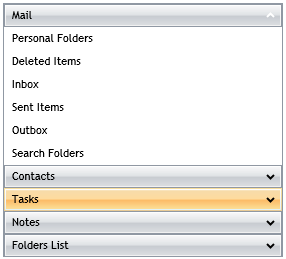

# Overview




Thank you for choosing Telerik __RadPanelBar__!  

__RadPanelBar__ is a versatile component allowing you to build different navigation systems such as left/right side menus and Outlook style panels. The templating mechanism of the control provides the ability to customize the control so that it can represent a site navigation system.

__Key Features:__

* __Hierarchical Data Binding__ - You can bind __RadPanelBar__ to various hierarchical structures specific to your application. Your __RadPanelBar__ can be bound to a collection of Objects, XML, or you can use a WCF service to populate the control.						  

* __Keyboard Support__ - Use your keyboard to navigate, expand , collapse or select items in RadPanelBar. Additionally, all corresponding events will be fired when using the keys to manage the panelbar items.						  

* __Different Expand Modes__ - The __ExpandMode__ can be either single or multiple, reflecting the allowed number of expanded items. When in single __ExpandMode__, all the panel items will collapse except the item that has just been expanded. Alternatively, the multiple __ExpandMode__ allows more than one items to be expanded simultaneously.						  

* __Styling and Appearance__ - __RadPanelBar__ can be fully customized using Microsoft Expression Blend. There are also several pre-defined themes that can be used to stylize the __RadPanelBar__ control.