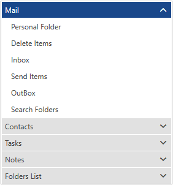

# Overview




Thank you for choosing Telerik __RadPanelBar__!  

__RadPanelBar__ is a versatile component allowing you to build different navigation systems such as left/right side menus and Outlook style panels. The templating mechanism of the control provides the ability to customize the control so that it can represent a site navigation system.

## Key Features

* __Hierarchical Data Binding__: You can bind RadPanelBar to various [hierarchical structures]() specific to your application. The control can be bound to a collection of Objects, XML, or you can use a WCF service to populate it.						  

* __Keyboard Support__: Use your keyboard to navigate, expand, collapse or select items in RadPanelBar. Additionally, all corresponding [events]() will be fired when using the keys to manage the panelbar items. 

* __Different Expand Modes__: The expand mode can be either single or multiple, reflecting the allowed number of expanded items. When in single mode, all the panel items will collapse except the item that has just been expanded. Alternatively, the multiple mode allows more than one items to be expanded simultaneously.

* __Styling and Appearance__: RadPanelBar can be fully customized using Microsoft Expression Blend. There are also several pre-defined themes that can be used to stylize the RadPanelBar control. Read more about this in the [Styling and Appearance]() section.

>tip Get started with the control with its [Getting Started]() help article that shows how to use it in a basic scenario.

<!-- -->
> Check out the control demos at [demos.telerik.com](http://demos.telerik.com/silverlight/#PanelBar/FirstLook)[demos.telerik.com](http://demos.telerik.com/wpf/)

## See Also  
* [Structure]()
* [Bind to object]()
* [Developer Focused Examples]()