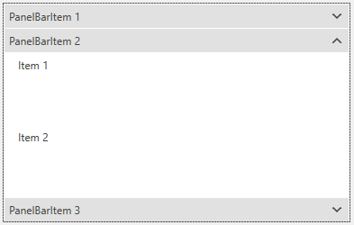

# Getting Started

This tutorial will walk you through the creation of a sample application that contains __RadPanelBar__. 

## Adding Telerik Assemblies Using NuGet

To use __RadPanelBar__ when working with NuGet packages, install the `Telerik.Windows.Controls.Navigation.for.Wpf.Xaml` package. The [package name may vary]() slightly based on the Telerik dlls set - [Xaml or NoXaml]()

Read more about NuGet installation in the [Installing UI for WPF from NuGet Package]() article.

>tip With the 2025 Q1 release, the Telerik UI for WPF has a new licensing mechanism. You can learn more about it [here]().

## Adding Assembly References Manually

If you are not using NuGet packages, you can add a reference to the following assemblies:

* __Telerik.Licensing.Runtime__
* __Telerik.Windows.Controls__
* __Telerik.Windows.Controls.Navigation__
* __Telerik.Windows.Data__

## Adding RadPanelBar to the Project

The following example demonstrates how you can add a RadPanelBar in XAML.

__RadPanelBar with Statically Declared Items in XAML__
```XAML
<telerik:RadPanelBar>
    <telerik:RadPanelBarItem Header="Item 1" />
    <telerik:RadPanelBarItem Header="Item 2" />
    <telerik:RadPanelBarItem Header="Item 3" />
</telerik:RadPanelBar>
```

__Result from the Previous Example in the Office2016 Theme__


## Declaratively Populating the Items Collection of the RadPanelBar Control

The following example demonstrates how you can add __RadPanelBarItems__ directly to the __Items__ collection of the RadPanelBar in code behind:			

__Adding RadPanelBarItems in Code__
```C#
RadPanelBar myPanelBar = new RadPanelBar();
RadPanelBarItem item1 = new RadPanelBarItem() { Header = "Item 1" };
RadPanelBarItem item2 = new RadPanelBarItem() { Header = "Item 2" };
RadPanelBarItem item3 = new RadPanelBarItem() { Header = "Item 3" };
myPanelBar.Items.Add(item1);
myPanelBar.Items.Add(item2);
myPanelBar.Items.Add(item3);
```
```VB.NET
Dim myPanelBar As New RadPanelBar()
Dim item1 As New RadPanelBarItem() With {
.Header = "Item 1"
		}
Dim item2 As New RadPanelBarItem() With {
.Header = "Item 2"
		}
Dim item3 As New RadPanelBarItem() With {
.Header = "Item 3"
		}
myPanelBar.Items.Add(item1)
myPanelBar.Items.Add(item2)
myPanelBar.Items.Add(item3)
```

## Databinding the RadPanelBar Control		  

**RadPanelBar** can be also be bound to a collection of objects. You can learn more about this in the [Data Binding]() article in our documentation.

For information on how to apply a theme different than the default one, see the [Setting a Theme]() article.

## Telerik UI for WPF Learning Resources

* [Telerik UI for WPF PanelBar Component](https://www.telerik.com/products/wpf/panelbar.aspx)
* [Getting Started with Telerik UI for WPF Components]()
* [Telerik UI for WPF Installation]()
* [Telerik UI for WPF and WinForms Integration]()
* [Telerik UI for WPF Visual Studio Templates]()
* [Setting a Theme with Telerik UI for WPF]()
* [Telerik UI for WPF Virtual Classroom (Training Courses for Registered Users)](https://learn.telerik.com/learn/course/external/view/elearning/16/telerik-ui-for-wpf) 
* [Telerik UI for WPF License Agreement](https://www.telerik.com/purchase/license-agreement/wpf-dlw-s)

## See Also
* [Events]()
* [Data Binding]()
