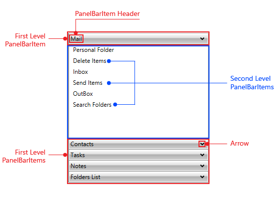

# Structure

This section defines terms and concepts used in the scope of __RadPanelBar__ you have to get familiar with  prior to continue reading this help. They can also be helpful when contacting our support service in order to describe your issue better. For more detailed descriptions of the required parts of the control please visit the [Required Parts]() section.

* __Item Header__ - text or object to display the item header of __RadPanelBarItem__

* __Items__ - collection of __RadPanelBarItems__

* __Expand/Collapse Arrow__ - arrow that expands __RadPanelBarItem__

## See Also
 * [Required Parts]()
 * [Getting Started]()