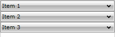
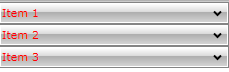
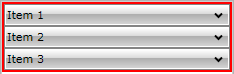

# Colors

You can change the colors of some elements comprising the __RadPanelBar__ by modifying some of the properties of the control. In case you need to make more drastic changes, you can create your own custom control template and change completely the look and feel of the control.

Here is a list of the properties which can be used to change the colors of the __RadPanelBar__ control:		

* __Background__ – changes the background of the whole control or just the background of the item if it is set locally to an item.			

	```XAML
		<telerik:RadPanelBar Background="#BADD27" />
	```

	```C#
		RadPanelBar myPanelBar = new RadPanelBar()
		{
		    Background = new SolidColorBrush(Color.FromArgb(0xFF, 0xBA, 0xDD, 0x27))
		};
	```
	```VB.NET
		Dim myPanelBar As New RadPanelBar() With {
		.Background = New SolidColorBrush(Color.FromArgb(&HFF, &HBA, &HDD, &H27))
		 }
	```

* __Foreground__ - changes the foreground of the whole control or just the foreground of the item if it is set locally to an item.			
	
	```XAML
		<telerik:RadPanelBar Foreground="Red" />
	```
	
	```C#
		myPanelBar.Foreground = new SolidColorBrush(Colors.Red);
	```
	```VB.NET
		myPanelBar.Foreground = New SolidColorBrush(Colors.Red)
	```

	*Before:*
	
	*After:*
	

* __BorderBrush__ - changes the border brush of the control if its border thickness is set to a value greater than 0 i.e. the border is visible.			

	```XAML
		<telerik:RadPanelBar BorderBrush="Red" BorderThickness="2" />
	```

	```C#
		myPanelBar.BorderThickness = new Thickness(2);
		myPanelBar.BorderBrush = new SolidColorBrush(Colors.Red);
	```
	```VB.NET
		myPanelBar.BorderThickness = New Thickness(2)
		myPanelBar.BorderBrush = New SolidColorBrush(Colors.Red)
	```

	*Before:*
	
	*After:*
	

These are the changes that can be achieved by using properties only. In case you need to do some further color adjustments to the default template, you will need to create your own custom control template(s).

Using custom control templates you can change any color in the __RadPanelBar__ control. You can use the __ItemTemplate__ property of the __RadPanelBar__ or the __Template__ property of __RadPanelBarItem__ in combination with a template selector to set your custom template for the corresponding level of items.		

We will continue with an example showing how to change the colors of the different visual states of the control. We assume that initially your custom template is the same as the default one.

To change the color of the __MouseOver__ state, find in the template the element named *MouseOverVisual* and change the brushes it uses. Below you can see the default brushes:		

```XAML
	<SolidColorBrush x:Key="RadPanelBar_MouseOverBorder" Color="#FFdbdbdb" />
	<LinearGradientBrush x:Key="RadPanelBar_SubMouseOver" EndPoint="0,1">
	    <GradientStop Color="#FFf8f6f9" Offset="0" />
	    <GradientStop Color="#FFf0f0f0" Offset="1" />
	</LinearGradientBrush>
```

To change the color of the __Selected__ visual state, find in the template the element named *SelectionVisual* and change the brushes it uses. Below you can see the default brushes (same as above):		

```XAML
	<!-- Selection -->
	<SolidColorBrush x:Key="RadPanelBar_MouseOverBorder" Color="#FFdbdbdb" />
	<LinearGradientBrush x:Key="RadPanelBar_SubMouseOver" EndPoint="0,1">
	    <GradientStop Color="#FFf8f6f9" Offset="0" />
	    <GradientStop Color="#FFf0f0f0" Offset="1" />
	</LinearGradientBrush>
```

To change the color of the __Disabled__ state, find in the template the element named *DisabledVisual* and change the brush it uses. Below you can see the default brush:		

```XAML
	<!-- Disabled -->
	<SolidColorBrush x:Key="DisabledBrush" Color="#99FFFFFF"></SolidColorBrush>
```

Besides the visual states colors, you can also modify the appearance of the __RadPanelBarItem__ header. You can do so by finding the following code in __RadPanelBarItem's__ control template and applying your desired changes:		

```XAML
	<Grid x:Name="HeaderRow" Background="Transparent">
```

This __Grid__ element wraps all header components, so by changing its background brush you will modify the panel bar item background.