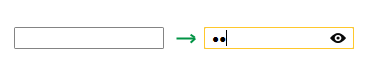
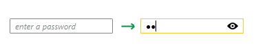

# Getting Started with {{ site.framework_name }} PasswordBox

This tutorial will walk you through the creation of a sample application that contains __RadPasswordBox__.

* [Assembly References](#assembly-references)
* [Adding RadPasswordBox to the Project](#adding-radpasswordbox-to-the-project)
* [Setting Watermark](#setting-watermark)

## Assembly References

In order to use the __RadPasswordBox__ control in your projects, you have to add references to the following assemblies:	

* __Telerik.Licensing.Runtime__
* __Telerik.Windows.Controls__

>tip With the 2025 Q1 release, the Telerik UI for WPF has a new licensing mechanism. You can learn more about it [here]().

### Adding Telerik Assemblies Using NuGet

To use __RadPasswordBox__ when working with NuGet packages, install the `Telerik.Windows.Controls.for.Wpf.Xaml` package. The [package name may vary]() slightly based on the Telerik dlls set - [Xaml or NoXaml]()

Read more about NuGet installation in the [Installing UI for WPF from NuGet Package]() article.

## Adding RadPasswordBox to the Project

Before proceeding with adding __RadPasswordBox__ to your project, make sure the required assembly references are added to the project. 

You can add __RadPasswordBox__ manually by writing the XAML code in __Example 1__. You can also add the control by dragging it from the Visual Studio Toolbox and dropping it over the XAML view.

#### __[XAML] Example 1: Adding RadPasswordBox in XAML__

{{region passwordbox-getting-started_0}}
	<telerik:RadPasswordBox Width="150" />
{{endregion}}

>In order to use __RadPasswordBox__ in XAML you have to add the namespace declaration shown in __Example 2__:
>#### __[XAML] Example 2: Declaring Telerik Namespace__
>{{region telerik-schemas}}
>    xmlns:telerik="http://schemas.telerik.com/2008/xaml/presentation"
>{{endregion}}

If you run the application you will see the PasswordBox as illustrated in __Figure 1__. 

#### __Figure 1: RadPasswordBox generated by the code in Example 1__

## Setting Watermark

When RadPasswordBox is empty and not focused, Watermark content can be shown. __Example 2__ demonstrates how to set Watermark text.

#### __[XAML] Example 2: Setting a watermark__

{{region passwordbox-getting-started_1}}
	<telerik:RadPasswordBox Width="150" WatermarkContent="enter a password" />
{{endregion}}

__Figure 2__ shows the result.

#### __Figure 2: RadPasswordBoxBox with Watermark set__

## Working with RadPasswordBox

The Text property of the RadPasswordBox contains only the sequence of masking characters set by the PasswordChar property. The actual input can be reached through the Password and SecurePassword properties. These properties are not dependency properties (cannot be bound) due to security reasons. To get these properties in MVVM, you can pass the RadPasswordBox element to a command from your view model. Let's demonstrate this with some code.

First we will declare the RadPasswordBox in XAML and bind a RadButton's Command property to a command from our view model.

#### __[XAML] Example 3: Declare the RadPasswordBox in XAML__

{{region passwordbox-getting-started_2}}
	<StackPanel Orientation="Horizontal" VerticalAlignment="Center" HorizontalAlignment="Center" >
		<telerik:RadPasswordBox x:Name="passwordBox" WatermarkContent="enter a password" Width="150" Margin="0 0 10 0" />
		<telerik:RadButton Content="Log in" Command="{Binding LoginCommand}" CommandParameter="{Binding ElementName=passwordBox}"/>
	</StackPanel>
{{endregion}}

Now we just need to create our view model.

#### __[C#] Example 3: Create ViewModel__

{{region passwordbox-getting-started_2}}
	public  class ViewModel
	{
		public System.Windows.Input.ICommand LoginCommand { get; set; }
		public ViewModel()
		{
			LoginCommand = new DelegateCommand(OnLoginCommand_Executed);
		}

		private void OnLoginCommand_Executed(object obj)
		{
			var passwordBox = obj as RadPasswordBox;
			if(passwordBox != null)
			{
				// actual entered password
				var password = passwordBox.Password;
			}
		}
	}
{{endregion}}

Voilà! Now when you click on the Login button, the __LoginCommand.Execute()__ method will be called. Inside the method you can get the __RadPasswordBox__ from the parameter and see the entered password from the __Password__ property.

## Setting a Theme

The controls from our suite support different themes. You can see how to apply a theme different than the default one in the [Setting a Theme]() help article.

>important Changing the theme using implicit styles will affect all controls that have styles defined in the merged resource dictionaries. This is applicable only for the controls in the scope in which the resources are merged. 

To change the theme, you can follow the steps below:

* Choose between the themes and add reference to the corresponding theme assembly (ex: **Telerik.Windows.Themes.Windows8.dll**). You can see the different themes applied in the **Theming** examples from our [WPF Controls Examples](https://demos.telerik.com/wpf/)[Silverlight Controls Examples](https://demos.telerik.com/silverlight/#PanelBar/Theming) application.

* Merge the ResourceDictionaries with the namespace required for the controls that you are using from the theme assembly. For the RadPasswordBox, you will need to merge the following resources:

	* __Telerik.Windows.Controls__
	* __Telerik.Windows.Controls.Navigation__

__Example 4__ demonstrates how to merge the ResourceDictionaries so that they are applied globally for the entire application.

#### __[XAML] Example 4: Merge the ResourceDictionaries__  
{{region radpasswordbox-getting-started_4}}
	<Application.Resources>
		<ResourceDictionary>
			<ResourceDictionary.MergedDictionaries>
				<ResourceDictionary Source="/Telerik.Windows.Themes.Windows8;component/Themes/System.Windows.xaml"/>
				<ResourceDictionary Source="/Telerik.Windows.Themes.Windows8;component/Themes/Telerik.Windows.Controls.xaml"/>
			</ResourceDictionary.MergedDictionaries>
		</ResourceDictionary>
	</Application.Resources>
{{endregion}}

>Alternatively, you can use the theme of the control via the [StyleManager](https://docs.telerik.com/devtools/wpf/styling-and-appearance/stylemanager/common-styling-apperance-setting-theme-wpf)[StyleManager](https://docs.telerik.com/devtools/silverlight/styling-and-appearance/stylemanager/common-styling-apperance-setting-theme).

__Figure 2__ shows a RadPasswordBox with the **Windows8** theme applied.

#### __Figure 2: RadPasswordBox with the Windows8 theme__


## Telerik UI for WPF Learning Resources

* [Telerik UI for WPF PasswordBox Component](https://www.telerik.com/products/wpf/passwordbox.aspx)
* [Getting Started with Telerik UI for WPF Components]()
* [Telerik UI for WPF Installation]()
* [Telerik UI for WPF and WinForms Integration]()
* [Telerik UI for WPF Visual Studio Templates]()
* [Setting a Theme with Telerik UI for WPF]()
* [Telerik UI for WPF Virtual Classroom (Training Courses for Registered Users)](https://learn.telerik.com/learn/course/external/view/elearning/16/telerik-ui-for-wpf) 
* [Telerik UI for WPF License Agreement](https://www.telerik.com/purchase/license-agreement/wpf-dlw-s)


## See Also

 * [Overview]()

 * [Visual Structure]()
