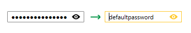
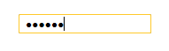
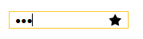
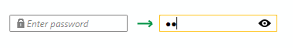

# Key Properties

The purpose of this help article is to show you the key properties of __RadPasswordBox__ control. The topic includes the following properties:

* [SecurePassword](#securepassword)

* [Password](#password)

* [IsPasswordVisible](#ispasswordvisible)

* [PasswordChar](#passwordchar)

* [ShowPasswordButton Settings](#showpasswordbutton-settings)

* [Watermark Settings](#watermark-settings)


## SecurePassword

__SecurePassword__ is a read-only property that returns the current password as a [System.Security.SecureString](https://msdn.microsoft.com/en-us/library/system.security.securestring(v=vs.110).aspx).

>__SecurePassword__ is not a dependency property (it is not bindable) due to security reasons. 

## Password

__Password__ property returns the current password as a string representation. It could be used to set initial password as demonstrated in __Example 1__.

__Example 1: Setting initial Password__

```XAML
	<telerik:RadPasswordBox Width="150" Password="defaultpassword" />
```

__Figure 1__ illustates __RadPasswordBox__ when loaded.

#### __Figure 1: RadPasswordBox with Password set__


>__Password__ is **not a dependency property** (it is not bindable) as dependency properties keep their values unencrypted in memory.

<!-- -->

>When the password is preserved in the __Password__ property, it is actually saved in the process memory as plain text. In certain cases, you could choose not to use that property (check [SecureString vs. String](https://msdn.microsoft.com/en-us/library/system.security.securestring(v=vs.110).aspx#vsString)). 

## IsPasswordVisible

__IsPasswordVisible__ is a read-only property indicating whether the password is currently visible.

## PasswordChar

__PasswordChar__ property defines the masking character used to hide the actual password. The default value is bullet character (●). __Example 2__ demonstrates how it could be set.
 
__Example 2: Setting PasswordChar__
```XAML
	<telerik:RadPasswordBox Width="150" PasswordChar="*"/>
```

#### __Figure 2: RadPasswordBox with PasswordChar set__


## ShowPasswordButton Settings

__ShowPasswordButton__ refers to the button used to display the entered password at runtime. __RadPasswordBox__ provides the following settings regarding the ShowPasswordButton.

>When the password is displayed through the __ShowPasswordButton__, it is preserved in the process memory as plain text. In some cases, you could choose to remove that button through the __ShowPasswordButtonVisibility__ property.

### ShowPasswordButtonVisibility

__ShowPasswordButtonVisibility__ property defines the visibility mode of the ShowPassword button. It is of __ShowPasswordButtonVisibilityMode__ enum type and could receive the following values:
* Never 
* Always
* Auto (the button will be visible only when the password is entered). 

The default value is Auto.

To completely remove the __ShowPasswordButton__, you could set this property to Never as demonstrated in __Example 3__.
 
__Example 3: Setting ShowPasswordButtonVisibility__
```XAML
	<telerik:RadPasswordBox Width="150" ShowPasswordButtonVisibility="Never" />
```

#### __Figure 3: RadPasswordBox with ShowPasswordButtonVisibility set__


### ShowPasswordButtonContent / ShowPasswordButtonContentTemplate

__ShowPasswordButtonContent__ and  __ShowPasswordButtonContentTemplate__ identify the content and respectively the template for presenting that content of the __ShowPassword__ button.  The next example demonstrates how these properties could be used in order to represent the __ShowPassword__ button with an Image.

First, we will create a simple DataTemplate as demonstrated in __Example 4__.

__Example 4: Adding ImageTemplate__
```XAML
	<DataTemplate x:Key="ImageTemplate">
		<Image Source="{Binding}" Stretch="None" />
	</DataTemplate>
```

__Example 5__ illustates how to set the ImageTemplate to the __ShowPasswordButtonContentTemplate__ property of __RadPasswordBox__ as well as define its __ShowPasswordButtonContent__ property.

__Example 5: Setting ShowPasswordButton content properties__
```XAML
	<telerik:RadPasswordBox Width="150" ShowPasswordButtonContent="star.png" ShowPasswordButtonContentTemplate="{StaticResource ImageTemplate}" />
```

#### __Figure 4: RadPasswordBox with ShowPasswordButton content properties applied__


## Watermark Settings

### WatermarkContent / WatermarkTemplate

__WatermarkContent__ and  __WatermarkTemplate__ identify the content and respectively the template for presenting that content of the Watermark inside __RadPasswordBox__. The next example illustates how you could use __WatermarkTemplate__ property in order to apply a Watermark with an Image. 

First, we will create a simple DataTemplate as demonstrated in __Example 6__.

__Example 6: Adding WatermarkWithImageTemplate__
```XAML
	<DataTemplate x:Key="WatermarkWithImageTemplate">
		<StackPanel Orientation="Horizontal">
			<Image Source="passwordImage.png" Width="14" Height="14" />
			<TextBlock Text="Enter password" />
		</StackPanel>           
	</DataTemplate>
```

Then, set the defined WatermarkWithImageTemplate to the __WatermarkTemplate__ of the __RadPasswordBox__.

__Example 7: Setting WatermarkTemplate__
```XAML
	<telerik:RadPasswordBox Width="150"  WatermarkTemplate="{StaticResource WatermarkWithImageTemplate}" />
```

__Figure 5__ shows the result.

#### __Figure 5: RadPasswordBox with WatermarkTemplate applied__


### WatermarkBehavior

__WatermarkBehavior__ is an enum property which defines when the Watermark content of __RadPasswordBox__ will be hidden. It could receive the following values:

* HiddenWhenFocused
* HideOnClick
* HideOnTextEntered

The default value is HideOnTextEntered.

## See Also

 * [Overview]()

 * [Getting Started]()