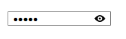

# Overview

Thank you for choosing Telerik __RadPasswordBox__!

__RadPasswordBox__ is a control used for easily entering and handling passwords. It is essential to use this control whenever a user is prompted to enter a password.

## Key Features

* __Password functionality__: RadPasswordBox hides the characters a user is typing for privacy reasons.

* __ShowPassword button__: Easily customizable button for displaying the password at runtime with three visibility modes.

* __Watermark__: RadPasswordBox control allows defining and using watermark in the input field.

* __Styling and Appearance__: Provides an easy way to customize the appearance of the control.

You can check __RadPasswordBox__ demos at: [http://demos.telerik.com/wpf](http://demos.telerik.com/wpf).

# See Also

 * [Getting Started]()

 * [Visual Structure]()
