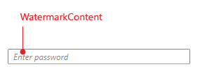
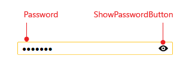

# Visual Structure

This article describes all the visual elements and terms used in __RadPasswordBox__ control. 

* __WatermarkContent__: represents the content shown instead of the password when the __PasswordBox__ is empty and is out of focus.

* __Password__: represents the input area showing the characters hiding the password and allowing you to enter the password value.

* __ShowPasswordButton__: represents the button used to display the password at runtime.

# See Also

 * [Overview]()

 * [Getting Started]()