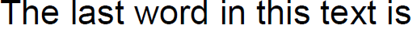
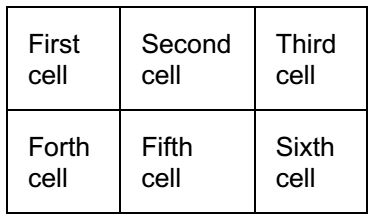

# FixedContentEditor

__FixedContentEditor__ is utility class that is intended to simplify the process of creating and editing the content of an __IContentRootElement__ such as [RadFixedPage]().
      

The current article will get you familiar with the following topics:
      

* [Creating FixedContentEditor](#creating-fixedcontenteditor)

* [Inserting Elements](#inserting-elements)

* [Positioning](#positioning)

* [Changing Current Styles](#changing-current-styles)

## Creating FixedContentEditor

__FixedContentEditor__ is always associated to a single __IContentRootElement__ which it takes as a constructor parameter when it is created. __Example 1__ shows how you can create an editor.
        

#### __[C#] Example 1: Create FixedContentEditor__

{{region radpdfprocessing-editing-fixedcontenteditor_0}}
    FixedContentEditor editor = new FixedContentEditor(contentRootElement);
{{endregion}}

The editor maintains an internal [Position]() inside the content root element. When a new element is created, its position is being set to the current position of the editor. The initial position of the editor can be specified when it is created.
        

__Example 2__ demonstrates how you can create а FixedContentEditor with specific initial position.
        

#### __[C#] Example 2: Create FixedContentEditor with Specific IPosition__

{{region radpdfprocessing-editing-fixedcontenteditor_1}}
    FixedContentEditor editor = new FixedContentEditor(contentRootElement, initialPosition);
{{endregion}}

## Inserting Elements

Composing a [RadFixedDocument]() normally requires to create all elements and specify exactly how they should look. The __FixedContentEditor__ takes care of most things for you. This section explains how you can add different type of elements.
        

### Inserting Text

Inserting а [TextFragment]() can be done with the __public void DrawText(string text)__ method. __Example 3__ inserts a fragment with content "First text fragment.".
            

#### __[C#] Example 3: Insert TextFragment__

{{region radpdfprocessing-editing-fixedcontenteditor_2}}
    editor.DrawText("First text fragment.");
{{endregion}}

__Figure 1__ shows the result of __Example 3__.
            

Figure 1: TextFragment Result

### Inserting Paragraph

__Example 4__ shows how you can use the __Block__ object to draw a paragraph.
            

#### __[C#] Example 4: Insert Paragraph__

{{region radpdfprocessing-editing-fixedcontenteditor_3}}
    Block block = new Block();
    block.InsertText("First sentence.");
    block.InsertText("Second sentence.");
    editor.DrawBlock(block);
{{endregion}}

__Figure 2__ shows the result of __Example 4__.
            

Figure 2: Paragraph

>tipBuilding a paragraph with the FixedContentEditor is much simpler than creating TextFragments yourself. The [Block]() object would flow the content of a paragraph for you if this is necessary.
              

### Inserting Image

__FixedContentEditor__ provides several overloads for inserting an [Image]().
            

__public void DrawImage(Stream stream);__

__public void DrawImage(Stream stream, double width, double height);__

__public void DrawImage(Stream stream, Size size);__

__public void DrawImage(ImageSource source);__

__public void DrawImage(ImageSource source, Size size);__

__public void DrawImage(ImageSource source, double width, double height);__

__Example 5__ shows how you can add an image created from a Stream.
            

#### __[C#] Example 5: Insert Image__

{{region radpdfprocessing-editing-fixedcontenteditor_4}}
    using (Stream stream = this.GetResourceStream("Telerik_logo.jpg"))
    {
        editor.DrawImage(stream, new Size(118, 28));
    }
{{endregion}}

Figure 3: Image Result

### Inserting Geometries

The following methods can be used to insert different [Geometries]() in the document:
            

__public void DrawLine(Point point1, Point point2)__: Inserts a line between the specified points.
            

__public void DrawRectangle(Rect rectangle)__: Inserts a rectangle.
            

__public void DrawEllipse(Point center, double radiusX, double radiusY)__: Inserts an ellipse.
            

__public void DrawCircle(Point center, double radius)__: Inserts a circle.
            

__public void DrawPath(PathGeometry pathGeometry)__: Inserts a custom path geometry.
            

__Example 6__ shows how you can add an ellipse using one of FixedContentEditor's methods.
            

#### __[C#] Example 6: Insert Ellipse__

{{region radpdfprocessing-editing-fixedcontenteditor_5}}
    editor.DrawEllipse(new Point(250, 70), 136, 48);
{{endregion}}

### Inserting Clipping

__FixedContentEditor__ exposes a __Clipping__ property which defines the [Clipping]() to be used for the inserted content elements. The following methods can be used to push and pop clippings:
            

__public IDisposable PushClipping(GeometryBase clip)__: Inserts a new clipping defined from the specified geometry.
            

__public IDisposable PushClipping(Rect clip)__: Inserts a new clipping defined from the specified rectangle.
            

__public Clipping PopClipping()__: Pops the last clipping, which was inserted with the editor.
            

When the returned __IDisposable__ object from the __PushClipping()__ method is disposed, the clipping is popped from the clippings in the editor.
            

When a new clipping is pushed, it is set as a clipping to the current clipping in the editor. __Example 7__ shows how a clipping can be pushed:
            

#### __[C#] Example 7: Push Clipping__

{{region radpdfprocessing-editing-fixedcontenteditor_6}}
    string visibleText = "The last word in this text is";
    string text = string.Format("{0} clipped.", visibleText); //The last word in this text is clipped.
    Block block = new Block();
    block.InsertText(visibleText);
    Size visisibleTextSize = block.Measure();

    using (editor.PushClipping(new Rect(new Point(0, 0), visisibleTextSize)))
    {
        editor.DrawText(text);
    }
{{endregion}}

__Figure 4__ shows the result of __Example 7__.
            

Figure 4: Clipping Result

### Inserting Table

__FixedContentEditor__ exposes __DrawTable()__ method which allows you to easily position and draw tabular data in the PDF document. You can specify the size you need to fit the table in by using the appropriate overload of the __DrawTable()__ method.
            

__Example 8__ generates a table and draws it in some fixed size.
            

#### __[C#] Example 8: Insert Table__

{{region radpdfprocessing-editing-fixedcontenteditor_8}}
    Table table = new Table();
    Border border = new Border();
    table.DefaultCellProperties.Borders = new TableCellBorders(border, border, border, border);
    table.DefaultCellProperties.Padding = new Thickness(10);
    TableRow firstRow = table.Rows.AddTableRow();
    firstRow.Cells.AddTableCell().Blocks.AddBlock().InsertText("First cell");
    firstRow.Cells.AddTableCell().Blocks.AddBlock().InsertText("Second cell");
    firstRow.Cells.AddTableCell().Blocks.AddBlock().InsertText("Third cell");
    TableRow secondRow = table.Rows.AddTableRow();
    secondRow.Cells.AddTableCell().Blocks.AddBlock().InsertText("Forth cell");
    secondRow.Cells.AddTableCell().Blocks.AddBlock().InsertText("Fifth cell");
    secondRow.Cells.AddTableCell().Blocks.AddBlock().InsertText("Sixth cell");

    RadFixedDocument document = new RadFixedDocument();
    RadFixedPage page = document.Pages.AddPage();
    FixedContentEditor editor = new FixedContentEditor(page);
    editor.Position.Translate(10, 10);
    editor.DrawTable(table, new Size(180, double.PositiveInfinity));
{{endregion}}

More detailed information about tables is avaialble in the [Table]() documentation article.

## Positioning

The [Position]() property exposed by __FixedContentEditor__ allows an easy way to manipulate the position of inserted content elements.
        

The code in __Example 9__ shows how to manipulate the position of the inserted content elements and __Figure 5__ shows the result of the code.
        

#### __[C#] Example 9: Scale and Rotate Content__

{{region radpdfprocessing-editing-fixedcontenteditor_7}}
    editor.Position.Scale(1.5, 0.5);
    editor.Position.Rotate(10);
    editor.DrawText("Image:");
    editor.Position.Translate(0, 20);
    using (Stream stream = this.GetResourceStream("Telerik_logo.jpg"))
    {
        editor.DrawImage(stream, new Size(118, 28));
    }
{{endregion}}

Figure 5: Positioning Result

        

## Changing Current Styles

__FixedContentEditor__ has some properties and methods that affect how it will be rendered:
        

* __TextProperties and GraphicProperties__: Responsible for the properties of text and graphics. For more information see the [Text and Graphic Properties]() article.
            

* __SaveTextProperties()__: Saves the TextProperties. It returns an IDisposable object which calls RestoreTextProperties() when disposed and can be used in using statement.
            

* __RestoreTextProperties()__: Restores the TextProperties.
            

* __SaveGraphicProperties()__: Saves the GraphicProperties. It returns an IDisposable object which calls RestoreGraphicProperties() when disposed and can be used in using statement.
            

* __RestoreGraphicProperties()__: Restores the GrahpicProperties.
            

* __SaveProperties()__: Saves both the text and the graphic properties. It returns an IDisposable object which calls RestoreProperties() when disposed and can be used in using statement.
            

* __RestoreProperties()__: Restores both text and graphic properties.
            

# See Also

 * [RadFixedPage]()

 * [Block]()

 * [Position]()

 * [TextFragment]()

 * [Image]()

 * [Geometry]()

 * [Clipping]()

 * [Table]()
