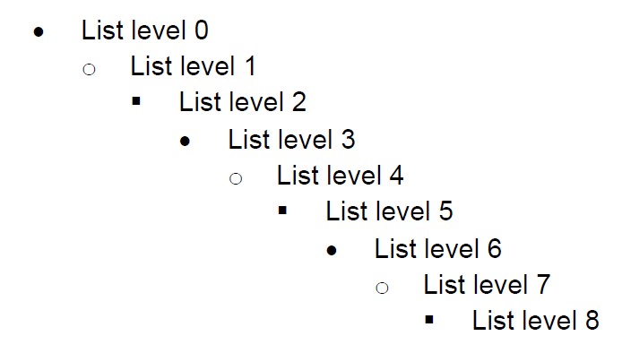
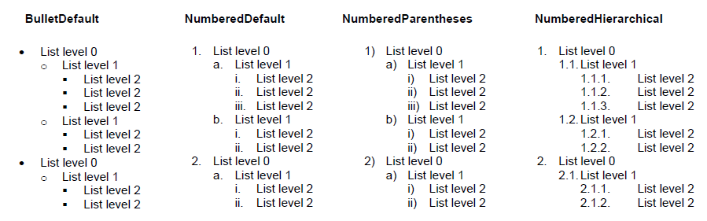
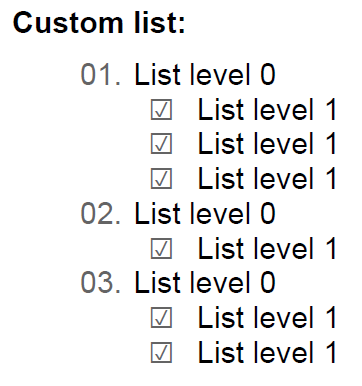
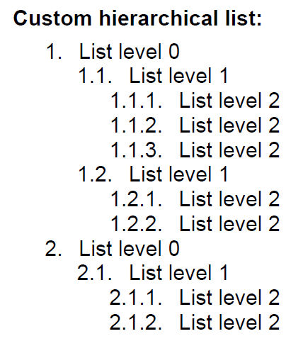
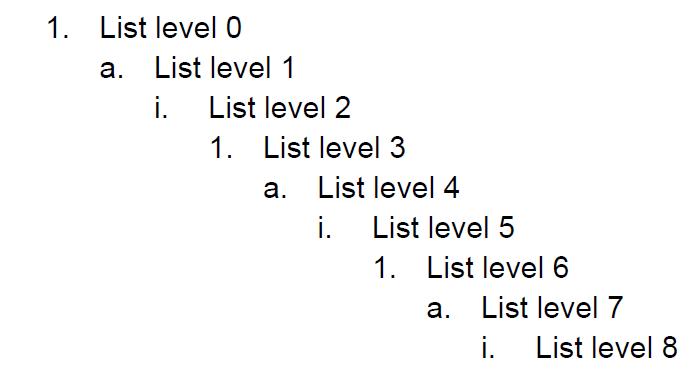

# List

List is a utility class that helps you easily create a list of numbered paragraphs. You can use lists by adding them to [RadFixedDocumentEditor]()’s Lists collection or by simply creating List class instances and setting the list bullets to some [Block]() instances.

Figure 1

This article aims to present the lists related API in __RadPdfProcessing__. It contains the following sections:

* [Creating List from ListTemplateType](#creating-list-from-listtemplatetype)

* [Creating Custom ListLevel](#creating-custom-listlevel)

* [Creating Custom Bullet](#creating-custom-bullet)

* [Using Lists with RadFixedDocumentEditor](#using-lists-with-radfixeddocumenteditor)

* [Using Lists with Block Class](#using-lists-with-block-class)

## Creating List from ListTemplateType

Each List contains a __ListLevelCollection__ where the presentation of each list level is defined by a __ListLevel__ class instance. For the most common cases you do not need to define each separate list level. Instead, you can use the __ListTemplateType__ enumeration to create a list with one of the predefined list templates.
The code snippet from __Example 1__ shows how to create a list with NumberedParentheses template:

#### __[C#] Example 1: Create Numbered Parentheses List Template Type__

{{region radpdfprocessing-editing-list_0}}
	List numberedParenthesesList = new List(ListTemplateType.NumberedParentheses);
{{endregion}}

#### __[VB.NET] Example 1: Create Numbered Parentheses List Template Type__

{{region radpdfprocessing-editing-list_1}}
	Dim numberedParenthesesList = New List(ListTemplateType.NumberedParentheses)
{{endregion}}

On the following image you may see the available list template types and how they look:

Figure 2

## Creating Custom ListLevel

When you need to create a custom List you should define the presentation of each list level. The appearance of the list level is defined with the properties of the __ListLevel__ class. The following list level properties are available in __RadPdfProcessing__:

* __StartIndex__: Specifies the index from which the list items' numbering will start. The default value of this property is 1.

* __RestartAfterLevel__: Specifies the index of the level which restarts the current level numbering. The default value is negative which means that all previous levels should restart the current level numbering. If this property has non-negative value, all previous levels that have level index less than or equal to the RestartAfterLevel value should restart the current level numbering.

* __ParagraphProperties__: Specifies the paragraph properties of the paragraphs from this list level.

* __CharacterProperties__: Specifies the character properties of the bullet element on this list level.

* __BulletNumberingFormat__: Specifies how the bullet element should be formatted on this list level.

* __IndentAfterBullet__: Specifies the amount of indent after the bullet element.

__Example 2__ shows how to create an empty list and add two custom list levels to its __ListLevelsCollection__. Level 0 has a bullet which displays its current numbering as two digit number with a leading zero. Level 1 displays a checkbox as a bullet symbol for all of the corresponding list items. Additionally, each of the levels defines custom values for the __LeftIndent__, __ForegroundColor__ and __IndentAfterBullet__ properties. 

#### __[C#] Example 2: Create Custom List Levels__

{{region radpdfprocessing-editing-list_2}}
	List list = new List();
	
	ListLevel levelZero = list.Levels.AddListLevel();
	levelZero.ParagraphProperties.LeftIndent = 30;
	levelZero.CharacterProperties.ForegroundColor = new RgbColor(100, 100, 100); 
	levelZero.IndentAfterBullet = 5;
	levelZero.BulletNumberingFormat = new TextBulletNumberingFormat((indexer) => string.Format("{0:D2}.", indexer.GetCurrentIndex(0)));
	
	ListLevel levelOne = list.Levels.AddListLevel();
	levelOne.ParagraphProperties.LeftIndent = 60;
	levelOne.CharacterProperties.ForegroundColor = new RgbColor(100, 100, 100);
	levelOne.IndentAfterBullet = 10;
	levelOne.BulletNumberingFormat = new TextBulletNumberingFormat((indexer) => "☑");
{{endregion}}

#### __[VB.NET] Example 2: Create Custom List Levels__

{{region radpdfprocessing-editing-list_3}}
	Dim list = New List()
	
	Dim levelZero = list.Levels.AddListLevel()
	levelZero.ParagraphProperties.LeftIndent = 30
	levelZero.CharacterProperties.ForegroundColor = New RgbColor(100, 100, 100)
	levelZero.IndentAfterBullet = 5
	levelZero.BulletNumberingFormat = New TextBulletNumberingFormat(Function(indexer) String.Format("{0:D2}.", indexer.GetCurrentIndex(0)))
	
	Dim levelOne = list.Levels.AddListLevel()
	levelOne.ParagraphProperties.LeftIndent = 60
	levelOne.CharacterProperties.ForegroundColor = New RgbColor(100, 100, 100)
	levelOne.IndentAfterBullet = 10
	levelOne.BulletNumberingFormat = New TextBulletNumberingFormat(Function(indexer) "☑")
{{endregion}}

The image in __Figure 3__ shows how the list created in __Example 2__ will look like when used:

Figure 3

## Creating custom bullet

When you are creating custom list level you need to specify how the bullet numbering should be formatted. With __RadPdfProcessing__ by implementing __IBulletNumberingFormat__ you may choose what __PositionContentElement__ should be used for each bullet appearance. This way knowing the current indexes of all list levels you can easily create bullets with text, geometry or image.

If you require using a text bullet you may use __TextBulletNumberingFormat__ class. This class implements __IBulletNumberingFormat__. When initializing an instance of this class, its constructor requires function that returns the string representation of the bullet.

The following code snippet shows how to create the bullets of a numbered hierarchical list using __TextBulletNumberingFormat__ class:

#### __[C#] Example 3: Create Custom Text Numbering Bullet__

{{region radpdfprocessing-editing-list_4}}
	List list = new List();
	
	for (int i = 0; i < 3; i++)
	{
	    ListLevel level = list.Levels.AddListLevel();
	    level.ParagraphProperties.LeftIndent = (i + 1) * 20;
	    level.IndentAfterBullet = 10;
	    int currentLevelIndex = i;
	
	    level.BulletNumberingFormat = new TextBulletNumberingFormat((indexer) =>
	        {
	            StringBuilder builder = new StringBuilder();
	
	            for (int levelIndex = 0; levelIndex <= currentLevelIndex; levelIndex++)
	            {
	                builder.AppendFormat("{0}.", indexer.GetCurrentIndex(levelIndex));
	            }
	
	            return builder.ToString();
	        });
	}
{{endregion}}

#### __[VB.NET] Example 3: Create Custom Text Numbering Bullet__

{{region radpdfprocessing-editing-list_5}}
	 Dim list = New List()
		For i = 0 To 2
		
		    Dim level = list.Levels.AddListLevel()
		    level.ParagraphProperties.LeftIndent = (i + 1) * 20
		    level.IndentAfterBullet = 10
		    Dim currentLevelIndex As Integer = i
		
		    level.BulletNumberingFormat = New TextBulletNumberingFormat(Function(indexer)
		                                                                    Dim builder = New StringBuilder()
		                                                                    For levelIndex = 0 To currentLevelIndex
		                                                                        builder.AppendFormat("{0}.", indexer.GetCurrentIndex(levelIndex))
		                                                                    Next
		
		                                                                    Return builder.ToString()
		                                                                End Function)
		Next
{{endregion}}

When using the list created in __Example 3__ its bullets will look as shown in __Figure 4__

Figure 4

## Using Lists with RadFixedDocumentEditor

In order to use lists with __RadFixedDocumentEditor__ you should first add them to the editor’s __ListCollection__. Each time you add a list item you should simply set the __ListId__ and __ListLevel__ values in the editor’s __Paragraph__ properties and call the InsertParagraph() method.

__Example 4__ shows how to create a list with __RadFixedDocumentEditor__ and insert a single item for each of the list levels. The appearance of the list is from the values in the predefined __ListTemplateType__ enumeration

#### __[C#] Example 4: Using Lists with RadFixedDocumentEditor__

{{region radpdfprocessing-editing-list_6}}
	using (RadFixedDocumentEditor editor = new RadFixedDocumentEditor(document))
	{
	    List list = editor.Lists.AddList(ListTemplateType.NumberedDefault);
	    editor.ParagraphProperties.ListId = list.Id;
	
	    for (int listLevel = 0; listLevel < list.Levels.Count; listLevel++)
	    {
	        editor.ParagraphProperties.ListLevel = listLevel;
	        editor.InsertParagraph();
	        editor.InsertRun(string.Format("List level {0}", listLevel));
	    }
	}
{{endregion}}

#### __[VB.NET] Example 4: Using Lists with RadFixedDocumentEditor__

{{region radpdfprocessing-editing-list_7}}
	Using editor As New RadFixedDocumentEditor(document)
	    Dim list = editor.Lists.AddList(ListTemplateType.NumberedDefault)
	    editor.ParagraphProperties.ListId = list.Id
	
	    For listLevel = 0 To list.Levels.Count - 1
	
	        editor.ParagraphProperties.ListLevel = listLevel
	        editor.InsertParagraph()
	        editor.InsertRun(String.Format("List level {0}", listLevel))
	    Next
	End Using
{{endregion}}

The result document looks like the image in Figure 5:

Figure 5

## Using Lists with Block Class

As the __Block__ class has __Bullet__ and __IndentAfterBullet__ properties you can easily set some custom bullet to any __Block__ instance. However, if you want to get automatically formatted bullet corresponding to some __List__ class instance you should use the __SetBullet(List list, int listLevel)__ method. This way you can easily set the bullet-related properties so that the bullet displays the correct list numbering and formatting.
The following code snippet shows how to create __List__ with __BulletDefault__ template and set the bullet of the first list level to a Block:

#### __[C#] Example 5: Using Lists with Block Class__

{{region radpdfprocessing-editing-list_8}}
	List list = new List(ListTemplateType.BulletDefault);
	Block block = new Block();
	block.SetBullet(list, 0);
	block.InsertText("Sample block text.");
{{endregion}}

#### __[VB.NET] Example 5: Using Lists with Block Class__

{{region radpdfprocessing-editing-list_8}}
	Private Sub UsingListsWithBlockClass()
	    Dim list = New List(ListTemplateType.BulletDefault)
	    Dim block = New Block()
	    block.SetBullet(list, 0)
	    block.InsertText("Sample block text.")
	End Sub
{{endregion}}

Figure 6 demonstrates how the block form __Example 5__ will look like when exported.

Figure 6
