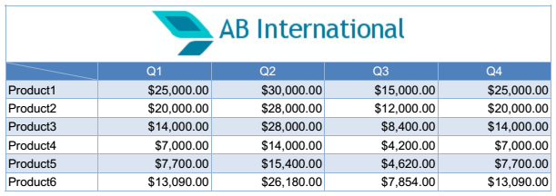
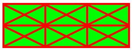

# Table

__Table__ is а utility class that helps you easily create tabular data content. All you need to do is to define the table content and pass a Table instance to a [FixedContentEditor]() or a [RadFixedDocumentEditor](). From then on these editors are responsible for positioning, measuring, drawing and splitting the table onto pages.

This article aims to present the table related API in __RadPdfProcessing__. It contains the following sections:
      

* [Defining Table Content](#defining-table-content)

* [Using DefaultCellProperties](#using-defaultcellproperties)

* [Modifying a Table](#modifying-a-table)

* [Drawing Table with RadFixedDocumentEditor](#drawing-table-with-radfixeddocumenteditor)

* [Drawing Table with FixedContentEditor](#drawing-table-with-fixedcontenteditor)

## Defining Table Content

Each table contains a series of [TableRow]() instances each of which contains a series of [TableCell]() instances. In order to define a simple table you need to generate the table cells and add some content to them.
        

__Example 1__ shows how to generate a simple table with two rows and three columns with some sample text in each table cell.
        

#### __[C#] Example 1: Create Simple Table__

{{region radpdfprocessing-editing-table_0}}
    Table table = new Table();

    TableRow firstRow = table.Rows.AddTableRow();
    firstRow.Cells.AddTableCell().Blocks.AddBlock().InsertText("cell11");
    firstRow.Cells.AddTableCell().Blocks.AddBlock().InsertText("cell12");
    firstRow.Cells.AddTableCell().Blocks.AddBlock().InsertText("cell13");

    TableRow secondRow = table.Rows.AddTableRow();
    secondRow.Cells.AddTableCell().Blocks.AddBlock().InsertText("cell21");
    secondRow.Cells.AddTableCell().Blocks.AddBlock().InsertText("cell22");
    secondRow.Cells.AddTableCell().Blocks.AddBlock().InsertText("cell23");
{{endregion}}

The result table is shown in __Figure 1__ below.
        

Figure 1: Table

## Using DefaultCellProperties

If you want to apply default styling to all the cells in a table you can use Table's __DefaultCellProperties__ property. This allows to easily modify the default cell presentation.
        

* __Padding__: Specifies the distances between the inner cell border contour and the cell content.
            

* __Borders__: Property of type __TableCellBorders__ which specifies the borders of a single cell. The available borders are left, right, top, bottom, diagonal up and diagonal down.
            

* __Background__: Specifies the background of the cell.
            

__Еxample 2__ shows how to use the __DefaultCellProperties__ of a table
        

#### __[C#] Example 2: Use DefaultCellProperties of Table__

{{region radpdfprocessing-editing-table_1}}
    Table table = new Table();
    Border redBorder = new Border(2, new RgbColor(255, 0, 0));
    table.DefaultCellProperties.Borders = new TableCellBorders(redBorder);
    table.DefaultCellProperties.Padding = new Thickness(20, 10, 20, 10);
    table.DefaultCellProperties.Background = new RgbColor(0, 255, 0);

    TableRow firstRow = table.Rows.AddTableRow();
    firstRow.Cells.AddTableCell();
    firstRow.Cells.AddTableCell();
    firstRow.Cells.AddTableCell();

    TableRow secondRow = table.Rows.AddTableRow();
    secondRow.Cells.AddTableCell();
    secondRow.Cells.AddTableCell();
    secondRow.Cells.AddTableCell();
{{endregion}}

The result of the snippet in __Example 2__ is demonstrated on __Figure 2__.
        

Figure 2: Result of DefaultCellProperties Modification

## Modifying a Table

There are several factors that affect tables measuring calculations. Some of them are listed and explained bellow:
        

* __Margin__: Specifies the distances between the table borders outline and the rest of the document's content.
            

* __Padding__: Set through the TableCell's Padding property, it specifies the distances between cell borders inner contour and the cell content.
            

* __BorderSpacing__: Specifies the distance between all the borders in the table. This distance is measured differently depending on the __BorderCollapse__ option.
            

* __BorderCollapse__: Specifies the way the border spacing calculations should be done. There are two options:
            

 * __Collapse__: The distance between borders is measured from the middle lines of the borders.
                

 * __Separate__: The distance between borders is measured from the outer border contour.
                

The next example aims to demonstrate how border calculations occur with different __BorderCollapse__ option. The code in __Example 3__ creates an empty table and sets default cell padding and red table border with thickness 10 to it.
        

#### __[C#] Example 3: Create Table with Red Border__

{{region radpdfprocessing-editing-table_2}}
    Table table = new Table();
    table.DefaultCellProperties.Padding = new Thickness(10, 6, 10, 6);
    Border redBorder = new Border(10, new RgbColor(255, 0, 0));
    table.Borders = new TableBorders(redBorder);
{{endregion}}

__Example 4__ adds a single row with two cells to the table from __Example 3__. The first cell has green border with thickness 5, while the second cell has blue border with thickness 3.
        

#### __[C#] Example 4: Add Green and Blue Cells__

{{region radpdfprocessing-editing-table_3}}
    TableRow tableRow = table.Rows.AddTableRow();

    TableCell firstCell = tableRow.Cells.AddTableCell();
    Border greenBorder = new Border(5, new RgbColor(0, 255, 0));
    firstCell.Borders = new TableCellBorders(greenBorder, greenBorder, greenBorder, greenBorder);
    firstCell.Blocks.AddBlock().InsertText("green bordered cell");

    TableCell secondCell = tableRow.Cells.AddTableCell();
    Border blueBorder = new Border(3, new RgbColor(0, 0, 255));
    secondCell.Borders = new TableCellBorders(blueBorder, blueBorder, blueBorder, blueBorder);
    secondCell.Blocks.AddBlock().InsertText("blue bordered cell");
{{endregion}}

__Figure 3__ shows the table from Example 3 and 4 with BorderCollapse property set to Collapse - all borders are drawn so that their middle lines coincide.
        

#### __[C#] Example 5: Collapse Border__

{{region radpdfprocessing-editing-table_4}}
    table.BorderCollapse = BorderCollapse.Collapse;
{{endregion}}

Figure 3: Collapse Border

__Figure 4__ shows the same table with BorderCollapse property set to Separate - all borders are drawn so that their outer contour coincide.
        

#### __[C#] Example 6: Separate Border__

{{region radpdfprocessing-editing-table_5}}
    table.BorderCollapse = BorderCollapse.Separate;
{{endregion}}

Figure 4: Separate Border

## Drawing Table with RadFixedDocumentEditor

When a table is generated it may be inserted in the PDF document using the __RadFixedDocumentEditor__'s __InsertTable()__ method. This way the table is inserted in the document and split onto pages if necessary. Additionally you may specify the table __LayoutType__ using RadFixedDocumentEditor's __TableProperties__. There are two available options in the __TableLayoutType__ enumeration:
        

* __FixedWidth__: Table width is always equal to the available page width.
            

* __AutoFit__: The table auto fits its width based on the content.
            

__Example 7__ generates a simple table with two cells.
        

#### __[C#] Example 7: Create Table__

{{region radpdfprocessing-editing-table_6}}
    Table table = new Table();

    Border border = new Border();
    table.Borders = new TableBorders(border);
    table.DefaultCellProperties.Borders = new TableCellBorders(border, border, border, border);

    table.BorderSpacing = 5;
    table.BorderCollapse = BorderCollapse.Separate;

    TableRow row = table.Rows.AddTableRow();
    row.Cells.AddTableCell().Blocks.AddBlock().InsertText("First cell");
    row.Cells.AddTableCell().Blocks.AddBlock().InsertText("Second cell");
{{endregion}}

__Example 8__ inserts the table from __Example 7__ in a RadFixedDocumentEditor and specifies the table layout type to AutoFit.
        

#### __[C#] Example 8: Insert AutoFit Table__

{{region radpdfprocessing-editing-table_7}}
    RadFixedDocumentEditor editor = new RadFixedDocumentEditor(document);
    editor.TableProperties.LayoutType = TableLayoutType.AutoFit;
    editor.InsertTable(table);
{{endregion}}

The result is that the table width is exactly as needed for fitting the cells content as visible in __Figure 5__.
        

Figure 5: AutoFit Table

Specifying FixedWidth layout option produces different results.
        

#### __[C#] Example 9: Insert FixedWidth Table__

{{region radpdfprocessing-editing-table_8}}
    editor.TableProperties.LayoutType = TableLayoutType.FixedWidth;
    editor.InsertTable(table);
{{endregion}}

Figure 6: FixedWidth Table

## Drawing Table with FixedContentEditor

When in need of more customization options, you can use the __DrawTable()__ method of __FixedContentEditor__ instead of __RadFixedDocumentEditor__.
        

__Example 10__ shows how to draw a rotated table with the help of FixedContentEditor.
        

#### __[C#] Example 9: Draw Rotated Table__

{{region radpdfprocessing-editing-table_9}}
    Table table = GenerateSampleTable();

    RadFixedDocument document = new RadFixedDocument();
    RadFixedPage page = document.Pages.AddPage();
    FixedContentEditor editor = new FixedContentEditor(page, new SimplePosition());

    editor.Position.Translate(10, 100);
    editor.Position.Rotate(-45);
    editor.DrawTable(table);
{{endregion}}

As a result on __Figure 7__ you can see a 45-degree rotated table similar to the one on Figure 5.
        

Figure 7: FixedWidth Table

# See Also

 * [FixedContentEditor]()

 * [RadFixedDocumentEditor]()

 * [TableRow]()

 * [TableCell]()
