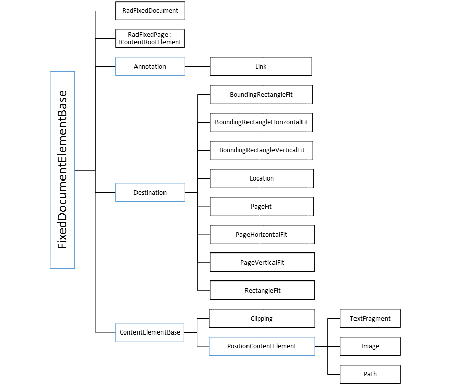

# Model

This article explains the structure of __RadPdfProcessing__'s document model.
      

## DocumentElements

[RadFixedDocument]() is the root element of all document elements. All document elements inherit from the __FixedDocumentElementBase__ abstract class. The diagram below describes the hierarchy in the __RadPdfProcessing__.
        

## Composition of Document Elements

__RadFixedDocument__ represents a tree of [RadFixedPage]() where the fixed content is hosted. The diagram below describes the composition of the fixed content. The document elements are denoted in black and collections - in orange.
        

# See Also

 * [RadFixedDocument]()

 * [RadFixedPage]()
