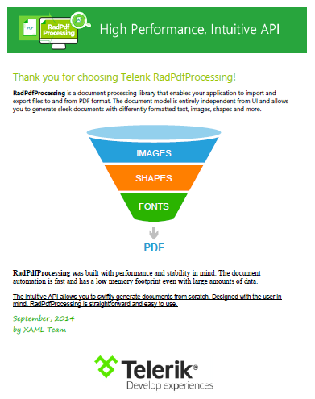

# {{ site.framework_name }} PdfProcessing Overview

>**RadPdfProcessing** is part of the **Telerik Document Processing** libraries. The full documentation for this component is available at [https://docs.telerik.com/devtools/document-processing/libraries/radpdfprocessing](https://docs.telerik.com/devtools/document-processing/libraries/radpdfprocessing/overview).
            
__RadPdfProcessing__ is a processing library that allows creation, import and export of PDF documents.





The API of RadPdfProcessing contains two different editors, enabling you to choose between editing in a flow-like manner, or using the much more powerful and flexible fixed document structure and drawing on the page.
            
The document model of the library provides support for:

* [**Pages**](https://docs.telerik.com/devtools/document-processing/libraries/radpdfprocessing/model/radfixedpage): Adding, modifying or removing of pages in a document. The properties enable you to change the size of the page, its rotation and more.

* **Automatic layout**: Although the PDF format is fixed, sometimes you will need to insert the content in a way that flows on the page. RadPdfProcessing enables to achieve this easily by using  [blocks](https://docs.telerik.com/devtools/document-processing/libraries/radpdfprocessing/editing/block), [tables](https://docs.telerik.com/devtools/document-processing/libraries/radpdfprocessing/editing/table) and [lists](https://docs.telerik.com/devtools/document-processing/libraries/radpdfprocessing/editing/list).

* [**Images**](https://docs.telerik.com/devtools/document-processing/libraries/radpdfprocessing/model/image): Decoded on demand to achieve better performance. The API enables you to obtain the encoded image data. You can also control the image quality when saving the document.

* [**Geometries**](https://docs.telerik.com/devtools/document-processing/libraries/radpdfprocessing/concepts/geometry): Enable you to describe the geometry of a 2D shape.

* [**Form XObjects**](https://docs.telerik.com/devtools/document-processing/libraries/radpdfprocessing/model/form): The Form XObjects enables you to describe composite objects (consisting of text, images, vector elements, etc.) within a PDF file and reuse this content among the document, for smaller document size and better rendering performance.

* [**Interactive Forms**](https://docs.telerik.com/devtools/document-processing/libraries/radpdfprocessing/model/interactive-forms/overview): Create and modify PDF files containing textboxes, buttons, listboxes and other interactive controls making available for the PDF file user to interactively fill some data in the PDF document and/or digitally sign the filled document. You can flatten the fields as well.

 
* [**Digital Signature**](https://docs.telerik.com/devtools/document-processing/libraries/radpdfprocessing/features/digital-signature): The digital signature feature enables you to sign and validate PDF document.

* [**Clipping**](https://docs.telerik.com/devtools/document-processing/libraries/radpdfprocessing/concepts/clipping): You can define the outline of other content elements like images and paths.

* [**Annotations**](https://docs.telerik.com/devtools/document-processing/libraries/radpdfprocessing/model/annotations-and-destinations): Associate an object with a location on a page of the PDF document.

* [**Destinations**](https://docs.telerik.com/devtools/document-processing/libraries/radpdfprocessing/model/annotations-and-destinations): Defines a particular view of a document.

* [**Colors and Color Spaces**](https://docs.telerik.com/devtools/document-processing/libraries/radpdfprocessing/concepts/colors-and-color-spaces): Support for different types of both.

* [**Fonts**](https://docs.telerik.com/devtools/document-processing/libraries/radpdfprocessing/concepts/fonts): Support for the standard PDF fonts, Type0, Type1, CIDFontType2, TrueType and more.

* [**Text and Graphic properties**](https://docs.telerik.com/devtools/document-processing/libraries/radpdfprocessing/editing/text-and-graphic-properties): Provide options for changing the properties of the different elements in the document elements so you can achieve a unique look.

* [**Password Protection**](https://docs.telerik.com/devtools/document-processing/libraries/radpdfprocessing/formats-and-conversion/pdf/pdfformatprovider/settings#import-settings)

* [**Merge documents**](https://docs.telerik.com/devtools/document-processing/libraries/radpdfprocessing/model/radfixeddocument) and [**document pages**](https://docs.telerik.com/devtools/document-processing/libraries/radpdfprocessing/formats-and-conversion/pdf/pdfstreamwriter/pdfpagesource).

* [**PdfFileStream**](https://docs.telerik.com/devtools/document-processing/libraries/radpdfprocessing/formats-and-conversion/pdf/pdfstreamwriter/overview): The API exposes a functionality that provides option for exporting PDF files with unmatched performance and minimized memory footprint. Extremely useful when you need to add some content to existing document, merge or split documents.

* [**Import of PDF and export to PDF and plain text**](https://docs.telerik.com/devtools/document-processing/libraries/radpdfprocessing/formats-and-conversion/plain-text/textformatprovider)


## Telerik UI for WPF Support and Learning Resources

* [Telerik UI for WPF PdfProcessing Homepage](https://www.telerik.com/products/wpf/pdf-processing.aspx)
* [Get Started with the Telerik UI for WPF PdfProcessing](https://docs.telerik.com/devtools/document-processing/libraries/radpdfprocessing/getting-started)
* [Telerik UI for WPF API Reference](https://docs.telerik.com/devtools/wpf/api/)
* [Getting Started with Telerik UI for WPF Components]()
* [Telerik UI for WPF Virtual Classroom (Training Courses for Registered Users)](https://learn.telerik.com/learn/course/external/view/elearning/16/telerik-ui-for-wpf) 
* [Telerik UI for WPF PdfProcessing Forums](https://www.telerik.com/forums/wpf)
* [Telerik UI for WPF Knowledge Base](https://docs.telerik.com/devtools/wpf/knowledge-base)


