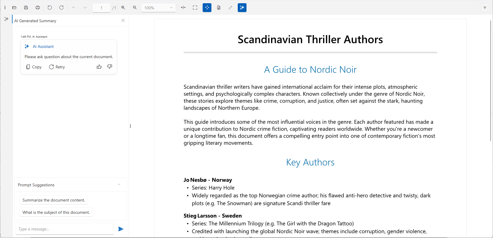
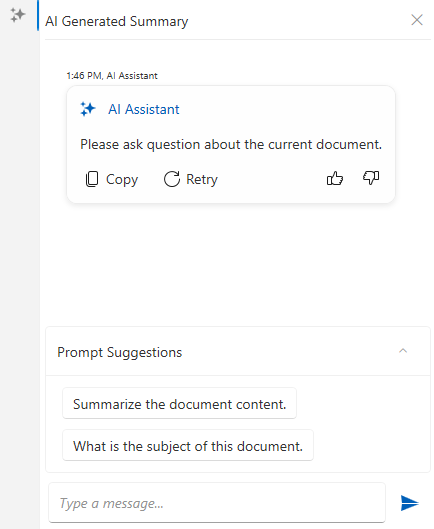
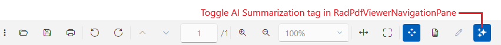
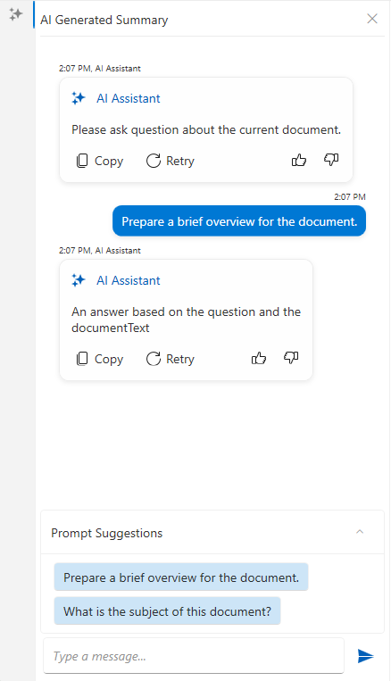

# AI Summarization for RadPdfViewer

RadPdfViewer provides a smart summarization feature that allows you to use LLM services to analyze the content of the PDF document.

This is implemented via a chat element in the UI of the component. The component can be connected to an AI service which provides the summarization information. The chat can be used to construct a prompt related to the document content.



## Required NuGet Packages

The summarization feature requires you to install few more packages, aside from the [standard ones](#adding-telerik-assemblies-using-nuget) for the RadPdfViewer control.

### Required Packages (.NET Framework)

```XML
<ItemGroup>
 <PackageReference Include="Azure.AI.OpenAI" Version="2.2.0-beta.2" />
 <PackageReference Include="Microsoft.Extensions.AI.OpenAI" Version="9.3.0-preview.1.25161.3" />
 <PackageReference Include="Telerik.Windows.Controls.ConversationalUI.for.Wpf.Xaml" Version="2025.3.1110"/>
 <PackageReference Include="Telerik.Windows.Controls.FixedDocumentViewers.for.Wpf.Xaml" Version="2025.3.1110" />
 <PackageReference Include="Telerik.Windows.Controls.FixedDocumentViewersUI.for.Wpf.Xaml" Version="2025.3.1110" />
 <PackageReference Include="Telerik.Windows.Documents.AIConnector" Version="2025.3.1008" />
</ItemGroup>
```

### Required Packages (.NET)

```XML
<ItemGroup>
 <PackageReference Include="Azure.AI.OpenAI" Version="2.2.0-beta.2" />
 <PackageReference Include="Microsoft.Extensions.AI.OpenAI" Version="9.3.0-preview.1.25161.3" />
 <PackageReference Include="Microsoft.Extensions.AI.Ollama" Version="9.3.0-preview.1.25161.3" />
 <PackageReference Include="Telerik.Windows.Controls.ConversationalUI.for.Wpf.Xaml" Version="2025.3.*" />
 <PackageReference Include="Telerik.Windows.Controls.FixedDocumentViewers.for.Wpf.Xaml" Version="2025.3.*" />
 <PackageReference Include="Telerik.Windows.Controls.FixedDocumentViewersUI.for.Wpf.Xaml" Version="2025.3.*" />
 <PackageReference Include="Telerik.Windows.Documents.AIConnector" Version="*-*" />
</ItemGroup>
```

### Using Assembly References

The recommended installation approach is to use the Telerik NuGet packages, but in case you cannot do this, the following list shows the required `.dll` files.

* `Telerik.Documents.AI.Core.dll`
* `Telerik.Documents.AI.RAG.dll`
* `Telerik.Windows.Documents.AIConnector.dll`
* `Telerik.Windows.Documents.Core.dll`
* `Telerik.Windows.Documents.Fixed.dll`
* `Telerik.Licensing.Runtime.dll`
* `Telerik.Windows.Controls.dll`
* `Telerik.Windows.Controls.ConversationalUI.dll`
* `Telerik.Windows.Controls.FixedDocumentViewers.dll`
* `Telerik.Windows.Controls.FixedDocumentViewersUI.dll`
* `Telerik.Windows.Controls.Input.dll`
* `Telerik.Windows.Controls.Navigation.dll`
* `Telerik.Windows.Controls.RibbonView.dll`
* `Telerik.Windows.Data.dll`

In this case, you should still install the third party AI-related libraries (like OpenAI and Ollama) using the corresponding NuGet packages.

## Showing the AI Summarization UI

The AI summarization is represented by a RadChat component that allows you to craft prompts and recieve reponses from the corresponding AI service. To the chat is part of the [RadPdfViewerNavigationPane]() control. To enable it, set the `EnableAISummary` property to `true`. This will include an extra tab in the navigation pane.

```XAML
<telerik:RadPdfViewerNavigationPane x:Name="navigationPane"
  RadPdfViewer="{Binding ElementName=pdfViewer, Mode=OneTime}"                                                
  EnableAISummary="True"/>
```



Additionally, the [RadPdfViewerToolBar]() provides a button that can be used to show and hide the AI summarization tab from the `RadPdfViewerNavigationPane`. To display the button, set the `HasAISummary` property of the toolbar to `true`. То link the toolbar with the navigation pane, `RadPdfViewerNavigationPane` property of the toolbar should be set as well.

```XAML
<telerik:RadPdfViewerToolBar HasAISummary="True" 
    RadPdfViewerNavigationPane="{Binding ElementName=navigationPane}"                             
	RadPdfViewer="{Binding ElementName=pdfViewer, Mode=OneTime}"/>
```



The following example shows how to connect the `RadPdfViewerNavigationPane`, the `RadPdfViewerToolBar` and the `RadPdfViewer` components together.

```XAML
<Grid>
    <Grid.RowDefinitions>
        <RowDefinition Height="Auto"/>
        <RowDefinition Height="*"/>
    </Grid.RowDefinitions>

    <Grid.ColumnDefinitions>
        <ColumnDefinition Width="Auto"/>
        <ColumnDefinition Width="*"/>
    </Grid.ColumnDefinitions>

    <telerik:RadPdfViewerToolBar HasAISummary="True" 
                                 Grid.ColumnSpan="2"                                                                                                   
                                 RadPdfViewerNavigationPane="{Binding ElementName=navigationPane}"                                     
                                 RadPdfViewer="{Binding ElementName=pdfViewer, Mode=OneTime}"/>
    <telerik:RadPdfViewerNavigationPane x:Name="navigationPane" Grid.Row="1"
                                        RadPdfViewer="{Binding ElementName=pdfViewer, Mode=OneTime}"
                                        EnableAISummary="True" />
    <telerik:RadPdfViewer x:Name="pdfViewer" 
                          Grid.Column="1" 
                          Grid.Row="1"
                          DataContext="{Binding CommandDescriptors, ElementName=pdfViewer}"/>
</Grid>
```

## Setting up the AI Provider

To connect the chat to an AI service, one of the built-in UI providers can be used. This setting is adjusted via the view model of the `RadPdfViewerNavigationPane`.
The view model is of type `RadPdfViewerNavigationPaneViewModel` which exposes an `ISummaryProvider` property named `SummaryProvider`.

```C#
// set the aiSummaryProvider beforehand
this.pdfViewerNavigationPanel.ViewModel.SummaryProvider = aiSummaryProvider;
```

### Using Azure OpenAI Provider

To enable the Azure OpenAI services, use the `AzureOpenAISummaryProvider` class. 

```C#
string key = "your-azure-openai-key";
SecureString secureKey = new SecureString();
foreach (char c in key)
{
	secureKey.AppendChar(c);
}

string endpoint = "https://your-resource-name.openai.azure.com/";
string model = "model-name"; //ex: "gpt-4o-mini"

var azureOpenAIprovider = new Telerik.Windows.Controls.FixedDocumentViewersUI.AIProviders.AzureOpenAISummaryProvider(secureKey, endpoint, model);
this.navigationPane.ViewModel.SummaryProvider = azureOpenAIprovider;
```

### Using OpenAI Provider

To enable the OpenAI services, use the `OpenAISummaryProvider` class. 

```C#
string key = "your-openai-key";
SecureString secureKey = new SecureString();
foreach (char c in key)
{
	secureKey.AppendChar(c);
}

string model = "model-name"; //ex: "gpt-4o-mini"

var openAIprovider = new Telerik.Windows.Controls.FixedDocumentViewersUI.AIProviders.OpenAISummaryProvider(secureKey, model);
this.navigationPane.ViewModel.SummaryProvider = openAIprovider;
```

### Using Ollama AI Provider (Local AI)

To use a local Ollama AI model, utilize the `LlamaSummaryProvider` class. 

```C#
string endpoint = "localhost server"; //ex: "http://localhost:11434/"
string model = "model-name"; //ex: "llama3"

var ollamaProvider = new Telerik.Windows.Controls.FixedDocumentViewersUI.AIProviders.LlamaSummaryProvider(endpoint, model);
this.navigationPane.ViewModel.SummaryProvider = ollamaProvider;
```

### Get Summary Programmatically

To get a summarization of the document programmatically, the `GetSummary` method of the corresponding AI provider can be used.

```C#
var textDoc = this.pdfViewer.Document.ToSimpleTextDocument(null);
var summaryProvider = this.navigationPane.ViewModel.SummaryProvider;
Task.Run(() =>
{
	string summary = summaryProvider.GetSummary(textDoc);

	// this is required only if you want to update the WPF UI with the result
	Application.Current.Dispatcher.Invoke(() =>
	{
		// update the UI if needed
	});
});
```

To pass additional instructions to the prompt, set the `PromptAddition` property of the provider.

```C#
ISummaryProvider summaryProvider = this.navigationPane.ViewModel.SummaryProvider;
summaryProvider.PromptAddition = "Be concise and translate the summary to Bulgarian.";
```

The summary providers expose also an event called `SummaryResourcesCalculated` which is invoked before the actual summarization process begins (after the `GetSummary` method is invoked), providing information about the estimated resource usage. The `SummaryResourcesCalculatedEventArgs` provides the following properties: 

* `EstimatedCallsRequired`&mdash; The number of API calls required
* `EstimatedTokensRequired`&mdash; The number of tokens to be processed
* `ShouldContinueExecution`&mdash; A boolean flag indicating whether to proceed with summarization. The default value is `true`.

```C#
private void SummarizationProvider_SummaryResourcesCalculated(object? sender, Telerik.Windows.Documents.AIConnector.SummaryResourcesCalculatedEventArgs e)
{
	// set e.ShouldContinueExecution = false; to cancel the summarization process
}
```

### Adjusting the Max Number of Tokens

The maximum number of tokens allowed is set via the `MaxTokenCount` property of the summary provider.

```C#
var azureOpenAIprovider = new Telerik.Windows.Controls.FixedDocumentViewersUI.AIProviders.AzureOpenAISummaryProvider(secureKey, endpoint, model);
azureOpenAIprovider.MaxTokenCount = 1000;
```

## Implementing Custom Summary Provider

Aside from the built-in providers, a custom summarization behavior can be implemented. This is done by implementing the `ISummaryProvider` interface.

__Very basic summary provider implementation__

```C#
public class CustomSummaryProvider : ISummaryProvider
{
    private string promptAddition = string.Empty;
    public string PromptAddition { get => promptAddition; set => promptAddition = value; }

    public string AskQuestion(string question, SimpleTextDocument simpleDocument)
    {
        string documentText = simpleDocument.Text;
        // implement custom logic here
        return "An answer based on the question and the documentText";
    }

    public string GetSummary(SimpleTextDocument simpleDocument)
    {
        string documentText = simpleDocument.Text;
        // implement custom summarizaiton logic here
        return "An answer based on the documentText";
    }
}
```

__Setting the custom summary provider__

```C#
	this.navigationPane.ViewModel.SummaryProvider = new CustomSummaryProvider();
```

## Customizing the Prompt Suggestions in the Chat

The default suggestions in the chat can be customized by replacing the UI element that displays them. This can be done via the `AdditionalContentTemplate` property of the `PdfChat` control.

```XAML
<telerik:RadPdfViewerNavigationPane RadPdfViewer="{Binding ElementName=pdfViewer, Mode=OneTime}"
									EnableAISummary="True">
	<telerik:RadPdfViewerNavigationPane.Resources>
		<!-- xmlns:conversationalUI="clr-namespace:Telerik.Windows.Controls.ConversationalUI;assembly=Telerik.Windows.Controls.ConversationalUI"  -->
		<Style TargetType="conversationalUI:PdfChat">
			<Setter Property="AdditionalContentTemplate">
				<Setter.Value>
					<DataTemplate>
						<telerik:RadExpander DataContext="{Binding DataContext, RelativeSource={RelativeSource AncestorType={x:Type conversationalUI:PdfChat}}}"                                                
											 IsExpanded="True"
											 Header="Prompt Suggestions">                                    
							<telerik:RadExpander.Content>
								<StackPanel>
									<telerik:RadButton Command="{Binding SendMessageCommand}"
													   Content ="Prepare a brief overview for the document." 
													   CommandParameter="{Binding Content, RelativeSource={RelativeSource Self}}"                                                                                         
													   HorizontalAlignment="Left"
													   Background="#320078D4"/>
									<telerik:RadButton Command="{Binding SendMessageCommand}" 
									  				   Content="What is the subject of this document?"                                                                
													   HorizontalAlignment="Left"
													   Background="#320078D4"/>
								</StackPanel>
							</telerik:RadExpander.Content>
						</telerik:RadExpander>
					</DataTemplate>
				</Setter.Value>
			</Setter>
		</Style>
	</telerik:RadPdfViewerNavigationPane.Resources>
</telerik:RadPdfViewerNavigationPane>
```

