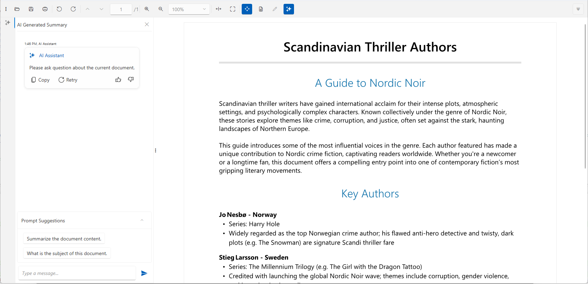
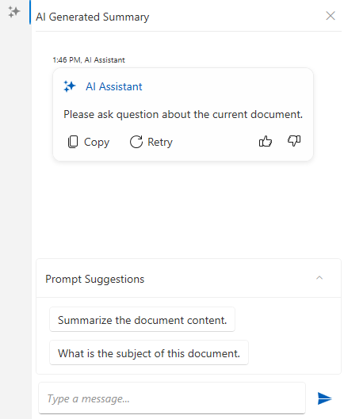
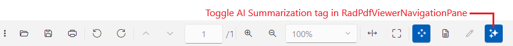
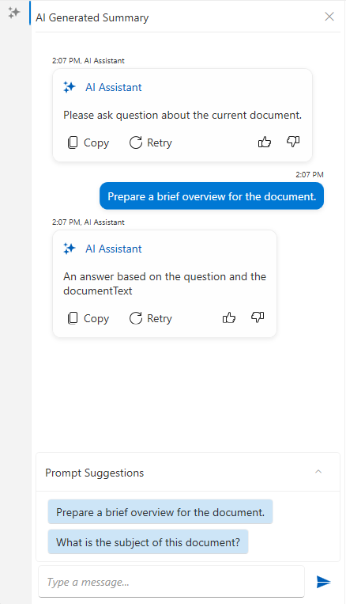

# AI Summarization for RadPdfViewer

RadPdfViewer provides a smart summarization feature that allows you to use LLM services to analyze the content of the PDF document.

This is implemented via a chat element in the UI of the component. The component can be connected to an AI service which provides the summarization information. The chat can be used to construct a prompt related to the document content.

## Required NuGet Packages

The summarization feature requires you to install few more packages, aside from the [standard ones](#adding-telerik-assemblies-using-nuget) for the RadPdfViewer control.

### Required Packages (.NET Framework)

* `Azure.AI.OpenAI`
* `OllamaSharp`
* `Microsoft.Extensions.AI.OpenAI`
* `SharpToken`
* `Telerik.Windows.Controls.ConversationalUI.for.Wpf.Xaml`
* `Telerik.Windows.Controls.FixedDocumentViewers.for.Wpf.Xaml`
* `Telerik.Windows.Controls.FixedDocumentViewersUI.for.Wpf.Xaml`
* `Telerik.Windows.Documents.AIConnector`

### Required Packages (.NET)

* `Azure.AI.OpenAI`
* `SharpToken`
* `Azure.Core`
* `Microsoft.Extensions.AI.OpenAI`
* `OllamaSharp`
* `Telerik.Windows.Controls.ConversationalUI.for.Wpf.Xaml`
* `Telerik.Windows.Controls.FixedDocumentViewers.for.Wpf.Xaml`
* `Telerik.Windows.Controls.FixedDocumentViewersUI.for.Wpf.Xaml`
* `Telerik.Windows.Documents.AIConnector`

### Using Assembly References

The recommended installation approach is to use the Telerik NuGet packages, but in case you cannot do this, the following list shows the required `.dll` files.

* `Telerik.Documents.AI.Core.dll`
* `Telerik.Documents.AI.RAG.dll`
* `Telerik.Windows.Documents.AIConnector.dll`
* `Telerik.Windows.Documents.Core.dll`
* `Telerik.Windows.Documents.Fixed.dll`
* `Telerik.Licensing.Runtime.dll`
* `Telerik.Windows.Controls.dll`
* `Telerik.Windows.Controls.ConversationalUI.dll`
* `Telerik.Windows.Controls.FixedDocumentViewers.dll`
* `Telerik.Windows.Controls.FixedDocumentViewersUI.dll`
* `Telerik.Windows.Controls.Input.dll`
* `Telerik.Windows.Controls.Navigation.dll`
* `Telerik.Windows.Controls.RibbonView.dll`
* `Telerik.Windows.Data.dll`

In this case, you should still install the third party AI-related libraries (like OpenAI and Ollama) using the corresponding NuGet packages.

## Showing the AI Summarization UI

The AI summarization is represented by a RadChat component that allows you to craft prompts and recieve reponses from the corresponding AI service. To the chat is part of the [RadPdfViewerNavigationPane]() control. To enable it, set the `EnableAISummary` property to `true`. This will include an extra tab in the navigation pane.

<snippet id='radpdfviewer-ai-summarization-block_1-xaml' />

Additionally, the [RadPdfViewerToolBar]() provides a button that can be used to show and hide the AI summarization tab from the `RadPdfViewerNavigationPane`. To display the button, set the `HasAISummary` property of the toolbar to `true`. То link the toolbar with the navigation pane, `RadPdfViewerNavigationPane` property of the toolbar should be set as well.

<snippet id='radpdfviewer-ai-summarization-block_2-xaml' />

The following example shows how to connect the `RadPdfViewerNavigationPane`, the `RadPdfViewerToolBar` and the `RadPdfViewer` components together.

<snippet id='radpdfviewer-ai-summarization-block_3-xaml' />

## Setting up the AI Provider

To connect the chat to an AI service, one of the built-in UI providers can be used. This setting is adjusted via the view model of the `RadPdfViewerNavigationPane`.
The view model is of type `RadPdfViewerNavigationPaneViewModel` which exposes an `ISummaryProvider` property named `SummaryProvider`.

<snippet id='radpdfviewer-ai-summarization-block_4-cs' />

### Using Azure OpenAI Provider

To enable the Azure OpenAI services, use the `AzureOpenAISummaryProvider` class. 

<snippet id='radpdfviewer-ai-summarization-block_5-cs' />

### Using OpenAI Provider

To enable the OpenAI services, use the `OpenAISummaryProvider` class. 

<snippet id='radpdfviewer-ai-summarization-block_6-cs' />

### Using Ollama AI Provider (Local AI)

To use a local Ollama AI model, utilize the `LlamaSummaryProvider` class. 

<snippet id='radpdfviewer-ai-summarization-block_7-cs' />

### Get Summary Programmatically

To get a summarization of the document programmatically, the `GetSummary` method of the corresponding AI provider can be used.

<snippet id='radpdfviewer-ai-summarization-block_8-cs' />

To pass additional instructions to the prompt, set the `PromptAddition` property of the provider.

<snippet id='radpdfviewer-ai-summarization-block_9-cs' />

The summary providers expose also an event called `SummaryResourcesCalculated` which is invoked before the actual summarization process begins (after the `GetSummary` method is invoked), providing information about the estimated resource usage. The `SummaryResourcesCalculatedEventArgs` provides the following properties: 

* `EstimatedCallsRequired`&mdash; The number of API calls required
* `EstimatedTokensRequired`&mdash; The number of tokens to be processed
* `ShouldContinueExecution`&mdash; A boolean flag indicating whether to proceed with summarization. The default value is `true`.

<snippet id='radpdfviewer-ai-summarization-block_10-cs' />

### Adjusting the Max Number of Tokens

The maximum number of tokens allowed is set via the `MaxTokenCount` property of the summary provider.

<snippet id='radpdfviewer-ai-summarization-block_11-cs' />

## Implementing Custom Summary Provider

Aside from the built-in providers, a custom summarization behavior can be implemented. This is done by implementing the `ISummaryProvider` interface.

__Very basic summary provider implementation__

<snippet id='radpdfviewer-ai-summarization-block_12-cs' />

__Setting the custom summary provider__

<snippet id='radpdfviewer-ai-summarization-block_13-cs' />

## Customizing the Prompt Suggestions in the Chat

The default suggestions in the chat can be customized by replacing the UI element that displays them. This can be done via the `AdditionalContentTemplate` property of the `PdfChat` control.

<snippet id='radpdfviewer-ai-summarization-block_14-xaml' />

