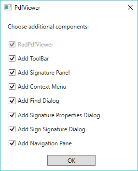
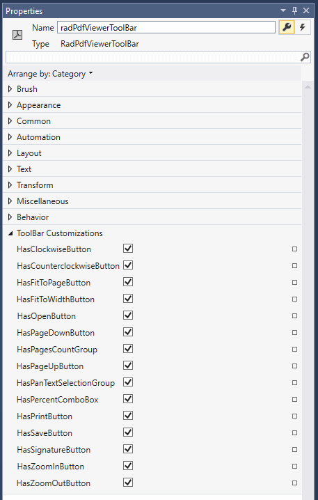
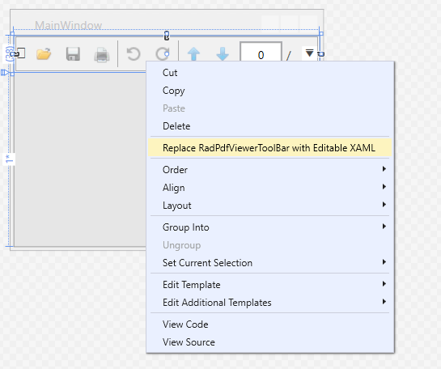

# Default UI

RadPdfViewer comes with pre-defined UI that is automatically wired with all of the commands provided by the control. **RadPdfViewerToolbar** compliments **RadPdfViewer**, with convenient toolbar exposing the variety of features. With single line of XAML you get all the UI expected from a standard PDF viewing application, including page navigation, zoom and page control, open/save/print buttons. When updating from version to version, you'll automatically get UI for all the new commands we expose.

#### Figure 1: RadPdfViewer with default UI and context menu
 

## Add RadPdfViewer with Predefined UI to Your Application

After dragging the RadPdfViewer control from the toolbox to the designer of Visual Studio, you will be prompted to choose the UI components you would like to use in your application. The available options are as follows:

>This functionality is available since R1 2018.

* **Add ToolBar**: When checked, the toolbar containing different functionalities for RadPdfViewer will be added. Otherwise, only the PdfViewer control will be added without any additional UI.

* **Add Signature Panel**: Ensure this option is checked when you would like RadPdfViewer to show the results of validating a document which contains digital signatures. More information about that functionality is available in the [Digital Signature]() topic.

* **Add Context Menu**: Determines whether the [Context Menu]() of RadPdfViewer should be added to the UI.

* **Add Find Dialog**: Determines whether the [Find Dialog]() of RadPdfViewer should be added to the UI.

* **Add Signature Properties Dialog**: Determines whether the [Signature Properties Dialog](#using-signaturepropertiesdialog) of RadPdfViewer should be added to the UI.

* **Add Sign Signature Dialog**: Determines whether the [Sign Signature Dialog](#signing) of RadPdfViewer should be added to the UI.

#### Figure 2: Choose the components you would like to use
 

**Example 1** shows how the XAML generated after enabling all options looks like.

#### [XAML] Example 1: Default UI

{{region radpdfviewer-default-ui_0}}

	<Grid>
	    <Grid.RowDefinitions>
		<RowDefinition Height="Auto"/>
		<RowDefinition Height="Auto"/>
		<RowDefinition/>
	    </Grid.RowDefinitions>
	    <telerik:RadPdfViewerToolBar RadPdfViewer="{Binding ElementName=pdfViewer, Mode=OneTime}" SignaturePanel="{Binding ElementName=signaturePanel, Mode=OneTime}"/>
	    <fixedViewersUI:SignaturePanel x:Name="signaturePanel" PdfViewer="{Binding ElementName=pdfViewer, Mode=OneWay}" Grid.Row="1"/>
	    <telerik:RadPdfViewer x:Name="pdfViewer" DataContext="{Binding CommandDescriptors, ElementName=pdfViewer}" 
				    fixedViewersUI:RadPdfViewerAttachedComponents.RegisterSignSignatureDialog="True" 
				    fixedViewersUI:RadPdfViewerAttachedComponents.RegisterFindDialog="True" Grid.Row="2" 
				    fixedViewersUI:RadPdfViewerAttachedComponents.RegisterSignaturePropertiesDialog="True" 
				    fixedViewersUI:RadPdfViewerAttachedComponents.RegisterContextMenu="True"/>
	</Grid>
{{endregion}}  
 
## Customizing the Default UI

### Adding and Removing Buttons and Sections from RadPdfViewerToolBar

**RadPdfViewerToolBar** exposes several properties that enable you to add or remove parts of the UI with a single click. A list of all the available properties and their values you can find in the **Properties** window of Visual Studio.

#### Figure 3: Choose the components you would like to use
 

The default value for all of the ToolBar Customization options is `true`. Unchecking an option results in setting the corresponding property in XAML to `false`. **Example 2** shows how these properties look like in XAML.

#### [XAML] Example 2: Using the properties of RadPdfViewerToolBar

{{region radpdfviewer-default-ui_1}}

	<telerik:RadPdfViewerToolBar RadPdfViewer="{Binding ElementName=pdfViewer, Mode=OneTime}" 
	                                HasPrintButton="False" HasSaveButton="False" HasSignatureButton="False" 
	                                HasZoomOutButton="False" HasZoomInButton="False" HasPercentComboBox="False" 
	                                HasPanTextSelectionGroup="False" HasPageUpButton="False" HasPagesCountGroup="False" 
	                                HasPageDownButton="False" HasOpenButton="False" HasFitToWidthButton="False" 
	                                HasFitToPageButton="False" HasCounterclockwiseButton="False" HasClockwiseButton="False"/>
{{endregion}}  

### Customizing the Template of RadPdfViewerToolBar

When you need to make a more complicated change to the toolbar besides adding and removing buttons, for example, adding a new button with custom functionality, you can extract the template of **RadPdfViewerToolBar**. This can be achieved through the **Replace RadPdfViewerToolBar with Editable XAML** option of the Visual Studio Designer's context menu.

#### Figure 4: Replace RadPdfViewerToolBar with Editable XAML option of the Visual Studio Designer's context menu

> Note that in this scenario, the RadPdfViewerToolBar is replaced by its XAML code. Doing this, you will not be able to receive updates for the control and will not be able to take advantage of the styling functionalities. 

### Customizing the Template of the Default Context Menu

Extracting the template of the default context menu can be done using a pretty similar approach to the one described for RadPdfViewerToolBar. Just right-click on RadPdfViewer in the designer of Visual Studio and choose **Replace Default Context Menu with Editable XAML**.
