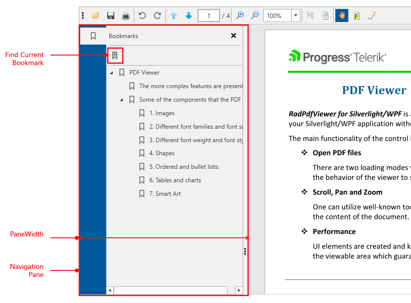

# Bookmarks (Outlines)

RadPdfViewer enables you to open documents and show the bookmarks they contain in a bookmarks panel. Bookmarks or Outlines are a tree-structured hierarchy that the reader presents as a visual table of contents separated from the actual content as a side panel. The Bookmark items allow users, by interacting with them, to navigate through parts of the document and/or invoke different actions.  

>The Bookmarks (Outlines) functionality is available as of R3 2018. 

#### Figure 1: Bookmarks in RadPdfViewer

## Visualizing Bookmarks

In **RadPdfViewer**, you can show bookmarks using **RadPdfViewerNavigationPane**. This is a control representing an area that can display different navigation panels, including the Bookmarks of the PDF document which serve as a table of contents. RadPdfViewerNavigationPane exposes the **PaneWidth** property, which you can use to specify the width of the panel.

#### [XAML] Example 1: Define RadPdfViewerNavigationPane

{{region radpdfviewer-features-bookmarks_0}}

	<Grid>
	    <Grid.ColumnDefinitions>
	        <ColumnDefinition Width="Auto" />
	        <ColumnDefinition />
	    </Grid.ColumnDefinitions>
	    <telerik:RadPdfViewerNavigationPane RadPdfViewer="{Binding ElementName=pdfViewer, Mode=OneTime}" PaneWidth="300" />
	    <telerik:RadPdfViewer Grid.Column="1" x:Name="pdfViewer" DataContext="{Binding ElementName=pdfViewer, Path=CommandDescriptors}" />
	</Grid>
{{endregion}}

The items inside the panel are represented by the **BookmarkItem** class, which can be used to obtain information about the style, text, appearance, action and destination of the bookmark.

## Setting the Way the Document Looks Like When Opened in a Viewer

The PDF format allows you to specify how the document should be displayed when opened. In RadPdfViewer, you can obtain the information about the document visualization using the **PageMode** property. It is of type **PageMode** and supports two values. The enum controls if any of the tabs in the havigation pane should be selected (opened) by default when the document contains bookmarks. The values of **PageMode** could be:

* **UseNone**: Nothing additional except the document is visible. 
* **UseBookmarks**: Document bookmarks are visible.

## Commands

The commands related to bookmarks are exposed in the **CommandDescriptors** property of **RadPdfViewer**. You can invoke them to execute a functionality of the bookmarks.

### ActivateBookmarkItemCommand

This command represents the bookmark activated action (usually a user click event). When executed, **RadPdfViewer** displays the related Bookmark destination or executes the provided action. The command accepts a parameter of type [**BookmarkItem**](https://docs.telerik.com/devtools/wpf/api/html/t_telerik_windows_documents_fixed_model_navigation_bookmarkitem.htm). 

### SyncCurrentBookmarkItemCommand

Synchronizes the current location in the document with the related bookmark item. Can be invoked through the UI using the **Find Current Bookmark** button, shown in **Figure 1**.

#### [C#] Example 2: Invoking a command in code

{{region radpdfviewer-features-bookmarks_1}}

	this.pdfViewer.CommandDescriptors.SyncCurrentBookmarkItemCommandDescriptor.Command.Execute(null);
{{endregion}}

## See Also

* [Showing a File]()
* [Wiring UI]()
 
* [Digital Signature]()
