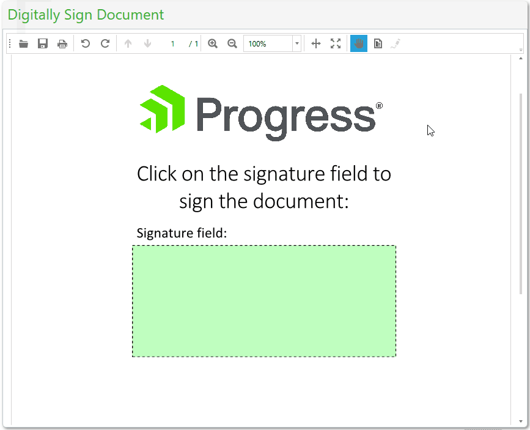
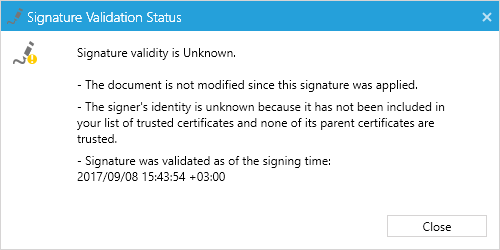

# Digital Signature

With RadPdfViewer you are able to display, sign and verify documents within your application and make sure that it has not been tampered with.

This article contains the following sections:

* [What is a Digital Signature?](#what-is-a-digital-signature)

* [Cryptography Standards](#cryptography-standards)

* [Signature Field](#signature-field)

* [Signing](#signing)

* [Validation](#validation)

* [Limitations](#limitations)

## What is a Digital Signature?

The digital signature is the equivalent of the handwritten signature and is intended to solve security problems in the digital communication. The signature is unique to each signer and is widely used to confirm that the document content originated from the signer and has not been modified in any way.

The digital signatures rely on a mathematical algorithm, which generates a public and a private key. The private key is used to create the signature while the user signs the document. The algorithm creates a hash over the document data and uses the signer's private key to encrypt this hash. The result of this operation is the digital signature of the document. Once the document is signed, any change on it invalidates the hash, respectively the signature is invalidated.

## Cryptography Standards

RadPdfViewer enables you to validate signature fields using standard Cryptography Standards. Following is a list of them:

* adbe.x509.rsa_sha1 ([PKCS #1](https://tools.ietf.org/html/rfc8017))

* adbe.pkcs7.sha1 ([PKCS #7](https://tools.ietf.org/html/rfc2315))

* adbe.pkcs7.detached (PKCS #7 Detached)

For all other formats you might need, there is a flexible API enabling you to implement them. To do so, you should inherit the [SignatureValidationHandlerBase](https://docs.telerik.com/devtools/wpf/api/telerik.windows.documents.fixed.model.digitalsignatures.signaturevalidationhandlerbase) and register the new handler in the [SignatureValidationHandlersManager](https://docs.telerik.com/devtools/wpf/api/telerik.windows.documents.fixed.model.digitalsignatures.signaturevalidationhandlersmanager). The base class exposes the ValidationOverride() method, so you can implement the logic for validating any type of signature. Once the validation is done in the body of this method, an instance of the [SignatureValidationResult](https://docs.telerik.com/devtools/wpf/api/telerik.windows.documents.fixed.model.digitalsignatures.signaturevalidationresult) class will be returned containing data for the signature status.


## Signature Field

The information about a digital signature in a document is stored in a signature field, which can be obtained through the **AcroForm** property of the document. This field exposes a property called Signature, which is responsible for validating.

>If you need to add signature fields and widgets to PDF files which do not have any fields, then the only possible approach is to use the [RadPdfProcessing](https://docs.telerik.com/devtools/document-processing/libraries/radpdfprocessing/overview) library. With it, you can [import the existing PDF](https://docs.telerik.com/devtools/document-processing/libraries/radpdfprocessing/formats-and-conversion/pdf/pdfformatprovider/pdfformatprovider#import), modify its [AcroForm FormFieldCollection](https://docs.telerik.com/devtools/document-processing/libraries/radpdfprocessing/model/interactive-forms/formfieldcollection), [create and position widgets](https://docs.telerik.com/devtools/document-processing/libraries/radpdfprocessing/model/interactive-forms/widgets#widget-class) for the new fields and finally [export the result to PDF](https://docs.telerik.com/devtools/document-processing/libraries/radpdfprocessing/formats-and-conversion/pdf/pdfformatprovider/pdfformatprovider#export) FileStream or MemoryStream. The exported file can then be [imported in RadPdfViewer](https://docs.telerik.com/devtools/wpf/controls/radpdfviewer/showing-a-file#setting-the-document-in-code-behind), so that you can render the resultant document. 
>
>Sample code for creating fields and widgets with **RadPdfProcessing** can be seen in the [CreateInteractiveForms SDK example](https://github.com/telerik/document-processing-sdk/tree/master/PdfProcessing/CreateInteractiveForms).

## Signing

When a document containing a signature field is loaded in RadPdfViewer, you can apply a signature to it. This is done through the **SignSignatureDialog**. This dialog gives you the ability to choose a .pfx file representing the certificate and enter the password for it. Clicking the ***Sign*** button prompts you to save the signed document to a new file. The newly saved file then opens in RadPdfViewer.

To use the **SignSignatureDialog** you should first register it. You can do this through the ExtensibilityManager as shown in **Example 1**.

#### **[C#] Example 1: Registering SignSignatureDialog using ExtensibilityManager**

```C#
	ExtensibilityManager.RegisterSignSignatureDialog(new SignSignatureDialog());
```

If you prefer adding the dialog through XAML, you can use the **RegisterSignSignatureDialog** property of the **RadPdfViewerAttachedComponents** class.


#### **[XAML] Example 2: Registering SignSignatureDialog through XAML**
 
```XAML

	<telerik:RadPdfViewer telerik:RadPdfViewerAttachedComponents.RegisterSignSignatureDialog="True" />
```


#### **Figure 1: Signing a document in RadPdfViewer**


The SignSignatureDialog can be customized when needed. To implement the customization, you should replace the value of the **ViewModelCreator** with your custom implementation of **SignSignatureDialogViewModel**.


## Validation

In the PDF document model, the validation is performed per signature. For a valid signed document is considered one that has not been changed after the signing and all of its certificates have valid trusted root certificate.

### Using Signature Panel

The signature panel of RadPdfViewer detects when the imported document contains a signature, validates the document and shows the final result to the user. 

#### **Figure 2: SignaturePanel showing signature status**


To enable this panel, you should add it to the XAML as demonstrated in **Example 2**:

#### **[XAML] Example 3: Declaring SignaturePanel and wiring it with RadPdfViewer**

```XAML

        <telerik:SignaturePanel Grid.Row="1" x:Name="signaturePanel" PdfViewer="{Binding ElementName=pdfViewer, Mode=OneWay}" Height="0"/>
        
        <telerik:RadPdfViewer Grid.Row="2" x:Name="pdfViewer"  DataContext="{Binding ElementName=pdfViewer, Path=CommandDescriptors}" />
```


### Using SignaturePropertiesDialog

The SignaturePanel detects if any signatures are present and validates them. However, the panel shows only the end result of the validation and doesn't expose a detailed information on which one is invalid and why. You can obtain this information from the SignaturePropertiesDialog. 

To use this dialog, you should register it first. This can be done through the **ExtensibilityManager** as demonstrated in **Example 4**.

#### **[C#] Example 4: Registering SignaturePropertiesDialog**

```C#

	ExtensibilityManager.RegisterSignaturePropertiesDialog(new SignaturePropertiesDialog());
```


If you prefer adding the dialog through XAML, you can use the **RegisterSignaturePropertiesDialog** property of the RadPdfViewerAttachedComponents class.

#### **[XAML] Example 5: Registering SignaturePropertiesDialog through XAML**

```XAML

	<telerik:RadPdfViewer telerik:RadPdfViewerAttachedComponents.RegisterSignaturePropertiesDialog="True" />
```


When registered, SignaturePropertiesDialog can be shown by clicking on the SignatureField that holds the particular signature or by invoking the ShowSignaturePropertiesDialogCommand. **Example 4** shows how you can access this command, instantiate a context for it, which points to the first signature field in the document, and invoke it.

#### **[C#] Example 6: Showing SignaturePropertiesDialog from code-behind**

```C#

	ShowSignaturePropertiesDialogCommandContext context = new ShowSignaturePropertiesDialogCommandContext();
	context.SignatureField = this.pdfViewer.Document.AcroForm.FormFields.Where(sf => sf.FieldType == FormFieldType.Signature).First() as SignatureField;
	this.pdfViewer.CommandDescriptors.ShowSignaturePropertiesDialogCommandDescriptor.Command.Execute(context);
```

**Figure 3** shows how it looks like the **SignaturePropertiesDialog** when visualizing a signature whose validation result is Unknown.

#### **Figure 3: SignaturePropertiesDialog showing the status of a signature**



### Validate a Signature in Code-Behind

The **Signature** class exposes two methods allowing you to validate a signature:

* **Validate()**: The method accepts a parameter of type SignatureValidationProperties which it uses while validating the signature. The **SignatureValidationProperties** class exposes the following properties:
	*  **Chain**: Gets or sets the chain used to validate the certificate that signed the digital signature. It is of type [X509Chain](https://msdn.microsoft.com/en-us/library/system.security.cryptography.x509certificates.x509chain(v=vs.110).aspx).
	*  **ChainStatusFlags**: Gets or sets the chain status flags which describes the used signature certificate as invalid. It is of type [X509ChainStatusFlags](https://msdn.microsoft.com/en-us/library/system.security.cryptography.x509certificates.x509chainstatusflags(v=vs.110).aspx).
	
	Validate() returns object of type [SignatureValidationResult](https://docs.telerik.com/devtools/wpf/api/telerik.windows.documents.fixed.model.digitalsignatures.signaturevalidationresult).

* **TryValidate()**: This method returns a boolean value indicating whether the validation succeeded or not. There are two overloads of this method. The first one accepts an out parameter containing a [SignatureValidationResult](https://docs.telerik.com/devtools/wpf/api/telerik.windows.documents.fixed.model.digitalsignatures.signaturevalidationresult) object and the second one allows you to also pass **SignatureValidationProperties**.

>The Validate() method throws an exception if there is a problem with the signature, while TryValidate() returns false in similar cases.

**Example 5** shows how the validation can be used.

#### **[C#] Example 7: Validate a field**


```C#
	
	string validationStatus;
	
	// For simplicity, the example handles only the first signature.
	SignatureField firstSignatureField = this.pdfViewer.Document.AcroForm.FormFields.FirstOrDefault(field => field.FieldType == FormFieldType.Signature) as SignatureField;
	if (firstSignatureField != null && firstSignatureField.Signature != null)
	{
	    SignatureValidationResult validationResult;
	    if (firstSignatureField.Signature.TryValidate(out validationResult))
	    {
	        if (!validationResult.IsDocumentModified)
	        {
	            if (validationResult.IsCertificateValid)
	            {
	                validationStatus = "Valid";
	            }
	            else
	            {
	                validationStatus = "Unknown";
	            }
	        }
	        else
	        {
	            validationStatus = "Invalid";
	        }
	    }
	    else
	    {
	        validationStatus = "Invalid";
	    }
	}
	else
	{
	    validationStatus = "None";
	}
```


## Limitations

There are few limitations related to the usage of a digital signature in RadPdfViewer.

* The validation of a signature depends on the bytes representing the document. Thus, to validate a signature, the stream used to import the document must be still open.

* The validation is always performed for the current field, against the state of the document in the moment of importing.

## See Also

* [Showing a File]()
