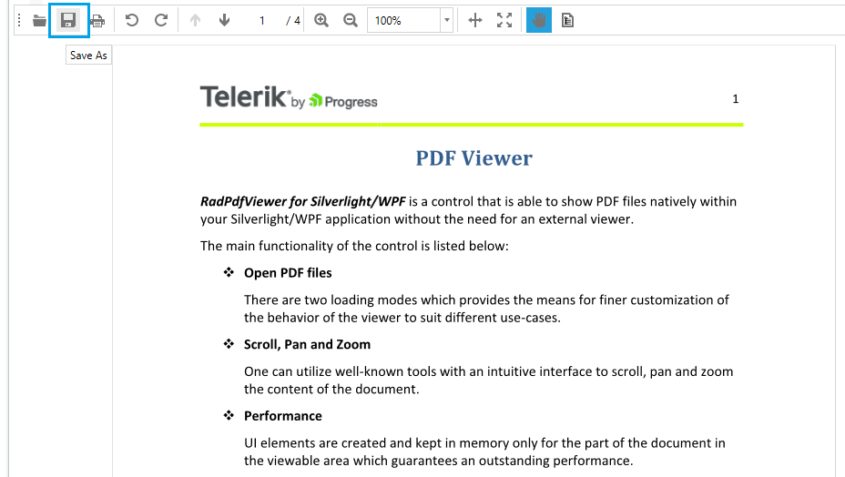

# Save As

RadPdfViewer enables you to save the loaded document to a file on the file system. This functionality can be easily wired to the UI using the related [command descriptor]() or silently invoked through the exposed API.

>The Save As functionality is available as of R3 2017. 

## Working with the SaveAsCommand
 
When invoked, the SaveAsCommand opens the SaveAs dialog and writes the document loaded in RadPdfViewer to a new file on the file system. The new document is then loaded in the control.

If there are changes to the document, the command adds additional bytes to the original PDF file in order to preserve the changes. For example, if some [interactive form field]() values are modified through **RadPdfViewer UI**, then the SaveAs command will preserve these changes in the new PDF file.

When the document is not modified, the command saves the original file stream without modifying it.

>Currently, this command has a limitation when working with **encrypted documents.** No changes can be saved when the original PDF file uses encryption.

### Wiring the Command to the UI

Similarly to the other commands of **RadPdfViewer**, the **SaveAsCommand** can be wired to the UI using its [command descriptor](). **Example 1** shows how you can set up a button to execute the save operation when clicked.
 
#### [XAML] Example 1: Wiring SaveAsCommand to UI
```XAML
	<telerik:RadButton Command="{Binding SaveAsCommandDescriptor.Command}" Visibility="{Binding SaveAsCommandDescriptor.IsEnabled, Converter={StaticResource BoolToVisibilityConverter}}" >
	    <ToolTipService.ToolTip>
	        <TextBlock Text="Save As" />
	    </ToolTipService.ToolTip>
	    <Image Source="{telerik:IconResource IconRelativePath=save.png, IconSources={StaticResource IconPaths}}" Stretch="None" />
	</telerik:RadButton>
```

#### Figure 1: Save As button in RadPdfViewer's toolbar



### Invoking in Code-Behind

You can invoke the SaveAsCommand from your code as well. **Example 2** shows how you can access and execute it.

 
#### [C#] Example 2: Invoking SaveAsCommand
```C#

	this.pdfViewer.CommandDescriptors.SaveAsCommandDescriptor.Command.Execute(null);
```



## Saving PDF Document Silently

The **SaveAsCommand** always shows a dialog to the users so they can choose a location to save the file to. If you would like to save the document without allowing interaction with the user, you can take advantage of the **Save() method** exposed by **RadPdfViewer**. The method takes a [**Stream**](https://docs.microsoft.com/en-us/dotnet/api/system.io.stream) as a parameter and directly saves the document of **RadPdfViewer** into this stream.

#### [C#] Example 3: Using the Save() method
```C#

	 this.pdfViewer.Save(new FileStream("Sample.pdf", FileMode.CreateNew));
```

## See Also

* [Showing a File]()
* [Wiring UI]()
 
* [Digital Signature]()
