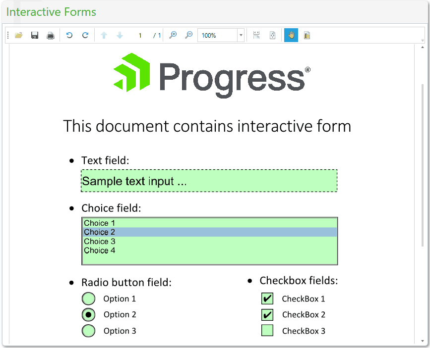

# Interactive Forms

With RadPdfViewer, you can provide the end users the ability to show, fill and save documents containing interactive forms. 

The control renders each field according to its type and provides an easy way for the user to edit its value. **Figure 1** shows a document containing text, list box, radio button and check box fields.

>In the versions between R1 and R3 2017, the content of the interactive forms is visualized read-only. The interactions with the form fields are supported since R3 2017. 

## Form Field Types

Following is a list of the form field types supported in **RadPdfViewer**:

- **CheckBox**: Represents a box that can be checked or unchecked.

- **ComboBox**: Represents a drop down control with choices that can be selected.

- **CombTexBox**: Represents a text input data container which restricts its text to some specific length and the characters are equally distributed through the field appearance length.

- **ListBox**: Represents a list with choices that can be selected.

- **PushButton**: Represents a simple button that can be clicked with the mouse. This is the only field that does not preserve any data. 

- **RadioButton**: Represents a group of radio button options. The user can select at most one option from the group.

- **Signature**: Represents a placeholder which preserves the digital signature information.

- **TextBox**: Represents a TextBox data container.

## Working with Interactive Forms in Code-Behind

The form fields in a document are preserved in its **AcroForm** property. You can obtain a form field value through the **FormFields** collection of the **AcroForm**.

>The UI of RadPdfViewer responds to interactive changes in field values (through mouse interaction with the UI) and it is not recommended to change the field collection in code. If you change the field values from your code, this may lead to unpredictable UI behavior and the applied changes will not be saved when using the **SaveAs** command.

After filling the forms, you can save the document using the Save As command.  

#### **Figure 1: Interactive form fields in RadPdfViewer**

## See Also

* [Showing a File]()
* [Digital Signature]()
