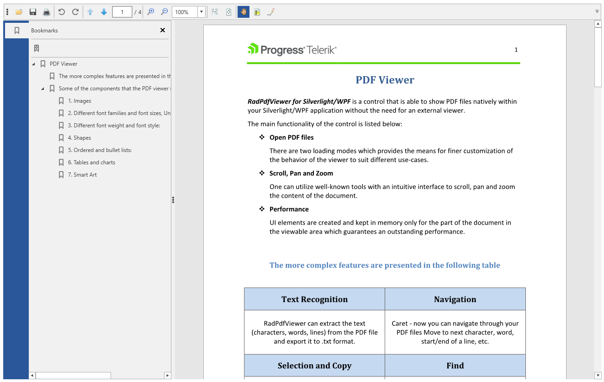

# {{ site.framework_name }} PdfViewer Overview

Thank you for choosing Telerik __RadPdfViewer__!

__RadPdfViewer__ is a control that can display PDF files natively in {{ site.framework_name }}. 





## Features

Some of the key features coming out-of-the-box with **RadPdfViewer** are:

* [**Interactive Forms**](): The control supports different types of interactive forms and enables the end user to modify their values.


* [**Bookmarks (Document Outlines)**](): RadPdfViewer can show the bookmarks of the document and ease the navigation inside.

* [**Digital Signatures**](): The user can show digitally signed documents and validate the signatures inside. Signing a document is supported as well.


* [**Saving a Document**](): When the user modifies the forms in a document or signs it, or just want to create another file from the document, they can use the Save As functionality of the viewer. 

* [**Annotations**](): Full support for Widget and Link annotations. **RadPdfViewer** provides a read-only support for all other types of annotations.

* **Fonts**: Built-in support for **TrueType**, **Type1** and **CID** fonts.

* [**Create an Image from a PDF Page**](): An API for exporting a PDF document page to an image.

* Working with [positions]() and modifying the [selection]() in the document.

* The control comes with a **predefined UI** that is intuitive and provides the means for utilizing the features of the control. Different dialogs are available as well.

* Using the UI you can easily [zoom in and out]().

* **Scroll** the document in the viewer. 

* You can also use **pan** and **text selection** by specifying a different [viewer mode]().

* The control utilizes **virtualization** in order to guarantee good performance with larger documents as well.

* **RadPdfViewer** allows [**printing**]() of the document loaded in it.

* You can [**rotate**]() the document as well.

* An easy to use [**Predefined UI**](). The UI also provides a number of customization options to fit the different requirements you might have.

* [**Context Menu**]() to provide easy access to several of the features of the control. 

* Extensible support for different stream compression filters. [[Read more]()]

* Support for documents encrypted with **Encryption Algorithm 4 (RC4/AES-128)** 

* The API provides different options for **extending** and **customizing** the control.

* Type3 fonts (Available in R1 2021).


## Telerik UI for WPF Support and Learning Resources

* [Telerik UI for WPF PDFViewer Homepage](https://www.telerik.com/products/wpf/pdf-viewer.aspx)
* [Get Started with the Telerik UI for WPF PDFViewer]()
* [Telerik UI for WPF API Reference](https://docs.telerik.com/devtools/wpf/api/)
* [Getting Started with Telerik UI for WPF Components]()
* [Telerik UI for WPF Virtual Classroom (Training Courses for Registered Users)](https://learn.telerik.com/learn/course/external/view/elearning/16/telerik-ui-for-wpf) 
* [Telerik UI for WPF PDFViewer Forums](https://www.telerik.com/forums/wpf)
* [Telerik UI for WPF Knowledge Base](https://docs.telerik.com/devtools/wpf/knowledge-base)


## See Also  
* [Useful Security Tips]()

 * [Getting Started]()
 * [Wiring UI]()
 * [Showing a File]()
