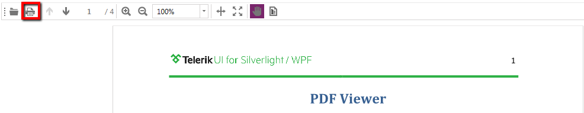

# Printing

__RadPdfViewer__ allows printing of the document shown in it. The following article describes the available printing methods, as well as how to use the respective for the feature API.      

## Using UI

__RadPdfViewer__'s sample UI allows you to print the currently shown PDF document with a simple button click.


The button shown in the above picture is actually bound to the __PrintPdfDocumentCommand__ with the help of the __PrintCommandDescriptor__, so you can modify the UI to fit your needs.

```XAML
	      <telerik:RadButton Command="{Binding PrintCommandDescriptor.Command}" Visibility="{Binding PrintCommandDescriptor.IsEnabled, Converter={StaticResource BoolToVisibilityConverter}}" HorizontalAlignment="Left" VerticalAlignment="Stretch" Margin="2" Padding="0" HorizontalContentAlignment="Center" VerticalContentAlignment="Center" IsBackgroundVisible="False">
	        <ToolTipService.ToolTip>
	          <TextBlock Text="Print" />
	        </ToolTipService.ToolTip>
	        <Image Source="/Telerik.Windows.Controls.FixedDocumentViewers;component/Images/printer.png" Stretch="None" />
	      </telerik:RadButton>
```

>tip More about command descriptors you can find [here]().

## Printing Programmatically

Additionally, to using the UI, you can print by taking advantage of the __Print()__ and __Print(PrintSettings printSettings)__ methods of __RadPdfViewer__. 

The __PrintSettings__ class holds all possible customization options when invoking printing:

* __DocumentName__: Specifies the name of the document.
              

* __PageMargins__: Specifies the page margin of the document.
              

* __UseDefaultPrinter__: Forces silent printing to the default printer. 

```C#
	    PrintSettings settings = new PrintSettings()
	    {
	        DocumentName = "My document",
	        PageMargins = new Thickness(50),
	        UseDefaultPrinter = true
	    };

	    this.pdfViewer.Print(settings);
```

RadPdfViewer also provides a __Print(PrintDialog printDialog, PrintSettings settings)__ method. It allows you to pass an already initialized PrintDialog instance to the method and print the PDF document shown in the viewer. This means that you have control over the way the document is printed and can, for example, print it silently to a printer other than the default one.

>tip You can download a runnable project showing how you can customize the printing functionality from our online [SDK repository on GitHub](https://github.com/telerik/xaml-sdk/tree/master/PdfViewer/CustomPrinting).

## See Also  

* [Wiring UI]()
