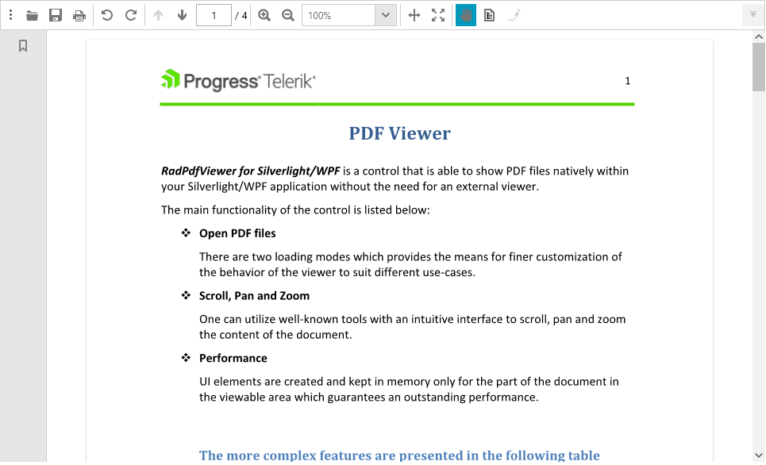

# Scrolling 

**RadPdfViewer** has inbuilt default scrolling mechanism. 

This topic explains how to use the scrolling functionality both [Using UI](#using-ui) or [Programmatically](#programmatically).

## Using UI

The scroll bars are visible only when the scrolling is needed.

 

The scrolling could be done by dragging the scroll bars and by using the keyboard arrows or the mouse wheel.

## Programmatically 

The **PdfViewer** is exposing the following properties and methods related to the scrolling functionality.

Properties:
* **HorizontalScrollBar**: Gets the horizontal scroll bar.
* **VerticalScrollBar**: Gets the vertical scroll bar.
* **CanHorizontallyScroll**: Gets the can horizontally scroll.
* **CanVerticallyScroll**: Gets the can vertically scroll.
* **HorizontalScrollOffset**: Gets the horizontal scroll offset.
* **VerticalScrollOffset**: Gets the vertical scroll offset.

Methods:
* [**ScrollToHorizontalOffset**(double offset)](#scrolltohorizontaloffset-double-offset)
* [**ScrollToVerticalOffset**(double offset)](#scrolltoverticaloffset-double-offset)

### ScrollToHorizontalOffset (double offset)

This method is used to scroll to horizontal offset.

#### [C#] Example 1: Scroll to horizontal offset
```C#

    this.pdfViewer.ScrollToHorizontalOffset(50);
```

The value is in device independent pixels (DIP) (1/96 inch).

### ScrollToVerticalOffset (double offset)

This method is used to scroll to vertical offset. 

#### [C#] Example 2: Scroll to vertical offset.
```C#

    this.pdfViewer.ScrollToVerticalOffset(50);
```

The value is in device independent pixels (DIP) (1/96 inch).

### Scroll to a Destination

Specific points can be defined as [Destination](https://docs.telerik.com/devtools/wpf/api/telerik.windows.documents.fixed.model.navigation.destination) objects and can be used to scroll to them. The _GoToDestination()_ method of **RadPdfViewer** will scroll the document to the destination passed.

#### [C#] Example 3: Scroll to destination
```C#

    string search = "word";
    RadFixedDocument document = this.pdfViewer.Document;

    SearchResult result = this.pdfViewer.Find(search);

    if (result == null || result == SearchResult.NotFound)
    {
        MessageBox.Show("Not Found");
        return;
    }

    document.Selection.Clear();
    document.CaretPosition.MoveToPosition(result.Range.StartPosition);
    this.pdfViewer.Select(result.Range);

    RadFixedPage page = result.Range.StartPosition.Page;
    PathGeometry geometry = document.Selection.GetSelectionGeometry(page);

    double top = double.MaxValue;
    foreach (PathFigure figure in geometry.Figures)
    {
        top = Math.Min(top, figure.StartPoint.Y);

        PolyLineSegment polyline = (System.Windows.Media.PolyLineSegment)figure.Segments[0];
        foreach (Point point in polyline.Points)
        {
            top = Math.Min(top, point.Y);
        }
    }

    Location location = new Location
    {
        Page = page,
        Top = top,
    };

    this.pdfViewer.GoToDestination(location);
```

More information about the **Destination** objects and the usage of the _GoToDestination()_ method is available in the [Annotations]() help article.

### Manipulating Scrollbars Appearance

The scroll bars are of type [ScrollBar](https://docs.microsoft.com/en-us/dotnet/api/system.windows.controls.primitives.scrollbar?view=netcore-3.1) which inherits from the [FrameworkElement](https://docs.microsoft.com/en-us/dotnet/api/system.windows.frameworkelement?view=netcore-3.1) class some properties that lets you change its visualization.

#### [C#] Example 4: Changing the size of the scrollbars
```C#

    this.pdfViewer.VerticalScrollBar.Width = 20;
    this.pdfViewer.VerticalScrollBar.MinHeight = 20;
    this.pdfViewer.VerticalScrollBar.MaxHeight = 200;

    this.pdfViewer.HorizontalScrollBar.Height = 30;
    this.pdfViewer.HorizontalScrollBar.MinWidth = 100;
    this.pdfViewer.HorizontalScrollBar.MaxWidth = 400;
```

>note Disabling the scrolling functionality of RadPdfViewer: Go to [Disable scrolling in the RadPdfViewer]() knowledge base article. 
