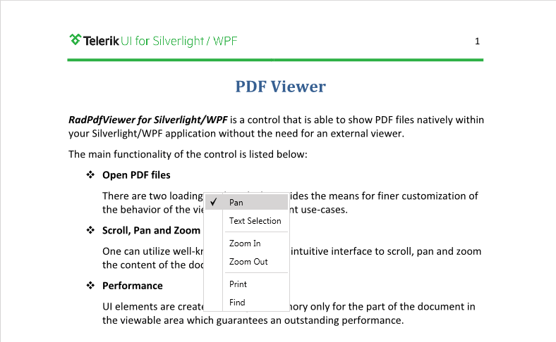
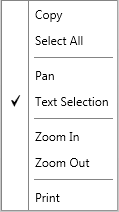

# Context Menu

This article describes how you can add additional functionality to __RadPdfViewer__ – a context menu.
      

>In order to use the capabilities of [RadContextMenu]() in __RadPdfViewer__ you need to add to your project a reference to the following assemblies:
>
> * Telerik.Windows.Controls.Navigation.dll 
> * Telerik.Windows.Controls.dll

## Sample RadContextMenu

The below snippet is an example of a context menu implemented through the RadContextMenu control. To be shown in the area where  __RadPdfViewer__ is you have to set it as a content of the viewer.
        

Every __RadMenuItem__ in the RadContextMenu is bound to a RadPdfViewer command through a [CommandDescriptor]().
        

The __Visibility__ of each RadMenuItem, on the other hand, is bound to the __IsEnabled__ property of the CommandDescriptor. In order to convert the *Boolean* value to *Visibility*  value, the __BoolToVisibility__ converter is used. The following XAML creates the context menu:
        

This is how the context menu looks:

The context menu can change dynamically. For example, when the Text Selection mode is enabled, Copy and Select All items are displayed in the menu with a separator below them:

Additionally, you can easily add a custom menu item to the context menu by binding it to a custom command descriptors. More on how to create command descriptors you can find [here]().
        
>tip Find a runnable project of the previous example in the [WPF Samples GitHub repository](https://github.com/telerik/xaml-sdk/tree/master/PdfViewer/ContextMenu).

## See Also
[Command Descriptors]().