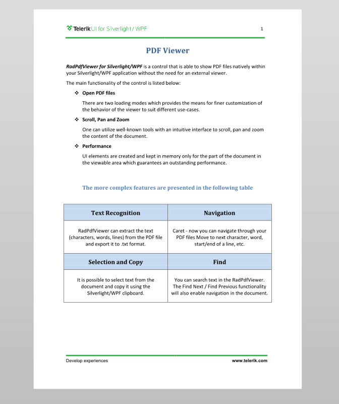

# Document Presenters


This article will help you get familiar with the concept of a document presenter in __RadPDFViewer__.
      

* [What Is a Document Presenter](#what-is-a-document-presenter)

* [Using FixedDocumentPagesPresenter](#using-fixeddocumentpagespresenter)

* [Using FixedDocumentSinglePageViewPresenter](#using-fixeddocumentsinglepageviewpresenter)


## What Is a Document Presenter

The document presenter is responsible for displaying the pages of the document, navigating in it, managing the selection markers, conversion between view coordinates and document location coordinates, plus proper response to mouse and touch events.
        

__RadPdfViewer__ provides two presenters out of the box:
        

* __FixedDocumentPagesPresenter__

* __FixedDocumentSinglePageViewPresenter__

Both of those presenters inherit the abstract __Telerik.Windows.Documents.UI.FixedDocumentPresenterBase__ class, which implements the __Telerik.Windows.Documents.UI.IFixedDocumentPresenter__ interface.
        

>You can access the document presenter in __RadPdfViewer__ by accessing the __FixedDocumentPresenter__ property. 
        
>tip FixedDocumentPresenterBase exposes the **VisiblePagesCacheOffset property**, which you can use to control the amount of pages that are cached before and after the visible ones. The default value of VisiblePagesCacheOffset is 1. 

## Using FixedDocumentPagesPresenter

This document presenter displays the pages in a vertical order and is used by default by __RadPdfViewer__. There is a fixed margin between the pages, and each pages is centered horizontally inside the __RadPdfViewer__ viewport. The code from **Example 1** shows how to set it as the currently used presenter.
        

__Example 1: Using FixedDocumentPagesPresenter__

```C#
	this.radPdfViewer.FixedDocumentPresenter = this.radPdfViewer.GetRegisteredPresenter(FixedDocumentPresenterNames.FixedDocumentPagesPresenter);
```


#### **Figure 1: FixedDocumentPagesPresenter**


## Using FixedDocumentSinglePageViewPresenter

This document presenter displays a single page inside the viewport. The page is vertically and horizontally centered. **Example 2** shows how to set the __FixedDocumentSinglePageViewPresenter__ as the currently used presenter.      
        

__Example 2: Using FixedDocumentSinglePageViewPresenter__

```C#
	this.radPdfViewer.FixedDocumentPresenter = this.radPdfViewer.GetRegisteredPresenter(FixedDocumentPresenterNames.FixedDocumentSinglePageViewPresenter);
```


#### **Figure 2: FixedDocumentSinglePageViewPresenter**


## See Also

 * [Rotation]()

 * [Custom Document Presenter]()
