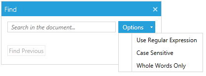

# Find Dialog


__RadPdfViewer__ allows flexible searching in a loaded PDF document. The following article describes the available search options, as well as how to use and customize the find dialog.
      

>important Other than the default needed [assemblies](), in order to take advantage of the Find dialog functionality in __RadPdfViewer__ you need to add to your project a reference to __Telerik.Windows.Controls.Navigation.dll__.

>note Find Programmatically is described in detail in the [Find]() article.
        

## Using the UI

There are three possible input parameters that determine the results of the search:
        

1. Regular Expression: Finds and returns entry of specified regular expression.
            

1. Case Sensitive: Finds and returns all entries of a specified string taking into consideration case-sensitive. For example, you are going to find “AB” string, strings such as “aB”, “Ab” and “ab” would be ignored in the results.
            

1. Whole Words Only: Finds and returns all entries of a given string which should be a whole word only (not a part of a word).
            

This is how the Find Dialog looks:


## Adding the FindDialog to a project

In a few simple steps the FindDialog could be added to a project.


First of all, it is obligatory to register a new find dialog. This can be done using the ExtensibilityManager.
        

__Example 1:  Register FindDialog using ExtensibilityManager__

```C#
		ExtensibilityManager.RegisterFindDialog(new FindDialog());
```


        
If you prefer adding the dialog through XAML, you can use the RegisterFindDialog property of the RadPdfViewerAttachedComponents class.

#### [XAML] Example 1: Register FindDialog in XAML 

```XAML
		<telerik:RadPdfViewer telerik:RadPdfViewerAttachedComponents.RegisterFindDialog="True" />

```




The __ShowFindDialogCommand__ handles the opening of the find dialog. This command is bound to the __Ctrl+F__ shortcut key combination (__Apple+F__ for Mac) in RadPdfViewer.
        

## Creating a custom find dialog

RadPdfViewer offers an easy way to create a custom find dialog which suits best to different user’s needs and desires.


In order to achieve this, should be created a class which inherits the __IFindDialog__ interface with its __ShowDialog__ method.
        

#### [C#] Example 2:Create custom find dialog

```C#
	    public class CustomFindDialog : Window, IFindDialog
	    {
	        public void ShowDialog(FindDialogContext context)
	        {
	            // ...
	        }
	    }
```

>tip Find a runnable project showing this functionality in the [WPF Samples GitHub repository](https://github.com/telerik/xaml-sdk/tree/master/PdfViewer/CustomFindDialog).

## See Also

 * [Find Programmatically]()
          
