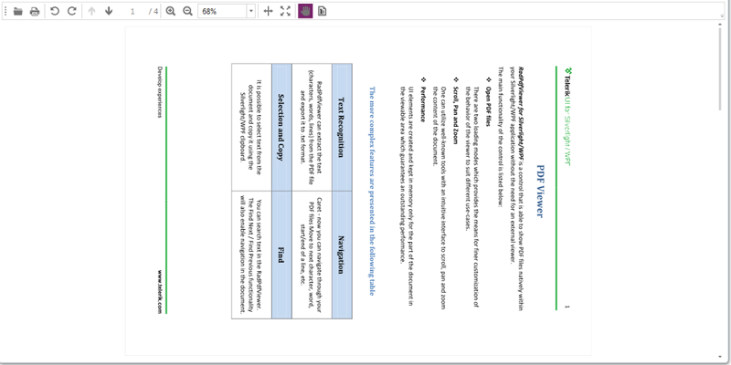

# Rotation


__RadPdfViewer__ control provides functionality for rotating the pages of the loaded document. You can programmatically rotate the document pages through the RadPdfViewer class or you can use the provided command descriptors.
      

The article focuses on the following topics:
      

* [Rotation Using Command Descriptors](#rotation-using-command-descriptors)

* [Rotation Using RadPdfViewer](#rotation-using-radpdfviewer)
 


## Rotation Using Command Descriptors

Command descriptors are wrappers for the predefined set of commands of __RadPdfViewer__ which allow for the respective command to be enabled/disabled based on the current document state. More information on the topic is available here.
        

The following command descriptors are available in the __CommandDescriptors__ property of the __RadPdfViewer__ class:
        

* *RotateClockwiseCommandDescriptor* – rotates the document pages in clockwise direction with step 90 degrees.
            

* *RotateCounterClockwiseCommandDescriptor* – rotates the document pages in counterclockwise direction with step 90 degrees.
            

Those command descriptors are wrappers for the RotateClockwiseCommand and RotateCounterClockwiseCommand.
        

Here is an example usage of those command descriptors:
        


```XAML
	        <telerik:RadButton Content="Clockwise" Command="{Binding ElementName=radPdfViewer, Path=CommandDescriptors.RotateClockwiseCommandDescriptor.Command}"/>
	        <telerik:RadButton Content="Counterclockwise" Command="{Binding ElementName=radPdfViewer, Path=CommandDescriptors.RotateCounterClockwiseCommandDescriptor.Command}" />
```


## Rotation Using RadPdfViewer

__RadPdfViewer__ has a __SetRotationAngle()__ method intended to rotate the pages of the loaded document at the specified angle relative to its initial position. The method takes a single argument of type __RotationAngle__. 
        

__RotationAngle__ is an enumeration that specifies the angle at which the document should be rotated. The possible values are Degrees0, Degrees90, Degrees180, Degrees270.
        


```C#
	    this.viewer.SetRotationAngle(RotationAngle.Degrees180);
```


The current angle at which the pages are rotated can be retrieved using the read-only __RotationAngle__ property of __RadPdfViewer__.        
        


```C#
	    RotationAngle currentAngle = this.viewer.RotationAngle;
```


