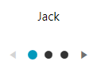
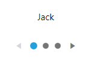

# Getting Started with {{ site.framework_name }} PipsPager

This tutorial will walk you through the creation of a sample application that contains a `PipsPager` control.

## Adding Telerik Assemblies Using NuGet

To use __RadPipsPager__ when working with NuGet packages, install the `Telerik.Windows.Controls.for.Wpf.Xaml` package. The [package name may vary]() slightly based on the Telerik dlls set - [Xaml or NoXaml]()

Read more about NuGet installation in the [Installing UI for WPF from NuGet Package]() article.

>tip With the 2025 Q1 release, the Telerik UI for WPF has a new licensing mechanism. You can learn more about it [here]().

## Adding Assembly References Manually

If you are not using NuGet packages, you can add a reference to the following assemblies:

* __Telerik.Licensing.Runtime__
* __Telerik.Windows.Controls__

## Defining the RadPipsPager

You can add RadPipsPager manually in XAML as demonstrated in the following example:

__Adding RadPipsPager in XAML__
```XAML
    <telerik:RadPipsPager/>
```

## Adding Items

The RadPipsPager control works with `RadPipsPagerItem` elements that are added to the `Items` collection of the control. These elements can be added both in XAML and in code.

__Adding RadPipsPagerItems__
```XAML
    <telerik:RadPipsPager>
        <telerik:RadPipsPagerItem/>
        <telerik:RadPipsPagerItem/>
        <telerik:RadPipsPagerItem/>
    </telerik:RadPipsPager>
```

__RadPipsPager with manually added items__


## Data Binding

The RadPipsPager component allows you to navigate the items of any `ItemsControl` controls by binding to its collection.

The following example a basic scenario where the RadPipsPager is used together with another control.

__Creating the model__
```C#
    public class Person
    {
        public string Name { get; set; }
    }
```
```VB.NET
    Public Class Person
        Public Property Name As String
    End Class
```

__Creating the view model__
```C#
    public class MainViewModel
    {
        public MainViewModel()
        {
            this.People = new ObservableCollection<Person>
            {
                new Person() { Name = "Jack" },
                new Person() { Name = "Mike" },
                new Person() { Name = "Nick" }
            };
        }

        public ObservableCollection<Person> People { get; set; }
    }
```
```VB.NET
    Public Class MainViewModel
        Public Sub New()
            Me.People = New ObservableCollection(Of Person) From {
                New Person() With {
                    .Name = "Jack"
                },
                New Person() With {
                    .Name = "Mike"
                },
                New Person() With {
                    .Name = "Nick"
                }
            }
        End Sub

        Public Property People As ObservableCollection(Of Person)
    End Class
```

__Creating the view__
```XAML
    <Grid HorizontalAlignment="Center" VerticalAlignment="Center">
        <Grid.DataContext>
            <local:MainViewModel/>
        </Grid.DataContext>
        <Grid.RowDefinitions>
            <RowDefinition Height="Auto"/>
            <RowDefinition Height="*"/>
        </Grid.RowDefinitions>
        <telerik:RadSlideView x:Name="slideView"
                              ItemsSource="{Binding People}"
                              SelectedIndex="0">
            <telerik:RadSlideView.ItemTemplate>
                <DataTemplate>
                    <TextBlock Text="{Binding Name}"
                               HorizontalAlignment="Center"/>
                </DataTemplate>
            </telerik:RadSlideView.ItemTemplate>
        </telerik:RadSlideView>
        <telerik:RadPipsPager ItemsSource="{Binding ElementName=slideView, Path=ItemsSource}"
                              SelectedItem="{Binding ElementName=slideView, Path=SelectedItem}"
                              Grid.Row="1"
                              ButtonVisibility="Visible"/>
    </Grid>
```

__RadPipsPager and RadSlideView result__



## Setting a Theme

The controls from our suite support different themes. You can see how to apply a theme different than the default one in the [Setting a Theme]() help article.

>important Changing the theme using implicit styles will affect all controls that have styles defined in the merged resource dictionaries. This is applicable only for the controls in the scope in which the resources are merged. 

* Choose between the themes and add reference to the corresponding theme assembly (ex: __Telerik.Windows.Themes.Windows8.dll__). You can see the different themes applied in the __Theming__ examples from our [WPF Controls Examples](https://demos.telerik.com/wpf/)[Silverlight Controls Examples](https://demos.telerik.com/silverlight/#PanelBar/Theming) application.

* Merge the ResourceDictionaries with the namespace required for the controls that you are using from the theme assembly. For the RadPipsPager, you will need to merge the following resources:

	* __Telerik.Windows.Controls__

The following example demonstrates how to merge the ResourceDictionaries so that they are applied globally for the entire application.

__Merge the ResourceDictionaries__
```XAML
    <Application.Resources>
    	<ResourceDictionary>
    		<ResourceDictionary.MergedDictionaries>
    			<ResourceDictionary Source="/Telerik.Windows.Themes.Windows8;component/Themes/System.Windows.xaml"/>
    			<ResourceDictionary Source="/Telerik.Windows.Themes.Windows8;component/Themes/Telerik.Windows.Controls.xaml"/>
    		</ResourceDictionary.MergedDictionaries>
    	</ResourceDictionary>
    </Application.Resources>
```

>Alternatively, you can use the theme of the control via the [StyleManager](https://docs.telerik.com/devtools/wpf/styling-and-appearance/stylemanager/common-styling-apperance-setting-theme-wpf).

The following image shows a RadPipsPager with the __Windows8__ theme applied.

__RadPipsPager with the Windows8 theme__




## Telerik UI for WPF Learning Resources

* [Telerik UI for WPF PipsPager Component](https://www.telerik.com/products/wpf/pipspager.aspx)
* [Getting Started with Telerik UI for WPF Components]()
* [Telerik UI for WPF Installation]()
* [Telerik UI for WPF and WinForms Integration]()
* [Telerik UI for WPF Visual Studio Templates]()
* [Setting a Theme with Telerik UI for WPF]()
* [Telerik UI for WPF Virtual Classroom (Training Courses for Registered Users)](https://learn.telerik.com/learn/course/external/view/elearning/16/telerik-ui-for-wpf) 
* [Telerik UI for WPF License Agreement](https://www.telerik.com/purchase/license-agreement/wpf-dlw-s)


## See Also
* [Navigation Buttons]()