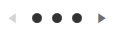

# Navigation Buttons

The navigation buttons allow you to navigate through the data. `RadPipsPager` provides the ability to control their visibility, position, and style. Furthermore, you can also specify an auto-hide period, after which the buttons will be automatically hidden, as well as enable or disable infinite scrolling.

## Controlling the Visibility of the Buttons

The visibility of the navigation buttons is controlled via the `ButtonVisibility` property of RadPipsPager. This property is of the type `ButtonVisibility` and it exposes the following options:

* `Collapsed`&mdash;This option will prevent the buttons from showing.
* `Visible`&mdash;With this option, the buttons will be visible.
* `VisibleOnMouseOver`&mdash;This option is the default one. With it, the buttons will be visible when the mouse is over the RadPipsPager control.
* `HiddenWhenDisabled`&mdash;When this option is chosen, each button will be hidden when it is in disabled state.

__Setting the ButtonVisibility property to Visible__
```XAML
    <telerik:RadPipsPager ButtonVisibility="Visible">
        <telerik:RadPipsPagerItem/>
        <telerik:RadPipsPagerItem/>
        <telerik:RadPipsPagerItem/>
    </telerik:RadPipsPager>
```

__RadPipsPager with visible buttons__



## Customizing the Appearance of the Navigation Buttons

RadPipsPager exposes the `PreviousButtonStyle` and `NextButtonStyle` properties that will allow you to set custom styles to the navigation buttons. Both buttons are of the type `RadButton` and the custom styles will have to target this type of element.

__Setting custom styles to the PreviousButtonStyle and NextButtonStyle properties__
```XAML
    <Grid>
        <Grid.Resources>
            <ResourceDictionary>
                <ResourceDictionary.MergedDictionaries>
                    <ResourceDictionary Source="/Telerik.Windows.Controls;component/Themes/FontResources.xaml"/>
                </ResourceDictionary.MergedDictionaries>

                <!--Set BasedOn property if NoXaml assemblies are used: BasedOn="{StaticResource PipsPagerPreviousButtonStyle}"-->
                <Style x:Key="CustomPipsPagerPreviousButtonStyle" TargetType="telerik:RadButton" BasedOn="{StaticResource PipsPagerPreviousButtonStyle}">
                    <Setter Property="Content" Value="{StaticResource GlyphArrow60Left}"/>
                    <Setter Property="ContentTemplate">
                        <Setter.Value>
                            <DataTemplate>
                                <Border Width="16" Height="16" Background="Red">
                                    <telerik:RadGlyph Glyph="{Binding}"/>
                                </Border>
                            </DataTemplate>
                        </Setter.Value>
                    </Setter>
                </Style>
                <!--Set BasedOn property if NoXaml assemblies are used: BasedOn="{StaticResource PipsPagerNextButtonStyle}"-->
                <Style x:Key="CustomPipsPagerNextButtonStyle" TargetType="telerik:RadButton" BasedOn="{StaticResource PipsPagerNextButtonStyle}">
                    <Setter Property="Content" Value="{StaticResource GlyphArrow60Right}"/>
                    <Setter Property="ContentTemplate">
                        <Setter.Value>
                            <DataTemplate>
                                <Border Width="16" Height="16" Background="Orange">
                                    <telerik:RadGlyph Glyph="{Binding}"/>
                                </Border>
                            </DataTemplate>
                        </Setter.Value>
                    </Setter>
                </Style>
            </ResourceDictionary>
        </Grid.Resources>
        <telerik:RadPipsPager ButtonVisibility="Visible"
                              PreviousButtonStyle="{StaticResource CustomPipsPagerPreviousButtonStyle}"
                              NextButtonStyle="{StaticResource CustomPipsPagerNextButtonStyle}">
            <telerik:RadPipsPagerItem/>
            <telerik:RadPipsPagerItem/>
            <telerik:RadPipsPagerItem/>
        </telerik:RadPipsPager>
    </Grid>
```

__RadPipsPager with custom styles for the navigation buttons__


## Setting an Auto-Hide Interval for the Navigation Buttons

You can specify a time interval, after which the navigation buttons will become hidden. This interval will begin after the mouse is out of the control or it stops moving when it's over it. To apply such a time interval, you can set the`AutoHideButtonsDelay` property of RadPipsPager. This property has a type of nullable `TimeSpan`. By default, this property will be __null__ and the buttons will not become hidden.

__Setting an auto-hide interval for the navigation buttons__
```XAML
    <telerik:RadPipsPager AutoHideButtonsDelay="00:00:05"/>
```