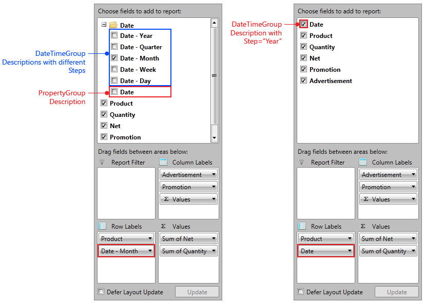

# Backwards compatibility

This article lists the breaking changes of the control.
      

## Q3 2013

__Changed__

* In the __Telerik.Pivot.Core.Filtering.SetCondition__ class the __set_Items__ has been removed.
                      

* In the __Telerik.Pivot.Core.Olap.OlapFilterDescription__ class the __set_Levels__ has been removed.
                      

* In the __Telerik.Pivot.Core.Olap.OlapGroupDescription__ class the __set_Levels__ has been removed.
                      

* In the __Telerik.Pivot.Core.Olap.OlapSetCondition__ class the __set_Items__ has been removed.
                      

* In the __Telerik.Pivot.Core.Olap.GenericDescriptionCollection__ class the __get_Levels__ has been changed.
                      

__What to do now:__

The above no longer have Public setters. All you need to do is enumerate the collections and add items to the collection.
              

__Changed__

* In the __Telerik.Pivot.Core.PropertyAggregateDescriptionBase__ class the __CreateAggregate__ has been removed.
                      

* In the __Telerik.Pivot.Core.AggregateDescriptionBase__ class the __CreateAggregate__ has been removed.
                      

__What to do now:__

To overcome the above changes all you need to do is use the CreateAggregate method on the AggregateFunction class.
              

__Changed__

* In the __Telerik.Pivot.Core.OlapAggregateDescription__ class the __CreateAggregate__ has been removed.
                      

__What to do now:__

CreateAggregate is not used and has been removed.
              

## Q2 2013

* With Q2 2013 release we have made a major change in the way we show DateTimeGroupDescriptions in __RadPivotFieldList__.
              

>The folder Date is collapsed on initialization.
                

* We have changed Pivot_Value localization key. The old value __Value:__ has been changed to __Value: {0}__.
              

* We have added serialization support, so in all of your projects where you have defined the DataProvider in XAML, you will have to add reference to __System.Runtime.Serialization__ assembly.
              

* With Q2 2013 release we have made a major change in the way we show DateTimeGroupDescriptions in __RadPivotFieldList__.
              

>The folder Date is collapsed on initialization.
                

* We have changed Pivot_Value localization key. The old value __Value:__ has been changed to __Value: {0}__.
              
