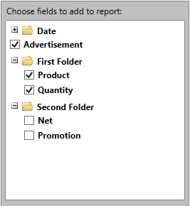

# Overview

This topic covers the specific events exposed by DataProviders of __RadPivotGrid__ control. All of the DataProviders as well as their FieldDescriptionProviders have useful events that can be used for customization purposes.      

## DataProvider Events

* __PrepareDescriptionForField__ - raised whenever the user adds a description to __RadPivotFieldList__. 

For example you can use the event in order to replace a __DoubleGroupDescription__ (__RadPivotGrid__  automatically creates DoubleGroupDescription for each numeric property) with a __PropertyGroupDescription__ as shown below:            


```C#
	private void OnPrepareDescriptionForField(object sender, Telerik.Pivot.Core.PrepareDescriptionForFieldEventArgs e)
	{
		// Get the current DoubleGroupDescription description.
		var doubleGroupDescription = e.Description as DoubleGroupDescription;
	
		if (e.DescriptionType == Telerik.Pivot.Core.DataProviderDescriptionType.Group && doubleGroupDescription != null)
		{
			// Replace it with PropertyGroupDescription.
			e.Description = new Telerik.Pivot.Core.PropertyGroupDescription() { PropertyName = doubleGroupDescription.PropertyName };
		}
	}
```

#### __VB__

```VB
	Private Sub OnPrepareDescriptionForField(ByVal sender As Object, ByVal e As Telerik.Pivot.Core.PrepareDescriptionForFieldEventArgs)
		' Get the current DoubleGroupDescription description.
		Dim doubleGroupDescription = TryCast(e.Description, DoubleGroupDescription)
	
		If e.DescriptionType = Telerik.Pivot.Core.DataProviderDescriptionType.Group AndAlso doubleGroupDescription IsNot Nothing Then
			' Replace it with PropertyGroupDescription.
			e.Description = New Telerik.Pivot.Core.PropertyGroupDescription() With {.PropertyName = doubleGroupDescription.PropertyName}
		End If
	End Sub
```

* __StatusChanged__ - raised whenever the status of the DataProvider is changed. It can be used in order to execute custom logic whenever the DataProvider is updated.            

>important The __StatusChanged__ event is raised on multiple threads, so it is required to use Dispatcher when executing a custom logic inside of the event handler. 

You can find an example below that demonstrates how to get the current status of the DataProvider:            


```C#
	private void OnDataProviderStatusChanged(object sender, DataProviderStatusChangedEventArgs e)
	{
	    if (e.NewStatus == DataProviderStatus.Ready)
	    {
	        Dispatcher.BeginInvoke(new Action(() => 
			{
				// Execute custom logic here.
			}));
	    }
	}
```

#### __VB__

```VB
	Private Sub OnDataProviderStatusChanged(ByVal sender As Object, ByVal e As DataProviderStatusChangedEventArgs)
		If e.NewStatus = DataProviderStatus.Ready Then
			Dispatcher.BeginInvoke(New Action(Sub()
				' Execute custom logic here.
			End Sub))
		End If
	End Sub
```

>You can also check for errors through the __Error__ property of the arguments.              

## FieldDescriptionProviders Events

>FieldDescrpitionProviders are used to generate the field infos for each property from your Data/Business object. They are visualized at the top part of __RadPivotFieldList__.

* __GetDescriptionsDataAsyncCompleted__ - raised when FieldTree at the top part of __RadPivotFieldList__ is generated. You can use the event in order to modify the FieldTree - you can add folders, reorder and modify the nodes. For example if you would need to group some of the nodes in folders you can use the following sample code:            


```C#
	private void OnGetDescriptionsDataAsyncCompleted(object sender, GetDescriptionsDataCompletedEventArgs e)
	{
		var rootItem = e.DescriptionsData.RootFieldInfo;
		var allContainers = rootItem.Children.ToList();
		rootItem.Children.Clear();
	
		var firstFolder = new ContainerNode("First Folder", ContainerNodeRole.Folder);
		var secondFolder = new ContainerNode("Second Folder", ContainerNodeRole.Folder);
	
		foreach (var item in allContainers)
		{
			if (item.Name == "Product" || item.Name == "Quantity")
			{
				firstFolder.Children.Add(item);
			}
			else if (item.Name == "Net" || item.Name == "Promotion")
			{
				secondFolder.Children.Add(item);
			}
			else
			{
				rootItem.Children.Add(item);
			}
		}
	
		rootItem.Children.Add(firstFolder);
		rootItem.Children.Add(secondFolder);       
	}
```

#### __VB__

```VB
	Private Sub OnGetDescriptionsDataAsyncCompleted(ByVal sender As Object, ByVal e As GetDescriptionsDataCompletedEventArgs)
		Dim rootItem = e.DescriptionsData.RootFieldInfo
		Dim allContainers = rootItem.Children.ToList()
		rootItem.Children.Clear()
	
		Dim firstFolder = New ContainerNode("First Folder", ContainerNodeRole.Folder)
		Dim secondFolder = New ContainerNode("Second Folder", ContainerNodeRole.Folder)
	
		For Each item In allContainers
			If item.Name = "Product" OrElse item.Name = "Quantity" Then
				firstFolder.Children.Add(item)
			ElseIf item.Name = "Net" OrElse item.Name = "Promotion" Then
				secondFolder.Children.Add(item)
			Else
				rootItem.Children.Add(item)
			End If
		Next item
	
		rootItem.Children.Add(firstFolder)
		rootItem.Children.Add(secondFolder)
	End Sub
```

You can observe the final result on __Figure 1__.

Figure 1: Custom folders in the FieldTree.


* __AddingContainerNode (available only for the LocalDataSourceFieldDescriptionsProvider)__ - raised multiple times while the FieldTree is generated - each time a node is added. 

The event can be used in order to add and/or remove nodes from the tree.  

>tip For more details on how to add/remove nodes from the FieldTree you can check the CustomizeFieldTree example from our [online SDK repository](https://github.com/telerik/xaml-sdk/tree/master/PivotGrid/CustomizeFieldTree).              

## See Also

 * [Layouts]()

 * [Understanding RadPivotGrid]()

 * [Populating with Data]()
